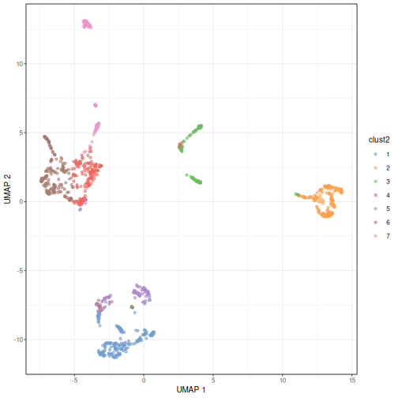
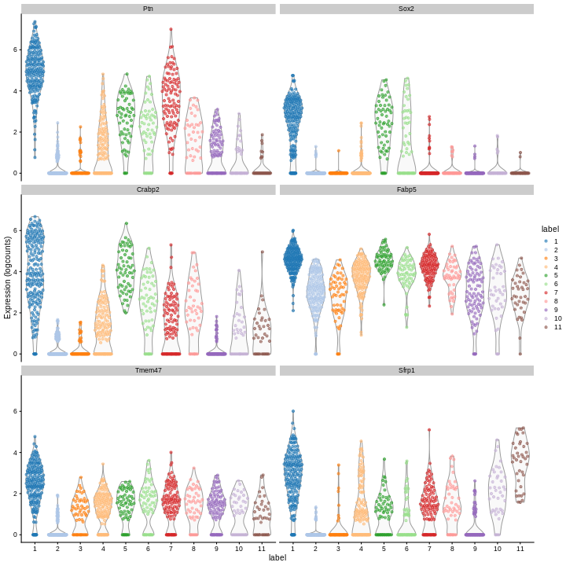
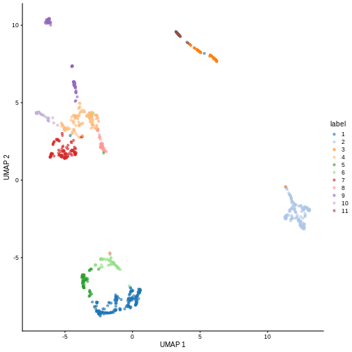
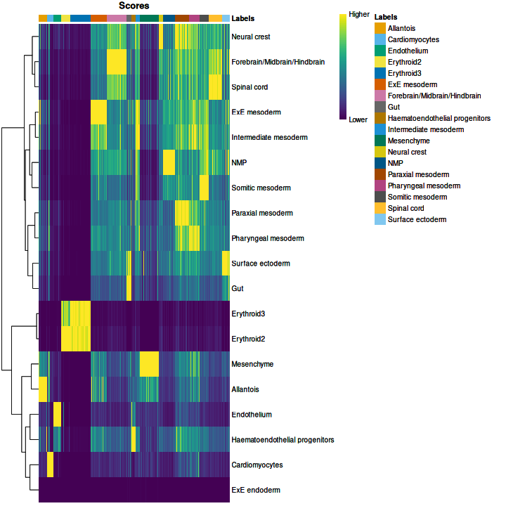
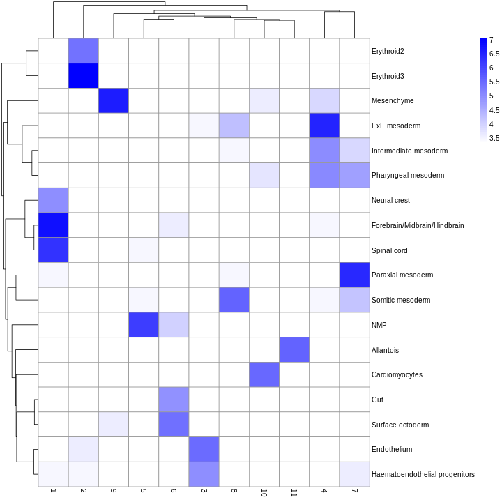
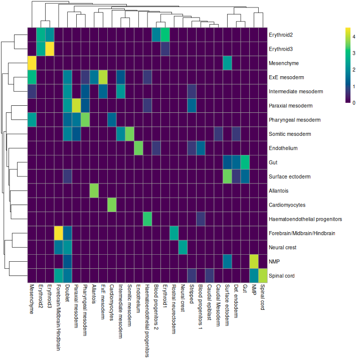
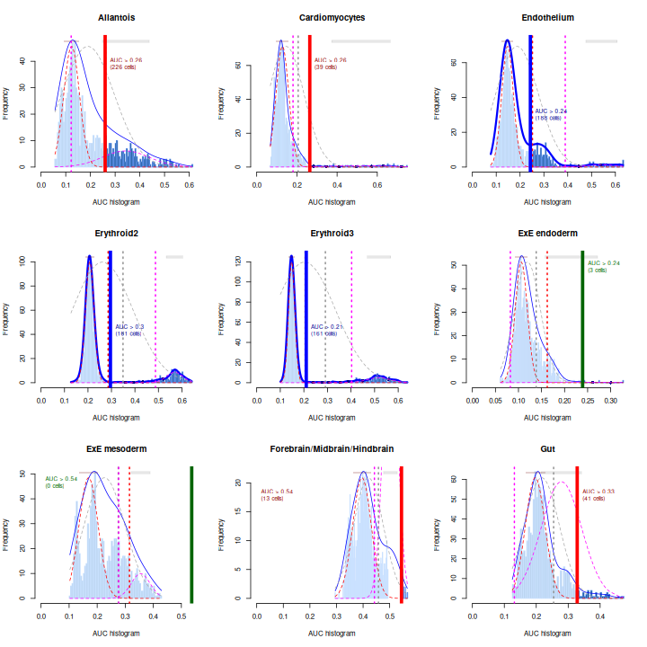
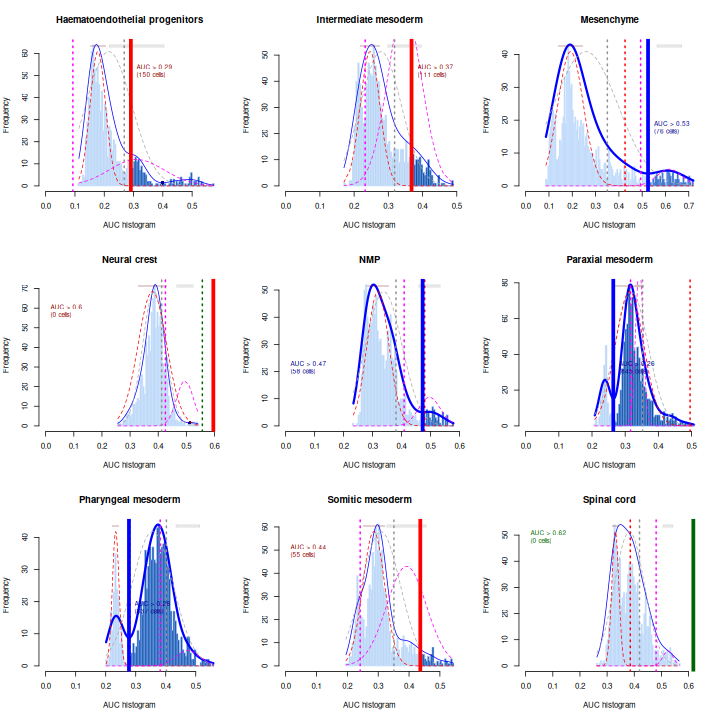
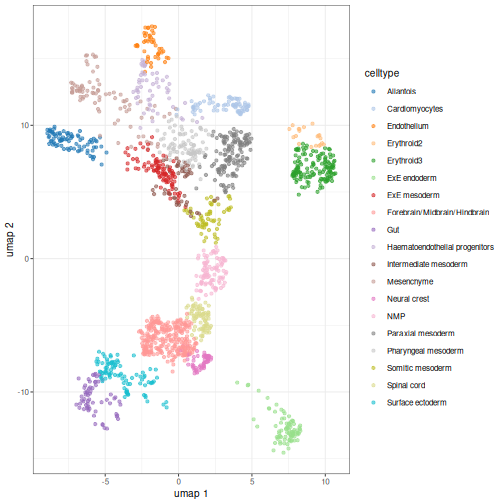

::: questions
-   How can we identify groups of cells with similar expression profiles?
-   How can we identify genes that drive separation between these groups of cells?
-   How to leverage reference datasets and known marker genes for the cell type annotation of new datasets?
:::

::: objectives
-   Identify groups of cells by clustering cells based on gene expression patterns.
-   Identify marker genes through testing for differential expression between clusters.
-   Annotate cell types through annotation transfer from reference datasets.
-   Annotate cell types through marker gene set enrichment testing.
:::

## Setup


Again we'll start by loading the libraries we'll be using:


``` r
library(AUCell)
library(MouseGastrulationData)
library(SingleR)
library(bluster)
library(scater)
library(scrapper)
library(pheatmap)
library(GSEABase)
```

## Data retrieval

We'll be using the fifth processed sample from the WT chimeric mouse embryo data: 


``` r
sce <- WTChimeraData(samples = 5, type = "processed")

sce
```

``` output
class: SingleCellExperiment 
dim: 29453 2411 
metadata(0):
assays(1): counts
rownames(29453): ENSMUSG00000051951 ENSMUSG00000089699 ...
  ENSMUSG00000095742 tomato-td
rowData names(2): ENSEMBL SYMBOL
colnames(2411): cell_9769 cell_9770 ... cell_12178 cell_12179
colData names(11): cell barcode ... doub.density sizeFactor
reducedDimNames(2): pca.corrected.E7.5 pca.corrected.E8.5
mainExpName: NULL
altExpNames(0):
```

To speed up the computations, we take a random subset of 1,000 cells.


``` r
set.seed(123)

ind <- sample(ncol(sce), 1000)

sce <- sce[,ind]
```

## Preprocessing

The SCE object needs to contain log-normalized expression counts as well as PCA coordinates in the reduced dimensions, so we compute those here: 


``` r
sce <- sce |> 
  normalizeRnaCounts.se() |> 
  chooseRnaHvgs.se()

sce <- sce |> 
  runPca.se(features = rowData(sce)$hvg)
```

## Clustering

Clustering is an unsupervised learning procedure that is used to
empirically define groups of cells with similar expression profiles. Its
primary purpose is to summarize complex scRNA-seq data into a digestible
format for human interpretation. This allows us to describe population
heterogeneity in terms of discrete labels that are easily understood,
rather than attempting to comprehend the high-dimensional manifold on
which the cells truly reside. After annotation based on marker genes,
the clusters can be treated as proxies for more abstract biological
concepts such as cell types or states.

Graph-based clustering is a flexible and scalable technique for identifying
coherent groups of cells in large scRNA-seq datasets. We first build a graph
where each node is a cell that is connected to its nearest neighbors in the
high-dimensional space. Edges are weighted based on the similarity between the
cells involved, with higher weight given to cells that are more closely related.
We then apply algorithms to identify "communities" of cells that are more
connected to cells in the same community than they are to cells of different
communities. Each community represents a cluster that we can use for downstream
interpretation.

Here, we use the `clusterGraph.se()` function from the
[scrapper](https://bioconductor.org/packages/release/bioc/html/scrapper.html) package to perform
graph-based clustering using the [Louvain
algorithm](https://doi.org/10.1088/1742-5468/2008/10/P10008) for
community detection. All calculations are performed using the top PCs to
take advantage of data compression and denoising. This function adds a "clusters" column to the `colData`.


``` r
sce <- clusterGraph.se(sce)

table(sce$clusters)
```

``` output

  1   2   3   4   5   6   7   8   9  10  11  12  13  14 
108 162  33 128  63  61  27 134  64  64  39  46  29  42 
```

<!-- scrapper::clusterGraph.se is actually about 3x slower than scran::clusterCells which calls bluster::clusterRows -->

You can see we ended up with 14 clusters of varying sizes.

We can now overlay the cluster labels as color on a UMAP plot:


``` r
sce <- runUmap.se(sce)

plotReducedDim(sce, "UMAP", color_by = "clusters")
```


:::: challenge

Our clusters look semi-reasonable, but what if we wanted to make them less granular? Look at the help documentation for `?clusterGraph.se` and `?buildSnnGraph` to find out what we'd need to change to get fewer, larger clusters.

::: solution

We see in the help documentation for `?clusterGraph.se` an argument called `num.neighbors`. Each type of clustering algorithm will have some sort of hyper-parameter that controls the granularity of the output clusters. If the clustering process has to connect larger sets of neighbors, the graph will tend to be cut into larger groups, resulting in less granular clusters. Create a new set of clusters with `k = 30`. Given their visual differences, do you think one set of clusters is "right" and the other is "wrong"?


``` r
sce <- clusterGraph.se(sce, num.neighbors = 30,
                       output.name = "clust2")

plotReducedDim(sce, "UMAP", color_by = "clust2")
```



:::

::::

## Marker gene detection

To interpret clustering results as obtained in the previous section, we
identify the genes that drive separation between clusters. These marker
genes allow us to assign biological meaning to each cluster based on
their functional annotation. In the simplest case, we have *a priori*
knowledge of the marker genes associated with particular cell types,
allowing us to treat the clustering as a proxy for cell type identity.

The most straightforward approach to marker gene detection involves
testing for differential expression between clusters. If a gene is
strongly DE between clusters, it is likely to have driven the separation
of cells in the clustering algorithm.

Here, we use `scoreMarkers()` to perform pairwise comparisons of gene
expression, focusing on up-regulated (positive) markers in one cluster when
compared to another cluster.


``` r
rownames(sce) <- rowData(sce)$SYMBOL

markers <- scoreMarkers.se(sce, groups = sce$clusters)

markers
```

``` output
List of length 14
names(14): 1 2 3 4 5 6 7 8 9 10 11 12 13 14
```

The resulting object contains a sorted marker gene list for each
cluster, in which the top genes are those that contribute the most to
the separation of that cluster from all other clusters.

Here, we inspect the ranked marker gene list for the first cluster.


``` r
head(markers[[1]], 3)
```

``` output
DataFrame with 3 rows and 22 columns
           mean  detected cohens.d.min cohens.d.mean cohens.d.median
      <numeric> <numeric>    <numeric>     <numeric>       <numeric>
Ptn     5.18941  1.000000    0.4135944       3.39489         3.68598
Sox2    2.93998  0.972222    0.6191891       3.33378         3.92825
Sfrp1   3.02850  0.953704   -0.0370316       2.02099         2.10181
      cohens.d.max cohens.d.min.rank   auc.min  auc.mean auc.median   auc.max
         <numeric>         <integer> <numeric> <numeric>  <numeric> <numeric>
Ptn        5.92151                 1  0.607339  0.926049   0.989583  1.000000
Sox2       4.53758                 1  0.678819  0.918697   0.980176  0.986111
Sfrp1      3.83032                 2  0.490379  0.850266   0.926881  0.974994
      auc.min.rank delta.mean.min delta.mean.mean delta.mean.median
         <integer>      <numeric>       <numeric>         <numeric>
Ptn              1       0.438100         3.42700           3.76778
Sox2             1       0.664106         2.38613           2.79828
Sfrp1            2      -0.042077         1.87168           2.06497
      delta.mean.max delta.mean.min.rank delta.detected.min delta.detected.mean
           <numeric>           <integer>          <numeric>           <numeric>
Ptn          4.98641                   1        0.000000000            0.372927
Sox2         2.93998                   1        0.083333333            0.708979
Sfrp1        2.96871                   2        0.000578704            0.407483
      delta.detected.median delta.detected.max delta.detected.min.rank
                  <numeric>          <numeric>               <integer>
Ptn                0.256410           0.790123                       2
Sox2               0.868774           0.972222                       1
Sfrp1              0.318783           0.893098                       2
```

Each column contains summary statistics for each gene in the given cluster.
These are usually the mean/median/min/max of statistics like Cohen's *d* and AUC
when comparing this cluster (cluster 1 in this case) to all other clusters.
`auc.mean` is usually the most important to check. AUC is the probability that a
randomly selected cell in cluster *A* has a greater expression of gene
*X* than a randomly selected cell in cluster *B*. 

We can then inspect the top marker genes for the first cluster using the
`plotExpression` function from the
[scater](https://bioconductor.org/packages/scater) package.


``` r
c1_markers <- markers[[1]]

ord <- order(-c1_markers$auc.mean)

top.markers <- head(rownames(c1_markers[ord,]))

plotExpression(sce, 
               features = top.markers, 
               x        = "clusters",
               color_by = "clusters")
```



Clearly, not every marker gene distinguishes cluster 1 from every other cluster. However, with a combination of multiple marker genes it's possible to clearly identify gene patterns that are unique to cluster 1. It's sort of like the 20 questions game - with answers to the right questions about a cell (e.g. "Do you highly express Ptn? Sox2?"), you can clearly identify what cluster it falls in.

:::: challenge

Looking at the last plot, what clusters are most difficult to distinguish from cluster 1? Now re-run the UMAP plot from the previous section. Do the difficult-to-distinguish clusters make sense?

::: solution

You can see that at least among the top markers, cluster 9 (purple) tends to have the least separation from cluster 1. 


``` r
plotReducedDim(sce, "UMAP", color_by = "clusters")
```



Looking at the UMAP again, we can see that the marker gene overlap of clusters 1 and 6 makes sense. They're right next to each other on the UMAP. They're probably closely related cell types, and a less granular clustering would probably lump them together.

:::

::::

## Cell type annotation

The most challenging task in scRNA-seq data analysis is arguably the
interpretation of the results. Obtaining clusters of cells is fairly
straightforward, but it is more difficult to determine what biological
state is represented by each of those clusters. Doing so requires us to
bridge the gap between the current dataset and prior biological
knowledge, and the latter is not always available in a consistent and
quantitative manner. Indeed, even the concept of a "cell type" is [not
clearly defined](https://doi.org/10.1016/j.cels.2017.03.006), with most
practitioners possessing a "I'll know it when I see it" intuition that
is not amenable to computational analysis. As such, interpretation of
scRNA-seq data is often manual and a common bottleneck in the analysis
workflow.

To expedite this step, we can use various computational approaches that
exploit prior information to assign meaning to an uncharacterized
scRNA-seq dataset. The most obvious sources of prior information are the
curated gene sets associated with particular biological processes, e.g.,
from the Gene Ontology (GO) or the Kyoto Encyclopedia of Genes and
Genomes (KEGG) collections. Alternatively, we can directly compare our
expression profiles to published reference datasets where each sample or
cell has already been annotated with its putative biological state by
domain experts. Here, we will demonstrate both approaches on the
wild-type chimera dataset.

### Assigning cell labels from reference data

A conceptually straightforward annotation approach is to compare the
single-cell expression profiles with previously annotated reference
datasets. Labels can then be assigned to each cell in our
uncharacterized test dataset based on the most similar reference
sample(s), for some definition of "similar". This is a standard
classification challenge that can be tackled by standard machine
learning techniques such as random forests and support vector machines.
Any published and labelled RNA-seq dataset (bulk or single-cell) can be
used as a reference, though its reliability depends greatly on the
expertise of the original authors who assigned the labels in the first
place.

In this section, we will demonstrate the use of the
*[SingleR](https://bioconductor.org/packages/3.23/SingleR)* method for cell type annotation [Aran et al.,
2019](https://www.nature.com/articles/s41590-018-0276-y). This method
assigns labels to cells based on the reference samples with the highest
Spearman rank correlations, using only the marker genes between pairs of
labels to focus on the relevant differences between cell types. It also
performs a fine-tuning step for each cell where the correlations are
recomputed with just the marker genes for the top-scoring labels. This
aims to resolve any ambiguity between those labels by removing noise
from irrelevant markers for other labels. Further details can be found
in the [*SingleR*
book](https://bioconductor.org/books/release/SingleRBook) from which
most of the examples here are derived.

::: callout

Remember, the quality of reference-based cell type annotation can only be as good as the cell type assignments in the reference. Garbage in, garbage out. In practice, it's worthwhile to spend time carefully assessing the quality of your reference dataset to make sure the original assignments are valid and are compatible with the query dataset you intend to annotate.

:::

Here we take a single sample from `EmbryoAtlasData` as our reference dataset. In practice you would want to take more/all samples, possibly with batch-effect correction (see the [multi-sample analysis episode](https://carpentries-incubator.github.io/bioc-scrnaseq/multi-sample.html)).


``` r
ref <- EmbryoAtlasData(samples = 29)
```

``` r
ref
```

``` output
class: SingleCellExperiment 
dim: 29452 7569 
metadata(0):
assays(1): counts
rownames(29452): ENSMUSG00000051951 ENSMUSG00000089699 ...
  ENSMUSG00000096730 ENSMUSG00000095742
rowData names(2): ENSEMBL SYMBOL
colnames(7569): cell_95727 cell_95728 ... cell_103294 cell_103295
colData names(17): cell barcode ... colour sizeFactor
reducedDimNames(2): pca.corrected umap
mainExpName: NULL
altExpNames(0):
```

In order to reduce the computational load, we subsample the dataset to 2,000 cells.


``` r
set.seed(123)

ind <- sample(ncol(ref), 2000)

ref <- ref[,ind]
```

You can see we have an assortment of different cell types in the reference (with varying frequency):


``` r
tab <- sort(table(ref$celltype), decreasing = TRUE)

data.frame(tab)
```

``` output
                             Var1 Freq
1    Forebrain/Midbrain/Hindbrain  282
2                      Erythroid3  140
3               Paraxial mesoderm  133
4                    ExE mesoderm   97
5                             NMP   96
6                Surface ectoderm   92
7             Pharyngeal mesoderm   89
8                    ExE endoderm   83
9                      Mesenchyme   83
10                      Allantois   82
11                    Spinal cord   82
12                 Cardiomyocytes   74
13                            Gut   62
14               Somitic mesoderm   59
15                   Neural crest   57
16 Haematoendothelial progenitors   56
17          Intermediate mesoderm   48
18                    Endothelium   44
19                     Erythroid2   20
20            Blood progenitors 2    6
21                     Erythroid1    5
22            Blood progenitors 1    4
23                  Def. endoderm    4
24                Caudal Mesoderm    3
25                            PGC    3
```

We need the normalized log counts, so we add those on: 


``` r
ref <- normalizeRnaCounts.se(ref)
```

Some cleaning - remove cells of the reference dataset for which the cell
type annotation is missing:


``` r
nna <- !is.na(ref$celltype)

ref <- ref[,nna]
```

Also remove very rare cell types (fewer than 10 examples) to avoid allocating cells to a poorly characterized type.


``` r
abu.ct <- names(tab)[tab >= 10]

ind <- ref$celltype %in% abu.ct

ref <- ref[,ind] 
```

Restrict to genes shared between query and reference dataset.


``` r
rownames(ref) <- rowData(ref)$SYMBOL

shared_genes <- intersect(rownames(sce), rownames(ref))

sce <- sce[shared_genes,]

ref <- ref[shared_genes,]
```

Convert sparse assay matrices to regular dense matrices for input to
SingleR:


``` r
sce.mat <- as.matrix(assay(sce, "logcounts"))

ref.mat <- as.matrix(assay(ref, "logcounts"))
```

Finally, run SingleR with the query and reference datasets:


``` r
res <- SingleR(test = sce.mat, 
               ref = ref.mat,
               labels = ref$celltype)
res
```

``` output
DataFrame with 1000 rows and 4 columns
                                   scores                 labels delta.next
                                 <matrix>            <character>  <numeric>
cell_11995 0.344089:0.352252:0.322687:... Forebrain/Midbrain/H..  0.0714460
cell_10294 0.284061:0.269633:0.305867:...             Erythroid3  0.0927442
cell_9963  0.344064:0.308871:0.496652:...            Endothelium  0.2402474
cell_11610 0.287595:0.274519:0.302783:...             Erythroid3  0.0446964
cell_10910 0.418575:0.355947:0.360681:...           ExE mesoderm  0.0551009
...                                   ...                    ...        ...
cell_11597 0.326458:0.301278:0.302239:...                    NMP  0.1670511
cell_9807  0.472615:0.388327:0.400081:...             Mesenchyme  0.0715311
cell_10095 0.356238:0.294831:0.497544:...            Endothelium  0.0823898
cell_11706 0.271516:0.243037:0.282809:...             Erythroid2  0.0730011
cell_11860 0.356413:0.348997:0.339735:...       Surface ectoderm  0.0059137
                    pruned.labels
                      <character>
cell_11995 Forebrain/Midbrain/H..
cell_10294             Erythroid3
cell_9963             Endothelium
cell_11610             Erythroid3
cell_10910           ExE mesoderm
...                           ...
cell_11597                    NMP
cell_9807              Mesenchyme
cell_10095            Endothelium
cell_11706                     NA
cell_11860       Surface ectoderm
```

We inspect the results using a heatmap of the per-cell and label scores.
Ideally, each cell should exhibit a high score in one label relative to
all of the others, indicating that the assignment to that label was
unambiguous. 


``` r
plotScoreHeatmap(res)
```



We obtained fairly unambiguous predictions for mesenchyme and endothelial
cells, whereas we see expectedly more ambiguity between the two
erythroid cell populations.

We can also compare the cell type assignments with the unsupervised clustering
results to determine the identity of each cluster. Here, several cell type
classes are nested within the same cluster, indicating that these clusters are
composed of several transcriptomically similar cell populations. On the other
hand, there are also instances where we have several clusters for the same cell
type, indicating that the clustering represents finer subdivisions within these
cell types.


``` r
tab <- table(anno = res$pruned.labels, 
             cluster = sce$clusters)

pheatmap(log1p(tab), 
         color = hcl.colors(100))
```



As it so happens, we are in the fortunate position where our test
dataset also contains independently defined labels. We see strong
consistency between the two sets of labels, indicating that our
automatic annotation is comparable to that generated manually by domain
experts.


``` r
tab <- table(res$pruned.labels, sce$celltype.mapped)

pheatmap(log1p(tab), 
         color = hcl.colors(100))
```



:::: challenge

Assign the SingleR annotations as a column in the colData for the query object `sce`.

::: solution


``` r
sce$SingleR_label = res$pruned.labels
```

:::
::::

### Assigning cell labels from marker gene sets

A related strategy is to explicitly identify sets of marker genes that
are highly expressed in each individual cell. This does not require
matching of individual cells to the expression values of the reference
dataset, which is faster and more convenient when only the identities of
the markers are available. 

It's common to use expert-curated lists of marker genes derived from the
literature and/or experimental experience. However for the sake of
demonstration, in this case we'll use cell type markers derived empirically from
the mouse embryo atlas dataset.


``` r
mrkrs <- scoreMarkers.se(ref, groups = ref$celltype)
```

This gives a list of marker statistics for each cell type. Let's look at the Erythroid3 markers:


``` r
mrkrs[["Erythroid3"]][,c("mean", "auc.mean")]
```

``` output
DataFrame with 29411 rows and 2 columns
              mean  auc.mean
         <numeric> <numeric>
Hbb-bh1   10.37685  0.995020
Hba-a1     8.83379  0.998492
Hba-x      9.72428  0.997738
Hba-a2     7.67391  0.997996
Blvrb      4.55019  0.985159
...            ...       ...
Tceal9    1.355498 0.0312212
Tuba1a    0.521599 0.0587563
Tmsb10    2.274679 0.0526069
Marcksl1  1.196010 0.0377824
Serpinh1  0.240562 0.0327936
```

The full table gives a large list of statistics for each gene describing how well distinguishes Erythroid3 cells from other cell types. The two selected here, mean expression and mean AUC, are important statistics to look at. They help you check that the gene is highly expressed in the cell type and can consistently discriminate the selected type from the others, respectively.

Our test dataset will be as before the wild-type chimera dataset.


``` r
sce
```

``` output
class: SingleCellExperiment 
dim: 29411 1000 
metadata(1): PCA
assays(2): counts logcounts
rownames(29411): Xkr4 Gm1992 ... Vmn2r122 CAAA01147332.1
rowData names(7): ENSEMBL SYMBOL ... residuals hvg
colnames(1000): cell_11995 cell_10294 ... cell_11706 cell_11860
colData names(14): cell barcode ... clust2 SingleR_label
reducedDimNames(4): pca.corrected.E7.5 pca.corrected.E8.5 PCA UMAP
mainExpName: NULL
altExpNames(0):
```

We use the *[AUCell](https://bioconductor.org/packages/3.23/AUCell)* package to identify marker sets that
are highly expressed in each cell. This method ranks genes by their
expression values within each cell and constructs a response curve of
the number of genes from each marker set that are present with
increasing rank. It then computes the area under the curve (AUC) for
each marker set, quantifying the enrichment of those markers among the
most highly expressed genes in that cell. This is roughly similar to
performing a Wilcoxon rank sum test between genes in and outside of the
set, but involving only the top ranking genes by expression in each
cell.


``` r
get_top_n <- function(mrk_df, ntop = 100) {
  o = order(mrk_df$auc.median, decreasing = TRUE)
  
  rownames(mrk_df[head(o, ntop),])
}

all.sets <- lapply(names(mrkrs), 
                   function(x) {
                     GeneSet(get_top_n(mrkrs[[x]]), setName = x) 
                   })

all.sets <- GeneSetCollection(all.sets)

all.sets
```

``` output
GeneSetCollection
  names: Allantois, Cardiomyocytes, ..., Surface ectoderm (19 total)
  unique identifiers: Phlda2, Spin2c, ..., Sostdc1 (976 total)
  types in collection:
    geneIdType: NullIdentifier (1 total)
    collectionType: NullCollection (1 total)
```


``` r
rankings <- AUCell_buildRankings(as.matrix(counts(sce)),
                                 plotStats = FALSE, verbose = FALSE)

cell.aucs <- AUCell_calcAUC(all.sets, rankings)

results <- t(assay(cell.aucs))

head(results, 3)
```

``` output
            gene sets
cells        Allantois Cardiomyocytes Endothelium Erythroid2 Erythroid3
  cell_11995    0.0984         0.1062       0.129      0.211      0.145
  cell_10294    0.0970         0.0892       0.113      0.584      0.563
  cell_9963     0.2533         0.1502       0.506      0.191      0.158
            gene sets
cells        ExE endoderm ExE mesoderm Forebrain/Midbrain/Hindbrain   Gut
  cell_11995       0.0815        0.184                        0.491 0.175
  cell_10294       0.1218        0.117                        0.343 0.166
  cell_9963        0.1083        0.180                        0.366 0.208
            gene sets
cells        Haematoendothelial progenitors Intermediate mesoderm Mesenchyme
  cell_11995                          0.148                 0.249      0.157
  cell_10294                          0.138                 0.212      0.118
  cell_9963                           0.463                 0.229      0.363
            gene sets
cells        Neural crest   NMP Paraxial mesoderm Pharyngeal mesoderm
  cell_11995        0.441 0.365             0.315               0.345
  cell_10294        0.374 0.272             0.212               0.232
  cell_9963         0.369 0.295             0.373               0.335
            gene sets
cells        Somitic mesoderm Spinal cord Surface ectoderm
  cell_11995            0.311       0.475            0.159
  cell_10294            0.209       0.320            0.110
  cell_9963             0.301       0.337            0.133
```

We assign cell type identity to each cell in the test dataset by taking
the marker set with the top AUC as the label for that cell. Our new
labels mostly agree with the original annotation (and, thus, also with
the reference-based annotation). Instances where the original annotation
is divided into several new label groups typically points to large
overlaps in their marker sets. In the absence of prior annotation, a
more general diagnostic check is to compare the assigned labels to
cluster identities, under the expectation that most cells of a single
cluster would have the same label (or, if multiple labels are present,
they should at least represent closely related cell states). We only print out the top-left corner of the table here, but you should try looking at the whole thing:


``` r
new.labels <- colnames(results)[max.col(results)]

tab <- table(new.labels, sce$celltype.mapped)

tab[1:4,1:4]
```

``` output
                
new.labels       Allantois Blood progenitors 1 Blood progenitors 2
  Allantois             34                   0                   0
  Cardiomyocytes         0                   0                   0
  Endothelium            0                   0                   0
  Erythroid2             0                   0                   3
                
new.labels       Cardiomyocytes
  Allantois                   0
  Cardiomyocytes             27
  Endothelium                 0
  Erythroid2                  0
```

As a diagnostic measure, we examine the distribution of AUCs across
cells for each label. In heterogeneous populations, the distribution for
each label should be bimodal with one high-scoring peak containing cells
of that cell type and a low-scoring peak containing cells of other
types. The gap between these two peaks can be used to derive a threshold
for whether a label is "active" for a particular cell. (In this case, we
simply take the single highest-scoring label per cell as the labels
should be mutually exclusive.) In populations where a particular cell
type is expected, lack of clear bimodality for the corresponding label
may indicate that its gene set is not sufficiently informative.


``` r
par(mfrow = c(3,3))

AUCell_exploreThresholds(cell.aucs[1:9], plotHist = TRUE, assign = TRUE) 
```



Shown is the distribution of AUCs in the wild-type chimera dataset for
each label in the embryo atlas dataset. The blue curve represents the
density estimate, the red curve represents a fitted two-component
mixture of normals, the pink curve represents a fitted three-component
mixture, and the grey curve represents a fitted normal distribution.
Vertical lines represent threshold estimates corresponding to each
estimate of the distribution.

:::: challenge

Inspect the diagnostics for the next nine cell types. Do they look okay?

::: solution

``` r
par(mfrow = c(3,3))

AUCell_exploreThresholds(cell.aucs[10:18], plotHist = TRUE, assign = TRUE) 
```



:::

::::

## Exercises

::: challenge
#### Exercise 1: Clustering

The [Leiden
algorithm](https://www.nature.com/articles/s41598-019-41695-z) is
similar to the Louvain algorithm, but it is faster and has been shown to
result in better connected communities. Modify the above call to
`clusterCells` to carry out the community detection with the Leiden
algorithm instead. Visualize the results in a UMAP plot.

::: hint
The `NNGraphParam` constructor has an argument `cluster.args`. This
allows to specify arguments passed on to the `cluster_leiden` function
from the
[igraph](https://cran.r-project.org/web/packages/igraph/index.html)
package. Use the `cluster.args` argument to parameterize the clustering
to use modularity as the objective function and a resolution parameter
of 0.5.
:::

::: solution

``` r
arg_list <- list(objective_function = "modularity",
                 resolution_parameter = .5)

sce$leiden_clust <- clusterCells(sce, use.dimred = "PCA",
                               BLUSPARAM = NNGraphParam(cluster.fun = "leiden", 
                                                        cluster.args = arg_list))
```

``` error
Error in `clusterCells()`:
! could not find function "clusterCells"
```

``` r
plotReducedDim(sce, "UMAP", color_by = "leiden_clust")
```

``` error
Error in `retrieveCellInfo()`:
! cannot find 'leiden_clust'
```

:::
:::

::: challenge
#### Exercise 2: Reference marker genes

Identify the marker genes in the reference single cell experiment, using the `celltype` labels that come with the dataset as the groups. Compare the top 100 marker genes of two cell types that are close in UMAP space. Do they share similar marker sets?

::: solution


``` r
markers <- scoreMarkers(ref, groups = ref$celltype)
```

``` error
Error in `.checkSEX()`:
! SummarizedExperiment inputs are not supported, use 'scoreMarkers.se()' or extract the relevant 'assay()' instead
```

``` r
markers
```

``` output
List of length 14
names(14): 1 2 3 4 5 6 7 8 9 10 11 12 13 14
```

``` r
# It comes with UMAP precomputed too
plotReducedDim(ref, dimred = "umap", color_by = "celltype") 
```



``` r
# Repetitive work -> write a function
order_marker_df <- function(m_df, n = 100) {
  
  ord <- order(m_df$mean.AUC, decreasing = TRUE)
  
  rownames(m_df[ord,][1:n,])
}

x <- order_marker_df(markers[["Erythroid2"]])
```

``` error
Error in `order()`:
! argument 1 is not a vector
```

``` r
y <- order_marker_df(markers[["Erythroid3"]])
```

``` error
Error in `order()`:
! argument 1 is not a vector
```

``` r
length(intersect(x,y)) / 100
```

``` error
Error in `h()`:
! error in evaluating the argument 'x' in selecting a method for function 'intersect': object 'x' not found
```

Turns out there's pretty substantial overlap between `Erythroid2` and `Erythroid3`. It would also be interesting to plot the expression of the set difference to confirm that the remainder are the the genes used to distinguish these two types from each other.

:::
:::

:::: challenge 

#### Extension Challenge 1: Group pair comparisons

Why do you think marker genes are found by aggregating pairwise comparisons rather than iteratively comparing each cluster to all other clusters? 

::: solution

One important reason why is because averages over all other clusters can be sensitive to the cell type composition. If a rare cell type shows up in one sample, the most discriminative marker genes found in this way could be very different from those found in another sample where the rare cell type is absent. 

Generally, it's good to keep in mind that the concept of "everything else" is not a stable basis for comparison. Read that sentence again, because its a subtle but broadly applicable point. Think about it and you can probably identify analogous issues in fields outside of single-cell analysis. It frequently comes up when comparisons between multiple categories are involved.

:::
::::

:::: challenge

#### Extension Challenge 2: Parallelizing SingleR

SingleR can be computationally expensive. How do you set it to run in parallel?

::: solution

Use `BiocParallel` and the `BPPARAM` argument! This example will set it to use four cores on your laptop, but you can also configure BiocParallel to use cluster jobs.


``` r
library(BiocParallel)

my_bpparam <- MulticoreParam(workers = 4)

res2 <- SingleR(test = sce.mat, 
                ref = ref.mat,
                labels = ref$celltype,
                BPPARAM = my_bpparam)
```

`BiocParallel` is the most common way to enable parallel computation in Bioconductor packages, so you can expect to see it elsewhere outside of SingleR.

:::

::::

:::: challenge

#### Extension Challenge 3: Critical inspection of diagnostics

The first set of AUCell diagnostics don't look so good for some of the examples here. Which ones? Why?

::: solution

The example that jumps out most strongly to the eye is ExE endoderm, which doesn't show clear separate modes. Simultaneously, Endothelium seems to have three or four modes. 

Remember, this is an exploratory diagnostic, not the final word! At this point it'd be good to engage in some critical inspection of the results. Maybe we don't have enough / the best marker genes. In this particular case, the fact that we subsetted the reference set to 1000 cells probably didn't help.
:::

::::

::: checklist
## Further Reading

-   OSCA book, [Chapters
    5-7](https://bioconductor.org/books/release/OSCA.basic/clustering.html)
-   Assigning cell types with SingleR ([the
    book](https://bioconductor.org/books/release/SingleRBook/)).
-   The [AUCell](https://bioconductor.org/packages/AUCell) package
    vignette.
:::

::: keypoints
-   The two main approaches for cell type annotation are 1) manual annotation
    of clusters based on marker gene expression, and 2) computational annotation
    based on annotation transfer from reference datasets or marker gene set enrichment testing.
-   For manual annotation, cells are first clustered with unsupervised methods
    such as graph-based clustering followed by community detection algorithms such
    as Louvain or Leiden.
-   The `clusterGraph.se()` function from the *[scrapper](https://bioconductor.org/packages/3.23/scrapper)* package 
    enables graph clustering for scRNA-seq data.
-   Once clusters have been obtained, cell type labels are then manually
    assigned to cell clusters by matching cluster-specific upregulated marker
    genes with prior knowledge of cell-type markers.
-   The `scoreMarkers.se()` function from the *[scrapper](https://bioconductor.org/packages/3.23/scrapper)* package 
    package can be used to find candidate marker genes for clusters of cells by
    ranking differential expression between pairs of clusters.
-   Computational annotation using published reference datasets or curated gene sets
    provides a fast, automated, and reproducible alternative to the manual
    annotation of cell clusters based on marker gene expression.
-   The *[SingleR](https://bioconductor.org/packages/3.23/SingleR)*
    package is a popular choice for reference-based annotation and assigns labels
    to cells based on the reference samples with the highest Spearman rank correlations.
-   The *[AUCell](https://bioconductor.org/packages/3.23/AUCell)* package provides an enrichment
    test to identify curated marker sets that are highly expressed in each cell. 
:::

## Session Info


``` r
sessionInfo()
```

``` output
R version 4.6.1 (2026-06-24)
Platform: x86_64-pc-linux-gnu
Running under: Ubuntu 24.04.4 LTS

Matrix products: default
BLAS:   /usr/lib/x86_64-linux-gnu/openblas-pthread/libblas.so.3 
LAPACK: /usr/lib/x86_64-linux-gnu/openblas-pthread/libopenblasp-r0.3.26.so;  LAPACK version 3.12.0

locale:
 [1] LC_CTYPE=en_US.UTF-8       LC_NUMERIC=C              
 [3] LC_TIME=en_US.UTF-8        LC_COLLATE=en_US.UTF-8    
 [5] LC_MONETARY=en_US.UTF-8    LC_MESSAGES=en_US.UTF-8   
 [7] LC_PAPER=en_US.UTF-8       LC_NAME=C                 
 [9] LC_ADDRESS=C               LC_TELEPHONE=C            
[11] LC_MEASUREMENT=en_US.UTF-8 LC_IDENTIFICATION=C       

time zone: Etc/UTC
tzcode source: system (glibc)

attached base packages:
[1] stats4    stats     graphics  grDevices utils     datasets  methods  
[8] base     

other attached packages:
 [1] GSEABase_1.74.0              graph_1.90.0                
 [3] annotate_1.90.0              XML_3.99-0.24               
 [5] AnnotationDbi_1.74.0         pheatmap_1.0.13             
 [7] scrapper_1.6.3               scater_1.40.2               
 [9] ggplot2_4.0.3                scuttle_1.22.0              
[11] bluster_1.22.0               SingleR_2.14.1              
[13] MouseGastrulationData_1.26.0 SpatialExperiment_1.22.0    
[15] SingleCellExperiment_1.34.0  SummarizedExperiment_1.42.0 
[17] Biobase_2.72.0               GenomicRanges_1.64.0        
[19] Seqinfo_1.2.0                IRanges_2.46.0              
[21] S4Vectors_0.50.2             BiocGenerics_0.58.1         
[23] generics_0.1.4               MatrixGenerics_1.24.0       
[25] matrixStats_1.5.0            AUCell_1.34.0               
[27] BiocStyle_2.40.0            

loaded via a namespace (and not attached):
  [1] RColorBrewer_1.1-3        jsonlite_2.0.0           
  [3] magrittr_2.0.5            ggbeeswarm_0.7.3         
  [5] magick_2.9.1              farver_2.1.2             
  [7] rmarkdown_2.31            vctrs_0.7.3              
  [9] memoise_2.0.1             DelayedMatrixStats_1.34.0
 [11] htmltools_0.5.9           S4Arrays_1.12.0          
 [13] AnnotationHub_4.2.2       curl_8.0.0               
 [15] BiocNeighbors_2.6.0       SparseArray_1.12.2       
 [17] htmlwidgets_1.6.4         httr2_1.3.0              
 [19] plotly_4.12.1             cachem_1.1.0             
 [21] igraph_2.3.3              lifecycle_1.0.5          
 [23] pkgconfig_2.0.3           rsvd_1.0.5               
 [25] Matrix_1.7-6              R6_2.6.1                 
 [27] fastmap_1.2.0             digest_0.6.39            
 [29] irlba_2.3.7               ExperimentHub_3.2.2      
 [31] RSQLite_3.53.3            beachmat_2.28.0          
 [33] filelock_1.0.3            labeling_0.4.3           
 [35] httr_1.4.8                abind_1.4-8              
 [37] compiler_4.6.1            bit64_4.8.4              
 [39] withr_3.0.3               S7_0.2.2                 
 [41] BiocParallel_1.46.0       viridis_0.6.5            
 [43] DBI_1.3.0                 R.utils_2.13.0           
 [45] MASS_7.3-65               rappdirs_0.3.4           
 [47] DelayedArray_0.38.2       rjson_0.2.23             
 [49] tools_4.6.1               vipor_0.4.7              
 [51] otel_0.2.0                beeswarm_0.4.0           
 [53] R.oo_1.27.1               glue_1.8.1               
 [55] nlme_3.1-169              grid_4.6.1               
 [57] cluster_2.1.8.3           gtable_0.3.6             
 [59] R.methodsS3_1.8.2         tidyr_1.3.2              
 [61] data.table_1.18.6.1       BiocSingular_1.28.0      
 [63] ScaledMatrix_1.20.0       XVector_0.52.0           
 [65] ggrepel_0.9.8             BiocVersion_3.23.1       
 [67] pillar_1.11.1             BumpyMatrix_1.20.0       
 [69] splines_4.6.1             dplyr_1.2.1              
 [71] BiocFileCache_3.2.0       lattice_0.23-1           
 [73] renv_1.2.4                survival_3.8-6           
 [75] bit_4.6.0                 tidyselect_1.2.1         
 [77] Biostrings_2.80.1         knitr_1.51               
 [79] gridExtra_2.3.1           xfun_0.60                
 [81] mixtools_2.0.0.1          yaml_2.3.12              
 [83] evaluate_1.0.5            codetools_0.2-20         
 [85] kernlab_0.9-33            tibble_3.3.1             
 [87] BiocManager_1.30.27       cli_3.6.6                
 [89] xtable_1.8-8              segmented_2.2-1          
 [91] Rcpp_1.1.2                dbplyr_2.6.0             
 [93] png_0.1-9                 parallel_4.6.1           
 [95] blob_1.3.0                sparseMatrixStats_1.24.0 
 [97] viridisLite_0.4.3         scales_1.4.0             
 [99] purrr_1.2.2               crayon_1.5.3             
[101] rlang_1.3.0               formatR_1.14             
[103] KEGGREST_1.52.2          
```
