:::::::::::::::::::::::::::::::::::::: questions 

- How do I examine the quality of single-cell data?
- What data visualizations should I use during quality control in a single-cell analysis?
- How do I prepare single-cell data for analysis?

::::::::::::::::::::::::::::::::::::::::::::::::

::::::::::::::::::::::::::::::::::::: objectives

- Determine and communicate the quality of single-cell data.
- Identify and filter empty droplets and doublets.
- Perform normalization, feature selection, and dimensionality reduction as parts of a typical single-cell analysis pipeline. 

::::::::::::::::::::::::::::::::::::::::::::::::


## Setup and experimental design


As mentioned in the introduction, in this tutorial we will use the wild-type data from the Tal1 chimera experiment. These data are available through the [MouseGastrulationData](https://bioconductor.org/packages/release/data/experiment/html/MouseGastrulationData.html) Bioconductor package, which contains several datasets.

In particular, the package contains the following samples that we will use for the tutorial:

- Sample 5: E8.5 injected cells (tomato positive), pool 3
- Sample 6: E8.5 host cells (tomato negative), pool 3
- Sample 7: E8.5 injected cells (tomato positive), pool 4
- Sample 8: E8.5 host cells (tomato negative), pool 4
- Sample 9: E8.5 injected cells (tomato positive), pool 5
- Sample 10: E8.5 host cells (tomato negative), pool 5

We start our analysis by selecting only sample 5, which contains the injected cells in one biological replicate. We download the "raw" data that contains all the droplets for which we have sequenced reads.


``` r
library(MouseGastrulationData)
library(DropletUtils)
library(ggplot2)
library(EnsDb.Mmusculus.v79)
library(scater)
library(scrapper)
library(scDblFinder)

sce <- WTChimeraData(samples = 5, type = "raw")
```

``` r
(sce <- sce[[1]])
```

``` output
class: SingleCellExperiment 
dim: 29453 522554 
metadata(0):
assays(1): counts
rownames(29453): ENSMUSG00000051951 ENSMUSG00000089699 ...
  ENSMUSG00000095742 tomato-td
rowData names(2): ENSEMBL SYMBOL
colnames(522554): AAACCTGAGAAACCAT AAACCTGAGAAACCGC ...
  TTTGTCATCTTTACGT TTTGTCATCTTTCCTC
colData names(0):
reducedDimNames(0):
mainExpName: NULL
altExpNames(0):
```

This is the same data we examined in the previous lesson. 

We'll be proceeding through the standard EDA and QC steps one by one, but most of these are wrapped together in the helper function `analyze.se()` which performs all the most common steps in one command.

## Droplet processing

From the experiment, we expect to have only a few thousand cells, while we can see that we have data for more than 500,000 droplets. It is likely that most of these droplets are empty and are capturing only ambient or background RNA.

::: callout
Depending on your data source, identifying and discarding empty droplets may not be necessary. Some academic institutions have research cores dedicated to single cell work that perform the sample preparation and sequencing. Many of these cores will also perform empty droplet filtering and other initial QC steps. Specific details on the steps in common pipelines like [10x Genomics' CellRanger](https://www.10xgenomics.com/support/software/cell-ranger/latest/tutorials) can usually be found in the documentation that came with the sequencing material. 

The main point is: if the sequencing outputs were provided to you by someone else, make sure to communicate with them about what pre-processing steps have been performed, if any. 
:::

We can visualize barcode read totals to visualize the distinction between empty droplets and properly profiled single cells in a so-called "knee plot":


``` r
bcrank <- barcodeRanks(counts(sce))

# Only showing unique points for plotting speed.
uniq <- !duplicated(bcrank$rank)

line_df <- data.frame(cutoff = names(metadata(bcrank)),
                      value  = unlist(metadata(bcrank)))

ggplot(bcrank[uniq,], aes(rank, total)) + 
    geom_point() + 
    geom_hline(data = line_df,
               aes(color = cutoff,
                   yintercept = value),
               lty = 2) + 
    scale_x_log10() + 
    scale_y_log10() + 
    labs(y = "Total UMI count")
```

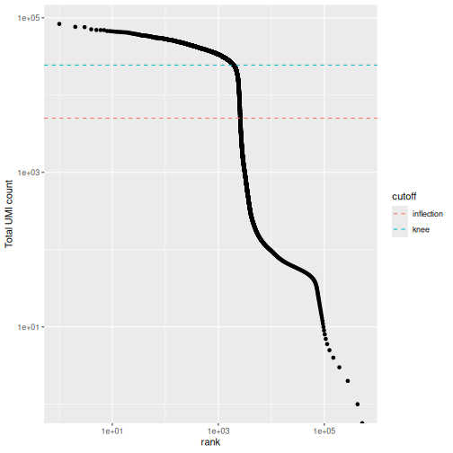

The distribution of total counts (called the unique molecular identifier or UMI count) exhibits a sharp transition between barcodes with large and small total counts, probably corresponding to cell-containing and empty droplets respectively. 

A simple approach would be to apply a threshold on the total count to only retain those barcodes with large totals. However, this may unnecessarily discard libraries derived from cell types with low RNA content.

:::: challenge 

What is the median number of total counts in the raw data?

::: solution


``` r
median(bcrank$total)
```

``` output
[1] 2
```

Just 2! Clearly many barcodes produce practically no output.

<!-- This is a direct application challenge of of  "It is likely that most of these droplets are empty and are capturing only ambient or background RNA" and a synthesis challenge of the previous episode where they learned to access columns of DataFrames. --> 
:::

::::

### Testing for empty droplets

A better approach is to test whether the expression profile for each cell barcode is significantly different from the ambient RNA pool[^1]. Any significant deviation indicates that the barcode corresponds to a cell-containing droplet. This allows us to discriminate between well-sequenced empty droplets and droplets derived from cells with little RNA, both of which would have similar total counts. 

We call cells at a false discovery rate (FDR) of 0.1%, meaning that no more than 0.1% of our called barcodes should be empty droplets on average.


``` r
# emptyDrops performs Monte Carlo simulations to compute p-values,
# so we need to set the seed to obtain reproducible results.
set.seed(100)

# this may take a few minutes
e.out <- emptyDrops(counts(sce))

summary(e.out$FDR <= 0.001)
```

``` output
   Mode   FALSE    TRUE     NAs 
logical    5919    3396  513239 
```

``` r
(sce <- sce[,which(e.out$FDR <= 0.001)])
```

``` output
class: SingleCellExperiment 
dim: 29453 3396 
metadata(0):
assays(1): counts
rownames(29453): ENSMUSG00000051951 ENSMUSG00000089699 ...
  ENSMUSG00000095742 tomato-td
rowData names(2): ENSEMBL SYMBOL
colnames(3396): AAACCTGAGACTGTAA AAACCTGAGATGCCTT ... TTTGTCACATTCTCAT
  TTTGTCATCTGAGTGT
colData names(0):
reducedDimNames(0):
mainExpName: NULL
altExpNames(0):
```

The result confirms our expectation: only 3396 droplets contain a cell, while the large majority of droplets are empty.

::::::::: spoiler

#### Setting the Random Seed

Whenever your code involves the generation of random numbers, it's a good practice to set the random seed in R with `set.seed()`. 

Setting the seed to a specific value (in the above example to 100) will cause the pseudo-random number generator to return the same pseudo-random numbers in the same order. 

This allows us to write code with reproducible results, despite technically involving the generation of (pseudo-)random numbers. 

:::::::::

## Quality control

While we have removed empty droplets, this does not necessarily imply that all the cell-containing droplets should be kept for downstream analysis.
In fact, some droplets could contain low-quality samples, due to cell damage or failure in library preparation.

Retaining these low-quality samples in the analysis could be problematic as they could:

- form their own cluster, complicating the interpretation of the results
- interfere with variance estimation and principal component analysis
- contain contaminating transcripts from ambient RNA

To mitigate these problems, we can check a few quality control (QC) metrics and, if needed, remove low-quality samples.

### Choice of quality control metrics

There are many possible ways to define a set of quality control metrics, see for instance [Cole 2019](learners/reference.md#litref). Here, we keep it simple and consider only:

- the _library size_, defined as the total sum of counts across all relevant features *for each cell*;
- the number of expressed features in each cell, defined as the number of endogenous genes with non-zero counts for that cell;
- the proportion of reads mapped to genes in the mitochondrial genome.

In particular, high proportions of mitochondrial genes are indicative of poor-quality cells, presumably because of loss of cytoplasmic RNA from perforated cells. The reasoning is that, in the presence of modest damage, the holes in the cell membrane permit efflux of individual transcript molecules but are too small to allow mitochondria to escape, leading to a relative enrichment of mitochondrial transcripts. For single-nucleus RNA-seq experiments, high proportions are also useful as they can mark cells where the cytoplasm has not been successfully stripped.

First, we need to identify mitochondrial genes. We use the available `EnsDb` mouse package available in Bioconductor, but a more updated version of Ensembl can be used through the `AnnotationHub` or `biomaRt` packages.


``` r
chr.loc <- mapIds(EnsDb.Mmusculus.v79,
                  keys    = rownames(sce),
                  keytype = "GENEID", 
                  column  = "SEQNAME")

is.mito <- which(chr.loc == "MT")
```

We can use the `scrapper` package to compute a set of quality control metrics, specifying that we want to use the mitochondrial genes as a special set of features.


``` r
qc_df <- computeRnaQcMetrics(counts(sce), 
                             subsets = list(mito = is.mito))

(colData(sce) <- cbind(colData(sce), qc_df))
```

``` output
DataFrame with 3396 rows and 3 columns
                       sum  detected     subsets
                 <numeric> <integer> <DataFrame>
AAACCTGAGACTGTAA     27577      5418   0.0170795
AAACCTGAGATGCCTT     29309      5405   0.0231669
AAACCTGAGCAGCCTC     28795      5218   0.0166696
AAACCTGCATACTCTT     34794      4781   0.0142553
AAACCTGGTGGTACAG       262       229   0.0000000
...                    ...       ...         ...
TTTGGTTTCGCCATAA     38398      6020  0.00656284
TTTGTCACACCCTATC      3013      1451  0.04082310
TTTGTCACACCGGAAA       820       157  0.79878049
TTTGTCACATTCTCAT      1472       675  0.40692935
TTTGTCATCTGAGTGT       267       233  0.05992509
```

Now that we have computed the metrics, we have to decide on thresholds to define high- and low-quality samples. We could check how many cells are above/below a certain fixed threshold. For instance,


``` r
table(qc_df$sum < 1e4)
```

``` output

FALSE  TRUE 
 2478   918 
```

``` r
table(qc_df$subsets$mito > .10)
```

``` output

FALSE  TRUE 
 2747   649 
```

or we could look at the distribution of such metrics and use a data adaptive threshold.


``` r
summary(qc_df$detected)
```

``` output
   Min. 1st Qu.  Median    Mean 3rd Qu.    Max. 
     45    2340    5074    4120    5628    7908 
```

``` r
summary(qc_df$subsets$mito)
```

``` output
   Min. 1st Qu.  Median    Mean 3rd Qu.    Max. 
0.00000 0.01206 0.01680 0.10062 0.02890 0.93368 
```

We can use the `perCellQCFilters` function to apply a set of common adaptive filters to identify low-quality cells. By default, we consider a value to be an outlier if it is more than 3 median absolute deviations (MADs) from the median in the "problematic" direction. This is loosely motivated by the fact that such a filter will retain 99% of non-outlier values that follow a normal distribution.


``` r
(thresh <- suggestRnaQcThresholds(qc_df))
```

``` output
$sum
[1] 5377.587

$detected
[1] 2725.544

$subsets
      mito 
0.04318437 
```

``` r
sce$keep <- filterRnaQcMetrics(thresh, qc_df)
```

:::: challenge

Maybe our sample preparation was poor and we want the QC to be more strict. How could we change the set the QC filtering to use 2.5 MADs as the threshold for outlier calling?

::: solution
You set `nmads = 2.5` like so:


``` r
thresh_strict <- suggestRnaQcThresholds(qc_df, num.mads = 2.5)
```

You would then need to reassign the `keep` column as well, but we'll stick with the 3 MADs default for now.

:::

::::

### Diagnostic plots

It is always a good idea to check the distribution of the QC metrics and to
visualize the cells that were removed, to identify possible problems with the
procedure. In particular, we expect to have few outliers and with a marked
difference from "regular" cells (e.g., a bimodal distribution or a long tail).
Moreover, if there are too many discarded cells, further exploration might be
needed.


``` r
plotColData(sce, y = "sum", colour_by = "keep") +
    labs(title = "Total count")
```

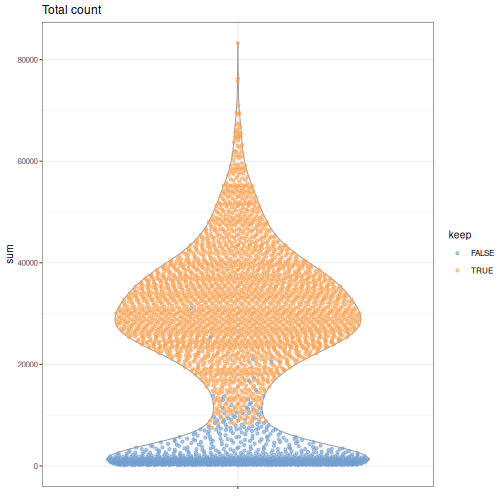

``` r
plotColData(sce, y = "detected", colour_by = "keep") + 
    labs(title = "Detected features")
```

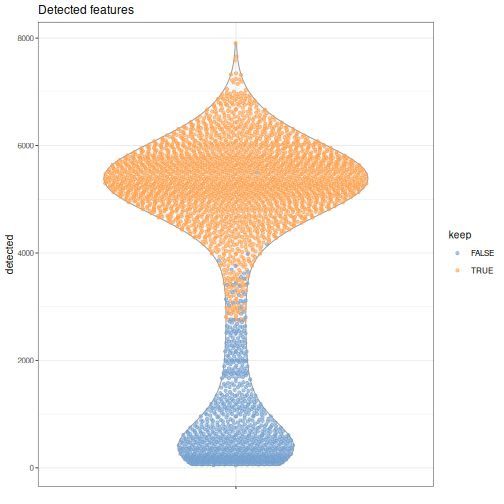

``` r
plotColData(sce, y = sce$subsets, colour_by = "keep") + 
    labs(title = "Mito percent")
```

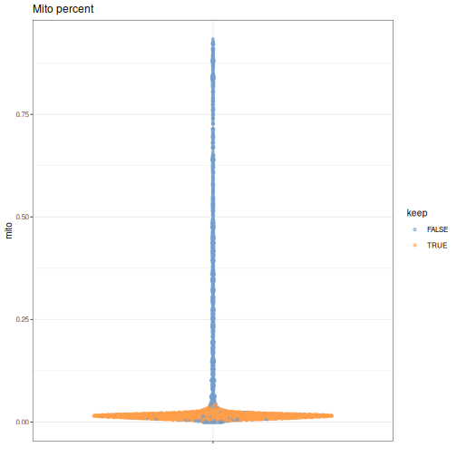

While the univariate distribution of QC metrics can give some insight on the quality of the sample, often looking at the bivariate distribution of QC metrics is useful, e.g., to confirm that there are no cells with both large total counts and large mitochondrial counts, to ensure that we are not inadvertently removing high-quality cells that happen to be highly metabolically active.


``` r
plotColData(sce,  x ="sum", y = sce$subsets, colour_by = "keep")
```

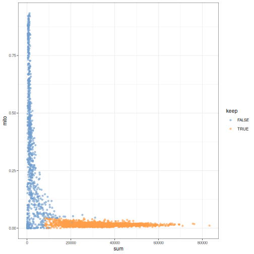

It could also be a good idea to perform a differential expression analysis between retained and discarded cells to check wether we are removing an unusual cell population rather than low-quality libraries (see [Section 1.5 of OSCA advanced](https://bioconductor.org/books/release/OSCA.advanced/quality-control-redux.html#qc-discard-cell-types)).

Once we are happy with the results, we can discard the low-quality cells by subsetting the original object.


``` r
(sce <- sce[,sce$keep])
```

``` output
class: SingleCellExperiment 
dim: 29453 2474 
metadata(0):
assays(1): counts
rownames(29453): ENSMUSG00000051951 ENSMUSG00000089699 ...
  ENSMUSG00000095742 tomato-td
rowData names(2): ENSEMBL SYMBOL
colnames(2474): AAACCTGAGACTGTAA AAACCTGAGATGCCTT ... TTTGGTTTCAGTCAGT
  TTTGGTTTCGCCATAA
colData names(4): sum detected subsets keep
reducedDimNames(0):
mainExpName: NULL
altExpNames(0):
```

## Normalization

Systematic differences in sequencing coverage between libraries are often
observed in single-cell RNA sequencing data. They typically arise from technical
differences in cDNA capture or PCR amplification efficiency across cells,
attributable to the difficulty of achieving consistent library preparation with
minimal starting material[^2]. Normalization aims to remove these differences
such that they do not interfere with comparisons of the expression profiles
between cells. The hope is that the observed heterogeneity or differential
expression within the cell population are driven by biology and not technical
biases.

We will mostly focus our attention on scaling normalization, which is the
simplest and most commonly used class of normalization strategies. This involves
dividing all counts for each cell by a cell-specific scaling factor, often
called a _size factor_. The assumption here is that any cell-specific bias
(e.g., in capture or amplification efficiency) affects all genes equally via
scaling of the expected mean count for that cell. The size factor for each cell
represents the estimate of the relative bias in that cell, so division of its
counts by its size factor should remove that bias. The resulting “normalized
expression values” can then be used for downstream analyses such as clustering
and dimensionality reduction.

The simplest and most natural strategy would be to normalize by the total sum of
counts across all genes for each cell. This is often called the _library size
normalization_.

The _library size factor_ for each cell is directly proportional to its library
size. These size factors are often scaled such that the mean size factor across
all cells is equal to 1. This ensures that the normalized expression values are
typically on the same scale as the original counts.


``` r
lib.sf <- centerSizeFactors(sce$sum)

summary(lib.sf)
```

``` output
   Min. 1st Qu.  Median    Mean 3rd Qu.    Max. 
 0.2323  0.7878  0.9631  1.0000  1.1806  2.5846 
```

``` r
sf_df <- data.frame(size_factor = lib.sf)

ggplot(sf_df, aes(size_factor)) + 
    geom_histogram() + 
    scale_x_log10()
```

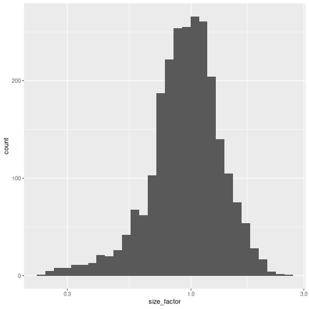

Now we can use the size factors to normalize the counts:


``` r
(sce <- normalizeRnaCounts.se(sce, size.factors = lib.sf))
```

``` output
class: SingleCellExperiment 
dim: 29453 2474 
metadata(0):
assays(2): counts logcounts
rownames(29453): ENSMUSG00000051951 ENSMUSG00000089699 ...
  ENSMUSG00000095742 tomato-td
rowData names(2): ENSEMBL SYMBOL
colnames(2474): AAACCTGAGACTGTAA AAACCTGAGATGCCTT ... TTTGGTTTCAGTCAGT
  TTTGGTTTCGCCATAA
colData names(5): sum detected subsets keep sizeFactor
reducedDimNames(0):
mainExpName: NULL
altExpNames(0):
```

There are more thoughtful ways to estimate cell-wise normalization factors (see `scuttle::pooledSizeFactors()`), but the broader single cell field has more or less decided to ignore normalization bias and use library size factors with a "meh, good enough" attitude. A statistically rigorous handling of this detail would require integrating over the uncertainty in the normalizing factor ([as is sometimes done for microbiome data](https://doi.org/10.1186/s13059-025-03609-3)), but this is generally regarded as too inexpedient for single-cell data. 

<!-- TODO: add a new challenge here to replace the old one -->

## Feature Selection

The typical next steps in the analysis of single-cell data are dimensionality reduction and clustering, which involve measuring the similarity between cells.

The choice of genes to use in this calculation has a major impact on the results. We want to select genes that contain useful information about the biology of the system while removing genes that contain only random noise. This aims to preserve interesting biological structure without the variance that obscures that structure, and to reduce the size of the data to improve computational efficiency of later steps.

### Quantifying per-gene variation

The simplest approach to feature selection is to select the most variable genes based on their log-normalized expression across the population. This is motivated by practical idea that if we're going to try to explain variation in gene expression by biological factors, those genes need to have variance to explain.

Calculation of the per-gene variance is simple but feature selection requires modeling of the mean-variance relationship. The log-transformation is not a variance stabilizing transformation in most cases, which means that the total variance of a gene is driven more by its abundance than its underlying biological heterogeneity. To account for this, the `modelGeneVar` function fits a trend to the variance with respect to abundance across all genes.


``` r
stats_df <- modelGeneVariances(logcounts(sce))$statistics

ggplot(stats_df, aes(means, variances)) + 
  geom_point(pch = 15, size = .4) + 
  geom_point(aes(y = fitted),
             color = "dodgerblue",
             size = .3) + 
    labs(x = "Mean of log-expression",
         y = "Variance of log-expression")
```

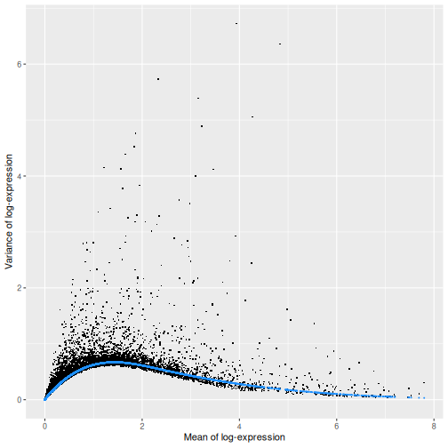

The blue line represents the uninteresting "technical" variance for any given gene abundance. The genes with a lot of additional variance exhibit interesting "biological" variation.

### Selecting highly variable genes

The next step is to identify HVGs to use in downstream analyses. A larger set will assure that we do not remove important genes, at the cost of potentially increasing noise. Typically, we restrict ourselves to the top $n$ genes, here we chose $n = 1000$, but this choice should be guided by prior biological knowledge; for instance, we may expect that only about 10% of genes to be differentially expressed across our cell populations and hence select 10% of genes as highly variable.

Here we use `chooseRnaHvgs.se()` to model the variances and add them to a column `hvg` on the SCE in one step:


``` r
sce <- chooseRnaHvgs.se(sce, top = 1000) 
# this calls modelGeneVariances internally

rowData(sce) |> head()
```

``` output
DataFrame with 6 rows and 7 columns
                              ENSEMBL      SYMBOL       means   variances
                          <character> <character>   <numeric>   <numeric>
ENSMUSG00000051951 ENSMUSG00000051951        Xkr4 0.002572569 0.002943073
ENSMUSG00000089699 ENSMUSG00000089699      Gm1992 0.000000000 0.000000000
ENSMUSG00000102343 ENSMUSG00000102343     Gm37381 0.000000000 0.000000000
ENSMUSG00000025900 ENSMUSG00000025900         Rp1 0.000797034 0.000873815
ENSMUSG00000025902 ENSMUSG00000025902       Sox17 0.171171833 0.384706077
ENSMUSG00000104328 ENSMUSG00000104328     Gm37323 0.000272068 0.000183127
                        fitted    residuals       hvg
                     <numeric>    <numeric> <logical>
ENSMUSG00000051951 0.003006277 -6.32040e-05     FALSE
ENSMUSG00000089699 0.000000000  0.00000e+00     FALSE
ENSMUSG00000102343 0.000000000  0.00000e+00     FALSE
ENSMUSG00000025900 0.000931406 -5.75911e-05     FALSE
ENSMUSG00000025902 0.170613259  2.14093e-01      TRUE
ENSMUSG00000104328 0.000317935 -1.34808e-04     FALSE
```

:::: challenge

<!-- TODO: update this challenge to chooseRnaHvgs.se -->

Imagine you have data that were prepared by three people with varying level of experience, which leads to varying technical noise. How can you account for this blocking structure when selecting HVGs?

::: hint

`modelGeneVariances()` can take a `block` argument. 

:::

::: solution
Use the `block` argument in the call to `modelGeneVariances()` like so. We don't have experimenter information in this dataset, so in order to have some names to work with we assign them randomly from a set of names.


``` r
sce$experimenter = factor(sample(c("Perry", "Merry", "Gary"),
                          replace = TRUE, 
                          size = ncol(sce)))

(blocked_variance_df = modelGeneVariances(logcounts(sce), 
                                         block = sce$experimenter))
```

Blocked models are evaluated on each block separately then combined. 
:::

:::

## Dimensionality Reduction

Many scRNA-seq analysis procedures involve comparing cells based on their expression values across multiple genes. For example, clustering aims to identify cells with similar transcriptomic profiles by computing Euclidean distances across genes. In these applications, each individual gene represents a dimension of the data, hence we can think of the data as "living" in a ten-thousand-dimensional space.

As the name suggests, dimensionality reduction aims to reduce the number of dimensions, while preserving as much as possible of the original information. This obviously reduces the computational work (e.g., it is easier to compute distance in lower-dimensional spaces), and more importantly leads to less noisy and more interpretable results (cf. the _curse of dimensionality_).

### Principal Component Analysis (PCA)

Principal component analysis (PCA) is a dimensionality reduction technique that provides a parsimonious summarization of the data by replacing the original variables (genes) by fewer linear combinations of these variables, that are orthogonal and have successively maximal variance. Such linear combinations seek to "separate out" the observations (cells), while losing as little information as possible.

Without getting into the details, one nice feature of PCA is that the principal components (PCs) are ordered by how much variance of the original data they "explain". Furthermore, by focusing on the top $k$ PC we are focusing on the most important directions of variability, which hopefully correspond to biological rather than technical variance. (It is however good practice to check this by e.g. looking at correlation between technical QC metrics and PCs).

One simple way to maximize our chance of capturing biological variation is by computing the PCs starting from the highly variable genes identified before. 


``` r
(sce <- runPca.se(sce, features = rowData(sce)$hvg))
```

``` output
class: SingleCellExperiment 
dim: 29453 2474 
metadata(1): PCA
assays(2): counts logcounts
rownames(29453): ENSMUSG00000051951 ENSMUSG00000089699 ...
  ENSMUSG00000095742 tomato-td
rowData names(7): ENSEMBL SYMBOL ... residuals hvg
colnames(2474): AAACCTGAGACTGTAA AAACCTGAGATGCCTT ... TTTGGTTTCAGTCAGT
  TTTGGTTTCGCCATAA
colData names(5): sum detected subsets keep sizeFactor
reducedDimNames(1): PCA
mainExpName: NULL
altExpNames(0):
```

By default, `runPca.se` computes the first 25 principal components. The metadata on the PCA is added to `metadata(sce)`. The PC embeddings are added to a `reducedDim()`. Let's make a graph of the percent variation explained:


``` r
pca_l <- metadata(sce)$PCA

pct_var_df <- data.frame(PC = 1:25,
                         pct_var = 100 * pca_l$variance.explained / 
                                         pca_l$total.variance)

ggplot(pct_var_df,
       aes(PC, pct_var)) + 
    geom_point() + 
    geom_segment(aes(xend = PC, yend = 0)) + 
    labs(y = "Variance explained (%)")
```

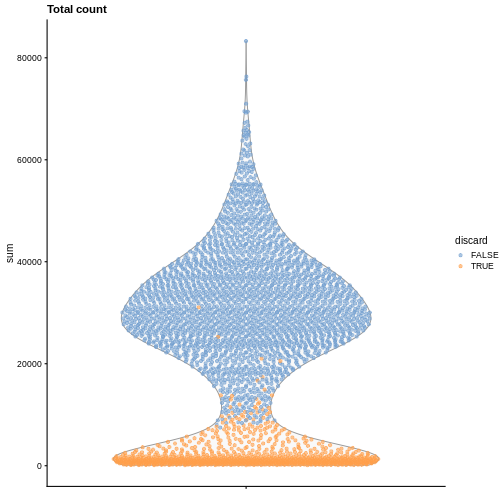

You can see the first two PCs capture the largest amount of variation, but in this case you have to take the first 8 PCs before you've captured 50% of the total.

And we can of course visualize the first 2-3 components, perhaps color-coding each point by an interesting feature, in this case the total number of UMIs per cell.


``` r
plotPCA(sce, colour_by = "sum")
```

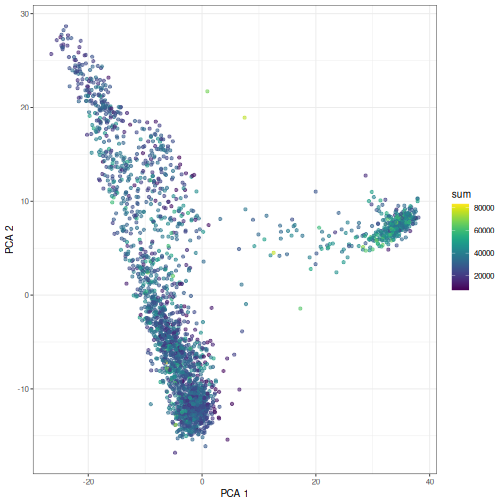

It can be helpful to compare pairs of PCs. This can be done with the `ncomponents` argument to `plotReducedDim()`. For example if one batch or cell type splits off on a particular PC, this can help visualize the effect of that.


``` r
plotReducedDim(sce, dimred = "PCA", ncomponents = 3)
```

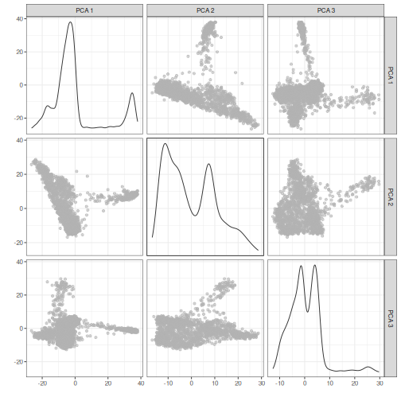

:::: challenge

Plot the first two PCs, coloring cells by `ENSMUSG00000055609`. That's the gene identifier for Hba-x, one of the HVGs.

::: solution

``` r
plotPCA(sce, colour_by = "ENSMUSG00000055609")
```

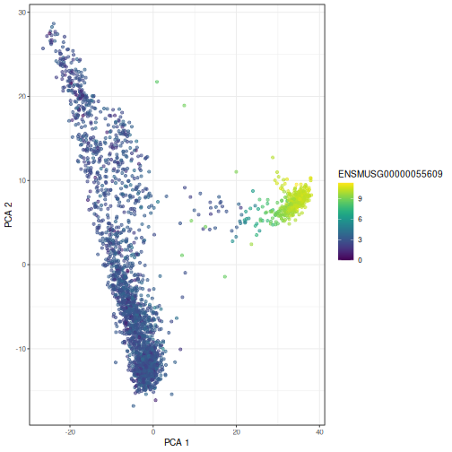

:::

::::

### Non-linear methods

While PCA is a simple and effective way to visualize (and interpret!) scRNA-seq data, non-linear methods such as t-SNE (_t-stochastic neighbor embedding_) and UMAP (_uniform manifold approximation and projection_) have gained much popularity in the literature.

These methods attempt to find a low-dimensional representation of the data that attempt to preserve pair-wise distance and structure in high-dimensional gene space as best as possible.

The commands to fit t-SNE coordinates and plot them are what you would expect:


``` r
set.seed(100)

sce <- runTsne.se(sce)

plotTSNE(sce)
```

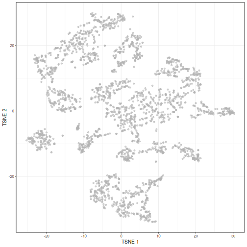

:::: challenge

Plot the TSNE coordinates, coloring cells by another HVG. 

::: solution

``` r
rowData(sce)[rowData(sce)$hvg,][1:3,] # pick your favorite 
```

``` output
DataFrame with 3 rows and 7 columns
                              ENSEMBL      SYMBOL     means variances    fitted
                          <character> <character> <numeric> <numeric> <numeric>
ENSMUSG00000025902 ENSMUSG00000025902       Sox17  0.171172  0.384706  0.170613
ENSMUSG00000061024 ENSMUSG00000061024        Rrs1  2.750415  0.746111  0.473188
ENSMUSG00000026147 ENSMUSG00000026147      Col9a1  0.363768  0.532111  0.329631
                   residuals       hvg
                   <numeric> <logical>
ENSMUSG00000025902  0.214093      TRUE
ENSMUSG00000061024  0.272922      TRUE
ENSMUSG00000026147  0.202480      TRUE
```

``` r
plotTSNE(sce, colour_by = "ENSMUSG00000025902") + 
  labs(title = "Sox17")
```

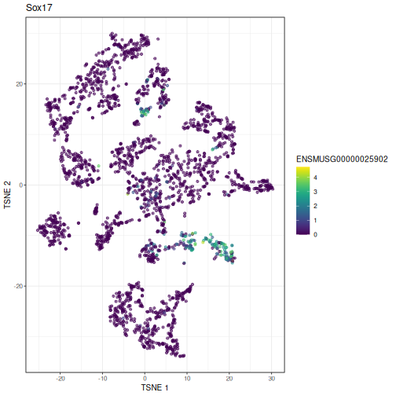
:::
::::

Fitting and plotting UMAP coordinates are similar:


``` r
set.seed(111)

sce <- runUmap.se(sce)

plotUMAP(sce)
```

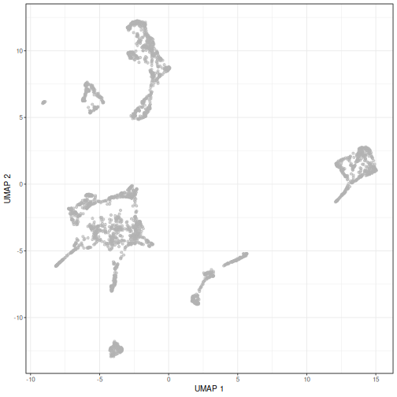

It is easy to over-interpret t-SNE and UMAP plots. We note that the relative sizes and positions of the visual clusters may be misleading, as they tend to inflate dense clusters and compress sparse ones, such that we cannot use the size as a measure of subpopulation heterogeneity. 

In addition, these methods are not guaranteed to preserve the global structure of the data (e.g., the relative locations of non-neighboring clusters), such that we cannot use their positions to determine relationships between distant clusters.

Note that the `sce` object now includes all the computed dimensionality reduced representations of the data for ease of reusing and replotting without the need for recomputing. Note the added `reducedDimNames` row when printing `sce` here:


``` r
sce
```

``` output
class: SingleCellExperiment 
dim: 29453 2474 
metadata(1): PCA
assays(2): counts logcounts
rownames(29453): ENSMUSG00000051951 ENSMUSG00000089699 ...
  ENSMUSG00000095742 tomato-td
rowData names(7): ENSEMBL SYMBOL ... residuals hvg
colnames(2474): AAACCTGAGACTGTAA AAACCTGAGATGCCTT ... TTTGGTTTCAGTCAGT
  TTTGGTTTCGCCATAA
colData names(5): sum detected subsets keep sizeFactor
reducedDimNames(3): PCA TSNE UMAP
mainExpName: NULL
altExpNames(0):
```

Despite their shortcomings, t-SNE and UMAP can be useful visualization techniques.
When using them, it is important to consider that they are stochastic methods that involve a random component (each run will lead to different plots) and that there are key parameters to be set that change the results substantially (e.g., the "perplexity" parameter of t-SNE).

:::: challenge

Re-run the UMAP for the same sample starting from the pre-processed data (i.e. not `type = "raw"`). What looks the same? What looks different?

::: solution


``` r
set.seed(111)

sce5 <- WTChimeraData(samples = 5) |> 
  normalizeRnaCounts.se() |> 
  chooseRnaHvgs.se() 

sce5 <- sce5 |> 
  runPca.se(features = rowData(sce5)$hvg) |> 
  runUmap.se()

plotUMAP(sce5)
```

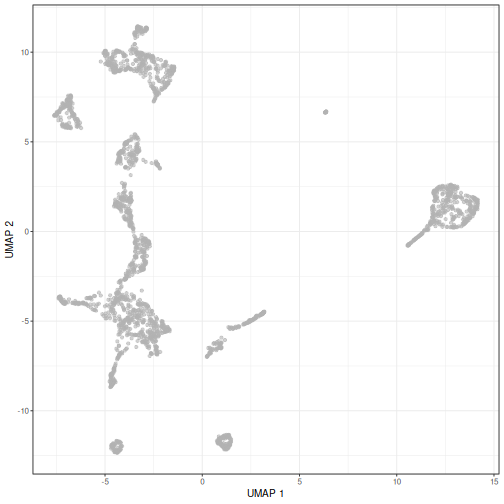

Given that it's the same cells processed through a very similar pipeline, the
result should look very similar. There's a slight difference in the total number
of cells, probably because the official processing pipeline didn't use the exact
same random seed / QC arguments as us. Note that we also skipped the
mitochondrial proportion filtering here  too.

But you'll notice that even though the shape of the structures are similar, they look slightly distorted. If the upstream QC parameters change, the downstream output visualizations will also change.

:::
::::

## Doublet identification

_Doublets_ are artifactual libraries generated from two cells. They typically arise due to errors in cell sorting or capture. Specifically, in droplet-based protocols, it may happen that two cells are captured in the same droplet. 

Doublets are obviously undesirable when the aim is to characterize populations at the single-cell level. In particular, doublets can be mistaken for intermediate populations or transitory states that do not actually exist. Thus, it is desirable to identify and remove doublet libraries so that they do not compromise interpretation of the results.

It is not easy to computationally identify doublets as they can be hard to distinguish from transient states and/or cell populations with high RNA content. When possible, it is good to rely on experimental strategies to minimize doublets, e.g., by using genetic variation (e.g., pooling multiple donors in one run) or antibody tagging (e.g., CITE-seq).

There are several computational methods to identify doublets; we describe only one here based on in-silico simulation of doublets.

### Computing doublet densities

At a high level, the algorithm can be defined by the following steps:

1. Simulate thousands of doublets by adding together two randomly chosen single-cell profiles.
2. For each original cell, compute the density of simulated doublets in the surrounding neighborhood.
3. For each original cell, compute the density of other observed cells in the neighborhood.
4. Return the ratio between the two densities as a "doublet score" for each cell.

Intuitively, if a "cell" is surrounded only by simulated doublets is very likely to be a doublet itself.

This approach is implemented below using the `scDblFinder` library. We then visualize the scores in a t-SNE plot. 


``` r
set.seed(100)

sce <- scDblFinder(sce)

plotTSNE(sce, colour_by = "scDblFinder.class")
```

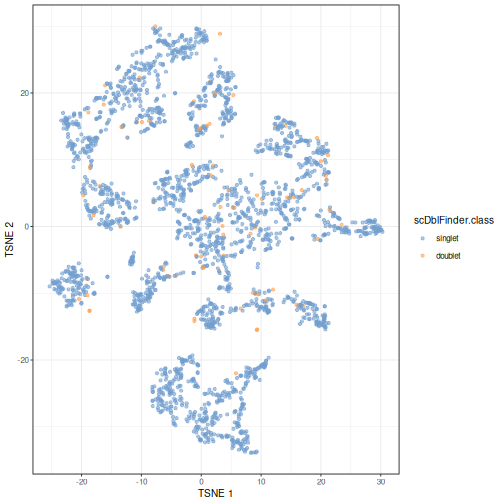

One way to determine whether a cell is in a real transient state or it is a doublet is to check the number of detected genes and total UMI counts.


``` r
plotColData(sce, "detected", "sum", colour_by = "scDblFinder.score")
```

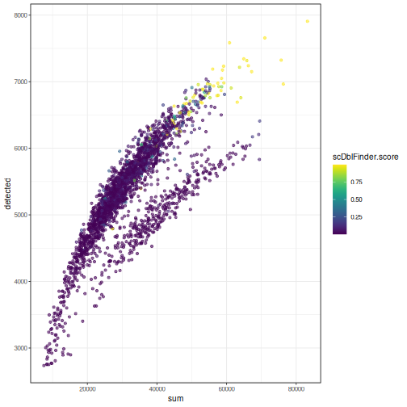

``` r
plotColData(sce, "detected", "sum", colour_by = "scDblFinder.class")
```

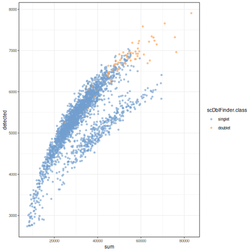

Discarding doublets is generally best in order to avoid biases in downstream analysis (e.g. differential expression).

## Exercises


:::::::::::::::::::::::::::::::::: challenge

#### Exercise 1: `analyze.se` 

Many of the functions in this lesson are part of a standard pipeline, and hence have 
been composed into one utility function `analyze.se()`. Read the steps that are and are not covered on the details section of the help page `?analyze.se`, then try running this function on sample 7 from the WTChimeraData. 

::: hint
`analyze.se()` doesn't do empty droplet detection.
:::

::: solution


``` r
sce2 <- WTChimeraData(samples = 7, type = "raw")
```

``` r
sce2 <- sce2[[1]]

e.out <- emptyDrops(counts(sce2))

sce2 <- sce2[,which(e.out$FDR <= 0.001)]

mito_list <- list(mito = grep("^mt-", rowData(sce2)$SYMBOL))

(res <- analyze.se(sce2, 
                   rna.qc.subsets = mito_list))
```

``` output
$x
class: SingleCellExperiment 
dim: 29453 2970 
metadata(2): qc PCA
assays(2): counts logcounts
rownames(29453): ENSMUSG00000051951 ENSMUSG00000089699 ...
  ENSMUSG00000095742 tomato-td
rowData names(7): ENSEMBL SYMBOL ... residuals hvg
colnames(2970): AAACCTGAGACAAGCC AAACCTGAGCGTGAGT ... TTTGTCAGTGACGCCT
  TTTGTCATCTGAAAGA
colData names(6): sum detected ... sizeFactor graph.cluster
reducedDimNames(3): PCA TSNE UMAP
mainExpName: NULL
altExpNames(0):

$markers
$markers$rna
List of length 14
names(14): 1 2 3 4 5 6 7 8 9 10 11 12 13 14
```

You can see it performs all the major steps in one function call. The empty droplet detection step isn't necessary on many modern datasets since it's commonly handled by upstream steps e.g. CellRanger. 

:::

:::::::::::::::::::::::::::::::::::::::::::::

:::::::::::::::::::::::::::::::::: challenge

#### Exercise 2: PBMC Data

The [`DropletTestFiles` package](https://www.bioconductor.org/packages/release/data/experiment/html/DropletTestFiles.html) includes the raw output from Cell Ranger of the peripheral blood mononuclear cell (PBMC) dataset from 10X Genomics, publicly available from the 10X Genomics website. Repeat the analysis of this vignette using those data. 

The hint demonstrates how to identify, download, extract, and read the data starting from the help documentation of `?DropletTestFiles::listTestFiles`, but try working through those steps on your own for extra challenge (they're useful skills to develop in practice).

::: hint


``` r
library(DropletTestFiles)

set.seed(100)

listTestFiles(dataset = "tenx-3.1.0-5k_pbmc_protein_v3") # look up the remote data path of the raw data

raw_rdatapath <- "DropletTestFiles/tenx-3.1.0-5k_pbmc_protein_v3/1.0.0/raw.tar.gz"

local_path <- getTestFile(raw_rdatapath, prefix = FALSE)

file.copy(local_path, 
          paste0(local_path, ".tar.gz"))

untar(paste0(local_path, ".tar.gz"),
      exdir = dirname(local_path))

sce <- read10xCounts(file.path(dirname(local_path), "raw_feature_bc_matrix/"))
```

:::

::: solution

After getting the data and running, we re-do many of the steps above in one step with the aforementioned `analyze.se()` function:


``` r
e.out <- emptyDrops(counts(sce))

sce <- sce[,which(e.out$FDR <= 0.001)]

mito_i <- grep("^MT-", rowData(sce)$Symbol)

res <- analyze.se(sce,
                  num.threads = 4,
                  rna.qc.subsets = list(mito = mito_i))

sce <- res[[1]]

sce <- scDblFinder(sce, 
                   processing = scrapper_proc)
```

:::

::::::::::::::::::::::::::::::::::

:::: challenge

#### Extension challenge 1: Spike-ins

Some sophisticated experiments perform additional steps so that they can estimate size factors from so-called "spike-ins". Judging by the name, what do you think "spike-ins" are, and what additional steps are required to use them?

::: solution

Spike-ins are deliberately-introduced exogeneous RNA from an exotic or synthetic source at a known concentration. This provides a known signal to normalize against. Exotic (e.g. soil bacteria RNA in a study of human cells) or synthetic RNA is used in order to avoid confusing spike-in RNA with sample RNA. This has the obvious advantage of accounting for cell-wise variation, but can substantially increase the amount of sample-preparation work.

:::

::::

:::: challenge

#### Extension challenge 2: Background research

Run an internet search for some of the most highly variable genes we identified in the feature selection section. See if you can identify the type of protein they produce or what sort of process they're involved in. Recall that these samples come from developing mouse embryoes. Do the genes in question make biological sense to you? 

::::

:::: challenge

#### Extension challenge 3: Reduced dimensionality representations

Can dimensionality reduction techniques provide a perfectly accurate representation of the data?

::: solution
No. Mathematically, this would require the data to fall on a two-dimensional plane (for linear methods like PCA) or a smooth 2D manifold (for methods like UMAP). You can be confident that this will never happen in real-world data, so the reduction from ~2500-dimensional gene space to two-dimensional plot space always involves some degree of information loss.
:::

::::

::::::::::::::::::::::::::::::::::::: keypoints 

- Empty droplets, i.e. droplets that do not contain intact cells and that capture only ambient or background RNA, should be removed prior to an analysis. The `emptyDrops` function from the [DropletUtils](https://bioconductor.org/packages/DropletUtils) package can be used to identify empty droplets. 
- Doublets, i.e. instances where two cells are captured in the same droplet, should also be removed prior to an analysis. The `scDblFinder()` function from the [scDblFinder](https://bioconductor.org/packages/scDblFinder) package can be used to identify doublets. 
- Quality control (QC) uses metrics such as library size, number of expressed features, and mitochondrial read proportion, based on which low-quality cells can be detected and filtered out. Diagnostic plots of the chosen QC metrics are important to identify possible issues. 
- Normalization is required to account for systematic differences in sequencing coverage between libraries and to make measurements comparable between cells. Library size normalization is the most commonly used normalization strategy, and involves dividing all counts for each cell by a cell-specific scaling factor.
- Feature selection aims at selecting genes that contain useful information about the biology of the system while removing genes that contain only random noise. Calculate per-gene variance with the `modelGeneVariances()` function and select highly-variable genes with `chooseRnaHvgs.se()`.
- Dimensionality reduction aims at reducing the computational work and at obtaining less noisy and more interpretable results. PCA is a simple and effective linear dimensionality reduction technique that provides interpretable results for further analysis such as clustering of cells. Non-linear approaches such as UMAP and t-SNE can be useful for visualization, but the resulting representations should not be used in downstream analysis.  

::::::::::::::::::::::::::::::::::::::::::::::::

:::::::::::::: checklist

## Further Reading

* OSCA book, Basics, [Chapters 1-4](https://bioconductor.org/books/release/OSCA.basic)
* OSCA book, Advanced, [Chapters 7-8](https://bioconductor.org/books/release/OSCA.advanced/)

:::::::::::::::


[^1]: [Lun (2019)](learners/reference.md#litref)
[^2]: [Vallejos (2017)](learners/reference.md#litref)
[^3]: [Lun (2016)](learners/reference.md#litref)

## Session Info


``` r
sessionInfo()
```

``` output
R version 4.6.1 (2026-06-24)
Platform: x86_64-pc-linux-gnu
Running under: Ubuntu 24.04.4 LTS

Matrix products: default
BLAS:   /usr/lib/x86_64-linux-gnu/openblas-pthread/libblas.so.3 
LAPACK: /usr/lib/x86_64-linux-gnu/openblas-pthread/libopenblasp-r0.3.26.so;  LAPACK version 3.12.0

locale:
 [1] LC_CTYPE=en_US.UTF-8       LC_NUMERIC=C              
 [3] LC_TIME=en_US.UTF-8        LC_COLLATE=en_US.UTF-8    
 [5] LC_MONETARY=en_US.UTF-8    LC_MESSAGES=en_US.UTF-8   
 [7] LC_PAPER=en_US.UTF-8       LC_NAME=C                 
 [9] LC_ADDRESS=C               LC_TELEPHONE=C            
[11] LC_MEASUREMENT=en_US.UTF-8 LC_IDENTIFICATION=C       

time zone: Etc/UTC
tzcode source: system (glibc)

attached base packages:
[1] stats4    stats     graphics  grDevices utils     datasets  methods  
[8] base     

other attached packages:
 [1] scDblFinder_1.26.7           scrapper_1.6.3              
 [3] scater_1.40.2                scuttle_1.22.0              
 [5] EnsDb.Mmusculus.v79_2.99.0   ensembldb_2.36.1            
 [7] AnnotationFilter_1.36.0      GenomicFeatures_1.64.0      
 [9] AnnotationDbi_1.74.0         ggplot2_4.0.3               
[11] DropletUtils_1.32.0          MouseGastrulationData_1.26.0
[13] SpatialExperiment_1.22.0     SingleCellExperiment_1.34.0 
[15] SummarizedExperiment_1.42.0  Biobase_2.72.0              
[17] GenomicRanges_1.64.0         Seqinfo_1.2.0               
[19] IRanges_2.46.0               S4Vectors_0.50.2            
[21] BiocGenerics_0.58.1          generics_0.1.4              
[23] MatrixGenerics_1.24.0        matrixStats_1.5.0           
[25] BiocStyle_2.40.0            

loaded via a namespace (and not attached):
  [1] RColorBrewer_1.1-3        jsonlite_2.0.0           
  [3] magrittr_2.0.5            ggbeeswarm_0.7.3         
  [5] magick_2.9.1              farver_2.1.2             
  [7] rmarkdown_2.31            BiocIO_1.22.0            
  [9] vctrs_0.7.3               memoise_2.0.1            
 [11] Rsamtools_2.28.0          DelayedMatrixStats_1.34.0
 [13] RCurl_1.98-1.20           htmltools_0.5.9          
 [15] S4Arrays_1.12.0           AnnotationHub_4.2.2      
 [17] curl_8.0.0                BiocNeighbors_2.6.0      
 [19] xgboost_3.2.1.1           Rhdf5lib_2.0.0           
 [21] SparseArray_1.12.2        rhdf5_2.56.0             
 [23] httr2_1.3.0               cachem_1.1.0             
 [25] GenomicAlignments_1.48.0  igraph_2.3.3             
 [27] lifecycle_1.0.5           pkgconfig_2.0.3          
 [29] rsvd_1.0.5                Matrix_1.7-6             
 [31] R6_2.6.1                  fastmap_1.2.0            
 [33] digest_0.6.39             dqrng_0.4.1              
 [35] irlba_2.3.7               ExperimentHub_3.2.2      
 [37] RSQLite_3.53.3            beachmat_2.28.0          
 [39] labeling_0.4.3            filelock_1.0.3           
 [41] httr_1.4.8                abind_1.4-8              
 [43] compiler_4.6.1            bit64_4.8.4              
 [45] withr_3.0.3               S7_0.2.2                 
 [47] BiocParallel_1.46.0       viridis_0.6.5            
 [49] DBI_1.3.0                 HDF5Array_1.40.0         
 [51] R.utils_2.13.0            MASS_7.3-65              
 [53] rappdirs_0.3.4            DelayedArray_0.38.2      
 [55] bluster_1.22.0            rjson_0.2.23             
 [57] tools_4.6.1               vipor_0.4.7              
 [59] otel_0.2.0                beeswarm_0.4.0           
 [61] R.oo_1.27.1               glue_1.8.1               
 [63] h5mread_1.4.1             restfulr_0.0.17          
 [65] rhdf5filters_1.24.1       grid_4.6.1               
 [67] cluster_2.1.8.3           gtable_0.3.6             
 [69] R.methodsS3_1.8.2         data.table_1.18.6.1      
 [71] metapod_1.20.0            BiocSingular_1.28.0      
 [73] ScaledMatrix_1.20.0       XVector_0.52.0           
 [75] ggrepel_0.9.8             BiocVersion_3.23.1       
 [77] pillar_1.11.1             limma_3.68.5             
 [79] BumpyMatrix_1.20.0        dplyr_1.2.1              
 [81] BiocFileCache_3.2.0       lattice_0.23-1           
 [83] renv_1.2.4                rtracklayer_1.72.0       
 [85] bit_4.6.0                 tidyselect_1.2.1         
 [87] locfit_1.5-9.12           Biostrings_2.80.1        
 [89] knitr_1.51                gridExtra_2.3.1          
 [91] ProtGenerics_1.44.0       edgeR_4.10.3             
 [93] xfun_0.60                 statmod_1.5.2            
 [95] UCSC.utils_1.8.0          lazyeval_0.2.3           
 [97] yaml_2.3.12               evaluate_1.0.5           
 [99] codetools_0.2-20          cigarillo_1.2.1          
[101] tibble_3.3.1              BiocManager_1.30.27      
[103] cli_3.6.6                 Rcpp_1.1.2               
[105] GenomeInfoDb_1.48.0       dbplyr_2.6.0             
[107] png_0.1-9                 XML_3.99-0.24            
[109] parallel_4.6.1            blob_1.3.0               
[111] scran_1.40.0              sparseMatrixStats_1.24.0 
[113] bitops_1.1-0              viridisLite_0.4.3        
[115] scales_1.4.0              purrr_1.2.2              
[117] crayon_1.5.3              rlang_1.3.0              
[119] formatR_1.14              KEGGREST_1.52.2          
```


