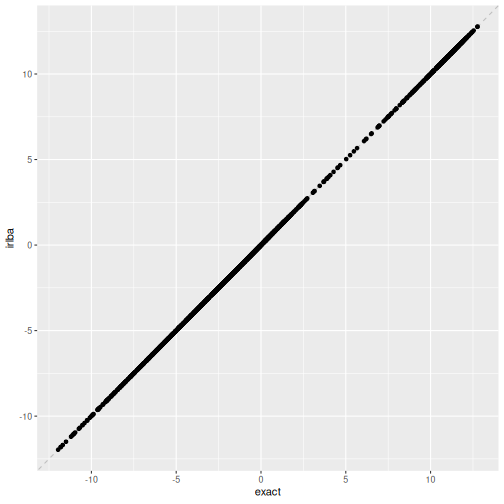
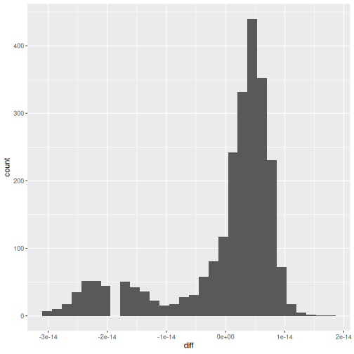

:::::::::::::::::::::::::::::::::::::: questions 

- How do we work with single-cell datasets that are too large to fit in memory?
- How do we speed up single-cell analysis workflows for large datasets?
- How do we convert between popular single-cell data formats?

::::::::::::::::::::::::::::::::::::::::::::::::

::::::::::::::::::::::::::::::::::::: objectives

- Work with out-of-memory data representations such as HDF5.
- Speed up single-cell analysis with parallel computation.
- Invoke fast approximations for essential analysis steps.
- Convert `SingleCellExperiment` objects to `SeuratObject`s and `AnnData` objects.

::::::::::::::::::::::::::::::::::::::::::::::::


## Motivation 

Advances in scRNA-seq technologies have increased the number of cells that can 
be assayed in routine experiments.
Public databases such as [GEO](https://www.ncbi.nlm.nih.gov/geo/) are continually
expanding with more scRNA-seq studies, 
while large-scale projects such as the
[Human Cell Atlas](https://www.humancellatlas.org/) are expected to generate
data for billions of cells.
For effective data analysis, the computational methods need to scale with the
increasing size of scRNA-seq data sets.
This section discusses how we can use various aspects of the Bioconductor 
ecosystem to tune our analysis pipelines for greater speed and efficiency.

## Out of memory representations

The count matrix is the central structure around which our analyses are based.
In most of the previous chapters, this has been held fully in memory as a dense 
`matrix` or as a sparse `dgCMatrix`.
Howevever, in-memory representations may not be feasible for very large data sets,
especially on machines with limited memory.
For example, the 1.3 million brain cell data set from 10X Genomics 
([Zheng et al., 2017](https://doi.org/10.1038/ncomms14049))
would require over 100 GB of RAM to hold as a `matrix` and around 30 GB as a `dgCMatrix`.
This makes it challenging to explore the data on anything less than a HPC system.

The obvious solution is to use a file-backed matrix representation where the
data are held on disk and subsets are retrieved into memory as requested. While
a number of implementations of file-backed matrices are available (e.g.,
[bigmemory](https://cran.r-project.org/web/packages/bigmemory/index.html),
[matter](https://bioconductor.org/packages/matter)), we will be using the
implementation from the [HDF5Array](https://bioconductor.org/packages/HDF5Array)
package. This uses the popular HDF5 format as the underlying data store, which
provides a measure of standardization and portability across systems. We
demonstrate with a subset of 20,000 cells from the 1.3 million brain cell data
set, as provided by the
[TENxBrainData](https://bioconductor.org/packages/TENxBrainData) package.


``` r
library(TENxBrainData)

sce.brain <- TENxBrainData20k() 
```

``` r
sce.brain
```

``` output
class: SingleCellExperiment 
dim: 27998 20000 
metadata(0):
assays(1): counts
rownames: NULL
rowData names(2): Ensembl Symbol
colnames: NULL
colData names(4): Barcode Sequence Library Mouse
reducedDimNames(0):
mainExpName: NULL
altExpNames(0):
```

Examination of the `SingleCellExperiment` object indicates that the count matrix
is a `HDF5Matrix`.
From a comparison of the memory usage, it is clear that this matrix object is
simply a stub that points to the much larger HDF5 file that actually contains
the data.
This avoids the need for large RAM availability during analyses.


``` r
counts(sce.brain)
```

``` output
<27998 x 20000> HDF5Matrix object of type "integer":
             [,1]     [,2]     [,3]     [,4] ... [,19997] [,19998] [,19999]
    [1,]        0        0        0        0   .        0        0        0
    [2,]        0        0        0        0   .        0        0        0
    [3,]        0        0        0        0   .        0        0        0
    [4,]        0        0        0        0   .        0        0        0
    [5,]        0        0        0        0   .        0        0        0
     ...        .        .        .        .   .        .        .        .
[27994,]        0        0        0        0   .        0        0        0
[27995,]        0        0        0        1   .        0        2        0
[27996,]        0        0        0        0   .        0        1        0
[27997,]        0        0        0        0   .        0        0        0
[27998,]        0        0        0        0   .        0        0        0
         [,20000]
    [1,]        0
    [2,]        0
    [3,]        0
    [4,]        0
    [5,]        0
     ...        .
[27994,]        0
[27995,]        0
[27996,]        0
[27997,]        0
[27998,]        0
```

``` r
object.size(counts(sce.brain))
```

``` output
2496 bytes
```

``` r
file.size(path(counts(sce.brain)))
```

``` output
[1] 76264332
```

Manipulation of the count matrix will generally result in the creation of a
`DelayedArray` object from the 
[DelayedArray](https://bioconductor.org/packages/DelayedArray) package.
This remembers the operations to be applied to the counts and stores them in
the object, to be executed when the modified matrix values are realized for use
in calculations.
The use of delayed operations avoids the need to write the modified values to a
new file at every operation, which would unnecessarily require time-consuming disk I/O.


``` r
tmp <- counts(sce.brain)

tmp <- log2(tmp + 1)

tmp
```

``` output
<27998 x 20000> DelayedMatrix object of type "double":
             [,1]     [,2]     [,3] ... [,19999] [,20000]
    [1,]        0        0        0   .        0        0
    [2,]        0        0        0   .        0        0
    [3,]        0        0        0   .        0        0
    [4,]        0        0        0   .        0        0
    [5,]        0        0        0   .        0        0
     ...        .        .        .   .        .        .
[27994,]        0        0        0   .        0        0
[27995,]        0        0        0   .        0        0
[27996,]        0        0        0   .        0        0
[27997,]        0        0        0   .        0        0
[27998,]        0        0        0   .        0        0
```

Many functions described in the previous workflows are capable of accepting 
`HDF5Matrix` objects.
This is powered by the availability of common methods for all matrix
representations (e.g., subsetting, combining, methods from 
[DelayedMatrixStats](https://bioconductor.org/packages/DelayedMatrixStats) 
as well as representation-agnostic C++ code 
using [beachmat](https://bioconductor.org/packages/beachmat).
For example, we compute QC metrics below with the same `computeRnaQcMetrics()` 
function that we used in the other workflows.


``` r
library(scrapper)

is.mito <- grepl("^mt-", rowData(sce.brain)$Symbol)

qcstats <- computeRnaQcMetrics(counts(sce.brain),
                               subsets = list(mito = is.mito))

qcstats
```

``` output
DataFrame with 20000 rows and 3 columns
            sum  detected     subsets
      <numeric> <integer> <DataFrame>
1          3060      1546   0.0401961
2          3500      1694   0.0337143
3          3092      1613   0.0187581
4          4420      2050   0.0296380
5          3771      1813   0.0265182
...         ...       ...         ...
19996      4431      2050  0.02866170
19997      6988      2704  0.00858615
19998      8749      2988  0.03486113
19999      3842      1711  0.03357626
20000      1775       945  0.01464789
```

Needless to say, data access from file-backed representations is slower than
that from in-memory representations. The time spent retrieving data from disk is
an unavoidable cost of reducing memory usage. Whether this is tolerable depends
on the application. One example usage pattern involves performing the heavy
computing quickly with in-memory representations on HPC systems with plentiful
memory, and then distributing file-backed counterparts to individual users for
exploration and visualization on their personal machines.

## Parallelization

Parallelization of calculations across genes or cells is an obvious strategy for
speeding up scRNA-seq analysis workflows.

Many packages/functions have built-in parallelization via arguments called
`num.threads`, `cores`, `Ncpus`, etc. or by allowing the user to set
`options("mc.cores")`. These arguments/settings are often the best and simplest
choice, so look for these first.

In the Bioconductor ecosystem, *[BiocParallel](https://bioconductor.org/packages/3.23/BiocParallel)* package provides a
common interface for parallel computing, usually presenting as a `BPPARAM`
argument in compatible functions. We can also use `BiocParallel` with more
expressive functions directly through the package's interface.

#### Basic use


``` r
library(BiocParallel)
```

`BiocParallel` makes it quite easy to iterate over a vector and distribute the
computation across workers using the `bplapply` function. Basic knowledge
of `lapply` is required.

In this example, we find the square root of a vector of numbers in parallel
by indicating the `BPPARAM` argument in `bplapply`.


``` r
param <- MulticoreParam(workers = 2)

bplapply(
    X = c(4, 9, 16, 25),
    FUN = sqrt,
    BPPARAM = param
)
```

``` output
[[1]]
[1] 2

[[2]]
[1] 3

[[3]]
[1] 4

[[4]]
[1] 5
```

Many Bioconductor functions have `BPPARAM` arguments. Whenever you see
that, you can set it to your preferred parameterization (`param` in the example
above) to enable parallelization.

Note that parallel execution with `MulticoreParam()` is not supported on Windows. See `?SnowParam()` as an alternative.

There exists a diverse set of parallelization backends depending on available
hardware and operating systems. Beyond parallelizing across cores/threads on the host machine, you can also submit jobs on a HPC job scheduler (e.g. Slurm) using the `BatchtoolsParam` class.
See [here](https://bioconductor.org/packages/3.23/BiocParallel/vignettes/BiocParallel_BatchtoolsParam.pdf) for
details.

Parallelization is best suited for independent, CPU-intensive tasks where the
division of labor results in a concomitant reduction in compute time. It is not
suited for tasks that are bounded by other compute resources, e.g., memory or
file I/O (though the latter is less of an issue on HPC systems with parallel
read/write). In particular, R itself is inherently single-core, so many of the
parallelization backends involve (i) setting up one or more separate R sessions,
(ii) loading the relevant packages and (iii) transmitting the data to that
session. Depending on the nature and size of the task, this overhead may
outweigh any benefit from parallel computing. While the default behavior of the
parallel job managers often works well for simple cases, it is sometimes
necessary to explicitly specify what data/libraries are sent to / loaded on the
parallel workers in order to avoid unnecessary overhead.

## Fast approximations

### Nearest neighbor searching

Identification of neighbouring cells in PC or expression space is a common procedure
that is used in many functions, e.g., `buildSnnGraph()` in `clusterGraph.se()`.
One can favour accuracy over speed by using an exact nearest neighbour
(NN) search, implemented with the $k$-means for $k$-nearest neighbours algorithm.
However, for large data sets, it may be preferable to use a faster approximate 
approach.

The *[BiocNeighbors](https://bioconductor.org/packages/3.23/BiocNeighbors)* framework makes it easy to switch between search
options by simply changing the `BNPARAM` argument in compatible functions.
To demonstrate, we will use the wild-type chimera data for which we had applied
graph-based clustering using the Louvain algorithm for community detection:


``` r
library(MouseGastrulationData)
library(BiocNeighbors)

sce <- WTChimeraData(samples = 5, type = "processed") |> 
  normalizeRnaCounts.se() |> 
  chooseRnaHvgs.se()

sce <- sce |> 
  runPca.se(features = rowData(sce)$hvg) 
```

For the sake of demonstration, we'll compare the cluster assignments with
approximate versus exact algorithms.


``` r
pc_mat <- reducedDim(sce, "PCA") |> t()

gr_apx <- buildSnnGraph(pc_mat) # defaults to AnnoyParam()
gr_ext <- buildSnnGraph(pc_mat, BNPARAM = KmknnParam())

cl_apx <- clusterGraph(gr_apx)
cl_ext <- clusterGraph(gr_ext)

table(cl_apx$membership, 
      cl_ext$membership)
```

``` output
    
       1   2   3   4   5   6   7   8   9  10  11  12  13  14  15  16  17
  1   89   0   0   0   0   0   0   0   0   0   0   0   0   0   0   0   0
  2    0  86   0   0   0   0   0   0   0   0   0   0   0   0   0   0   0
  3    0   1 126   0   0   0   0   0   0   0   0   0   1   0   0   0   0
  4    0   0   0 348   0   0   0   0   0   0   0   0   0   0   0   0   0
  5    1   0   0   0 222   0   0   0   0   2   0   1   0   0   0   0   0
  6    0   0   0   0   0 251   0   0   0   0   0   0   0   0   1   0   0
  7    0   0   0   0   0   1 134   0   0   0   0   0   0   0   0   0   0
  8    0   0   0   0   0   0   0  85   0   0   0   0   0   0   0   0   0
  9    0   0   0   0   0   0   0   0 108   0   0   0   0   0   0   0   0
  10   0   0   0   0   4   0   0   0   0 126   0   0   0   0   0   0   0
  11   0   0   0   0   0   0   0   0   0   8 135   0   0   0   0   1   0
  12   0   2   0   0   2   0   0   0   0   0   0 181   0   0   0   0   0
  13   0   0   0   0   0   0   0   0   0   2   0   0 183   0   0   0   0
  14   0   0   0   0   0   0   0   0   0   0   0   0   0  61   0   0   0
  15   0   0   0   0   0   1   0   0   0   2   0   0   0   0 150   0   0
  16  20   0   0   0   0   0   0   0   0   0   0   0   0   0   1   0   0
  17   0   0   0   0   0   0   0   0   0   0   0   0   0   0   0  25   0
  18   0   0   0   3   0   0   0   0   0   0   0   0   1   0   0   0  46
```

You can see that although they're pretty close, there's some disagreement.

### Singular value decomposition 

[Singular value decomposition](https://www.huber.embl.de/msmb/07-chap.html#singular-value-decomposition) (SVD) is the algorithm underlying PCA. The default `base::svd()`
function performs an exact SVD that is not performant for large datasets.

Under the hood, `scrapper` uses an algorithm called "Implicitly Restarted
Lanczos Bidiagonalization Algorithm" (IRLBA). This yields a fast and accurate
approximation for a set number of PC embeddings.

For the sake of demonstration, we'll compare `base::svd()` against `runPca()` on
the first 500 HVGs. We convert the log-counts to a standard dense matrix first


``` r
hvg_subset = rowData(sce)$hvg |> which() |> head(500)

input_mat <- logcounts(sce)[hvg_subset,] |>
  as.matrix() |> 
  scale(center = TRUE, scale = FALSE)

system.time({s1 <- svd(t(input_mat))})
```

``` output
   user  system elapsed 
  0.373   0.139   0.457 
```

``` r
system.time({i1 <- runPca(input_mat)})
```

``` output
   user  system elapsed 
  0.045   0.000   0.044 
```

Beyond IRLBA, another algorithm called randomized SVD (RSVD) goes further in the
"more speed, more approximation error" direction which can be beneficial for
larger datasets. See *[BiocSingular](https://bioconductor.org/packages/3.23/BiocSingular)* for more detail.

:::: challenge

The uncertainty from approximation error is sometimes aggravating. "How do I
know the approximation error isn't throwing me off?" One way to alleviate this
feeling is to quantify the approximation error on a small test set. Compare PC1
of the IRLBA and exact embeddings.

::: hint
While you can get the PC embeddings from the SVD results with some simple linear
algebra, you may find it easier to get them using the function `prcomp()` which
provides them pre-computed in a component called `x`.
:::

::: solution


``` r
library(ggplot2)

exact <- prcomp(t(input_mat))

test_diff <- i1$components[1,1] - exact$x[1,1]

if (test_diff > .1) {
  i1$components  <- -1 * i1$components
}

comp_df <- data.frame(
  exact = exact$x[,"PC1"],
  irlba = i1$components[1,]
)

comp_df$diff = comp_df$exact - comp_df$irlba

ggplot(comp_df, aes(exact, irlba)) + 
  geom_abline(lty = 2, color = 'grey') + 
  geom_point()
```



``` r
ggplot(comp_df, aes(diff)) + 
  geom_histogram()
```



Note that we check a test point of both results to see if they're close, and if
not multiply one set of embeddings by -1. This is because the signs of PC
embeddings are not uniquely identifiable in general, so different algorithms can
sometimes come with flipped signs.

You can see they're very close. 

:::

::::

## Interoperability with popular single-cell analysis ecosytems

### Seurat

[Seurat](https://satijalab.org/seurat) is an R package designed for QC, analysis,
and exploration of single-cell RNA-seq data. Seurat can be used to identify and
interpret sources of heterogeneity from single-cell transcriptomic measurements,
and to integrate diverse types of single-cell data. Seurat is developed and
maintained by the [Satija lab](https://satijalab.org/seurat/authors.html)
and is released under the [MIT license](https://opensource.org/license/mit/).

Although the basic processing of single-cell data with Bioconductor packages
(described in the [OSCA book](https://bioconductor.org/books/release/OSCA/)) and
with Seurat is very similar and will produce overall roughly identical results,
there is also complementary functionality with regard to cell type annotation,
dataset integration, and downstream analysis. To make the most of both
ecosystems it is therefore beneficial to be able to easily switch between a
`SeuratObject` and a `SingleCellExperiment`. See also the Seurat [conversion
vignette](https://satijalab.org/seurat/articles/conversion_vignette.html) for
conversion to/from other popular single cell formats such as the AnnData format
used by [scanpy](https://scanpy.readthedocs.io/en/stable/).

Seurat provides helper functions `as.SingleCellExperiment()` and `as.Seurat()`
to convert back and forth between SCEs and Seurat objects.

### Scanpy

[Scanpy](https://scanpy.readthedocs.io) is a scalable toolkit for analyzing
single-cell gene expression data built jointly with
[anndata](https://anndata.readthedocs.io/). It includes preprocessing,
visualization, clustering, trajectory inference and differential expression
testing. The Python-based implementation efficiently deals with datasets of more
than one million cells. Scanpy is developed and maintained by the [Theis lab]()
and is released under a [BSD-3-Clause
license](https://github.com/scverse/scanpy/blob/master/LICENSE). Scanpy is part
of the [scverse](https://scverse.org/), a Python-based ecosystem for single-cell
omics data analysis.

At the core of scanpy's single-cell functionality is the `anndata` data structure,
scanpy's integrated single-cell data container, which is conceptually very similar
to Bioconductor's `SingleCellExperiment` class.

Bioconductor's *[zellkonverter](https://bioconductor.org/packages/3.23/zellkonverter)* package provides a lightweight
interface between the Bioconductor `SingleCellExperiment` data structure and the
Python `AnnData`-based single-cell analysis environment. The idea is to enable
users and developers to easily move data between these frameworks to construct a
multi-language analysis pipeline across R/Bioconductor and Python.


``` r
library(zellkonverter)
```

The `readH5AD()` function can be used to read a `SingleCellExperiment` from an
H5AD file. Here, we use an example H5AD file contained in the  *[zellkonverter](https://bioconductor.org/packages/3.23/zellkonverter)*
package.


``` r
example_h5ad <- system.file("extdata", "krumsiek11.h5ad",
                            package = "zellkonverter")

readH5AD(example_h5ad, reader = "R")
```

``` output
class: SingleCellExperiment 
dim: 11 640 
metadata(2): highlights iroot
assays(1): X
rownames(11): Gata2 Gata1 ... EgrNab Gfi1
rowData names(0):
colnames(640): 0 1 ... 158-3 159-3
colData names(1): cell_type
reducedDimNames(0):
mainExpName: NULL
altExpNames(0):
```

We can also write a `SingleCellExperiment` to an H5AD file with the
`writeH5AD()` function. This is demonstrated below on the wild-type
chimera mouse gastrulation dataset. 


``` r
out.file <- tempfile(fileext = ".h5ad")

writeH5AD(sce, file = out.file)
```

``` output
Installing pyenv ...
Done! pyenv has been installed to '/github/home/.local/share/r-reticulate/pyenv/bin/pyenv'.
Using Python: /github/home/.pyenv/versions/3.14.0/bin/python3.14
Creating virtual environment '/github/home/.cache/R/basilisk/1.24.0/zellkonverter/1.22.0/zellkonverterAnnDataEnv-0.12.3' ... 
```

``` output
Done!
Installing packages: pip, wheel, setuptools
```

``` output
Installing packages: 'anndata==0.12.3', 'h5py==3.15.1', 'natsort==8.4.0', 'numpy==2.3.4', 'pandas==2.3.3', 'scipy==1.16.2'
```

``` output
Virtual environment '/github/home/.cache/R/basilisk/1.24.0/zellkonverter/1.22.0/zellkonverterAnnDataEnv-0.12.3' successfully created.
```

The resulting H5AD file can then be read into Python using scanpy's
[read_h5ad](https://scanpy.readthedocs.io/en/stable/generated/scanpy.read_h5ad.html)
function and then directly used in compatible Python-based analysis frameworks.

<!-- TODO: switch to anndataR? -->

## Exercises

:::::::::::::::::::::::::::::::::: challenge

#### Exercise 1: Out of memory representation

Write the counts matrix of one sample from the wild-type chimera mouse
gastrulation dataset to an HDF5 file. Create another counts matrix that reads
the data from the HDF5 file. Compare memory usage of holding the entire matrix
in memory as opposed to holding the data out of memory.

:::::::::::::: hint

See the `HDF5Array` function for reading from HDF5 and the `writeHDF5Array`
function for writing to HDF5 from the *[HDF5Array](https://bioconductor.org/packages/3.23/HDF5Array)* package.

:::::::::::::::::::::::

:::::::::::::: solution


``` r
wt_out <- tempfile(fileext = ".h5")

wt_counts <- counts(WTChimeraData(samples = 5))

writeHDF5Array(wt_counts,
               name = "wt_counts",
               file = wt_out)
```

``` output
<29453 x 2411> sparse HDF5Matrix object of type "double":
                    cell_9769  cell_9770  cell_9771 ... cell_12178 cell_12179
ENSMUSG00000051951          0          0          0   .          0          0
ENSMUSG00000089699          0          0          0   .          0          0
ENSMUSG00000102343          0          0          0   .          0          0
ENSMUSG00000025900          0          0          0   .          0          0
ENSMUSG00000025902          0          0          0   .          0          0
               ...          .          .          .   .          .          .
ENSMUSG00000095041          0          0          1   .          0          0
ENSMUSG00000063897          0          0          1   .          0          2
ENSMUSG00000096730          0          0          0   .          0          0
ENSMUSG00000095742          0          0          0   .          0          0
         tomato-td          1          1          1   .          0          1
```

``` r
oom_wt <- HDF5Array(wt_out, "wt_counts")

object.size(wt_counts)
```

``` output
157215216 bytes
```

``` r
object.size(oom_wt)
```

``` output
2488 bytes
```

:::::::::::::::::::::::

:::::::::::::::::::::::::::::::::::::::::::::

:::::::::::::::::::::::::::::::::: challenge

#### Exercise 2: Parallelization

Compare the runtime of `runPca()` when called with different numbers of threads
and compare the run time. Do you reach a limit where additional threads starts
to hurt performance?

:::::::::::::: solution


``` r
system.time({runPca(logcounts(sce))})

system.time({runPca(logcounts(sce), num.threads = 2)})

# Try others as your system allows
# system.time({runPca(logcounts(sce), num.threads = N)}) 
```

:::::::::::::::::::::::

:::::::::::::::::::::::::::::::::::::::::::::


:::::::::::::: checklist
## Further Reading

* OSCA book, [Chapter 14](https://bioconductor.org/books/release/OSCA.advanced/dealing-with-big-data.html): Dealing with big data 
* The `BiocParallel` [intro vignette](https://bioconductor.org/packages/3.23/BiocParallel/vignettes/Introduction_To_BiocParallel.html). 
* Modern Statistics for Modern Biology, [Ch. 7 Multivariate Analysis](https://www.huber.embl.de/msmb/07-chap.html)
::::::::::::::

::::::::::::::::::::::::::::::::::::: keypoints 

- Out-of-memory representations can be used to work with single-cell datasets that are too large to fit in memory.
- Parallelization of calculations across genes or cells is an effective strategy for speeding up analysis of large single-cell datasets.
- Fast approximations for nearest neighbor search and singular value composition can speed up essential steps of single-cell analysis with minimal loss of accuracy.
- Converter functions between existing single-cell data formats enable analysis workflows that leverage complementary functionality from poplular single-cell analysis ecosystems.

::::::::::::::::::::::::::::::::::::::::::::::::

## Session Info


``` r
sessionInfo()
```

``` output
R version 4.6.0 (2026-04-24)
Platform: x86_64-pc-linux-gnu
Running under: Ubuntu 24.04.4 LTS

Matrix products: default
BLAS:   /usr/lib/x86_64-linux-gnu/openblas-pthread/libblas.so.3 
LAPACK: /usr/lib/x86_64-linux-gnu/openblas-pthread/libopenblasp-r0.3.26.so;  LAPACK version 3.12.0

locale:
 [1] LC_CTYPE=en_US.UTF-8       LC_NUMERIC=C              
 [3] LC_TIME=en_US.UTF-8        LC_COLLATE=en_US.UTF-8    
 [5] LC_MONETARY=en_US.UTF-8    LC_MESSAGES=en_US.UTF-8   
 [7] LC_PAPER=en_US.UTF-8       LC_NAME=C                 
 [9] LC_ADDRESS=C               LC_TELEPHONE=C            
[11] LC_MEASUREMENT=en_US.UTF-8 LC_IDENTIFICATION=C       

time zone: Etc/UTC
tzcode source: system (glibc)

attached base packages:
[1] stats4    stats     graphics  grDevices utils     datasets  methods  
[8] base     

other attached packages:
 [1] zellkonverter_1.22.0         ggplot2_4.0.3               
 [3] BiocNeighbors_2.6.0          MouseGastrulationData_1.26.0
 [5] SpatialExperiment_1.22.0     BiocParallel_1.46.0         
 [7] scrapper_1.6.3               TENxBrainData_1.32.0        
 [9] HDF5Array_1.40.0             h5mread_1.4.0               
[11] rhdf5_2.56.0                 DelayedArray_0.38.2         
[13] SparseArray_1.12.2           S4Arrays_1.12.0             
[15] abind_1.4-8                  Matrix_1.7-6                
[17] SingleCellExperiment_1.34.0  SummarizedExperiment_1.42.0 
[19] Biobase_2.72.0               GenomicRanges_1.64.0        
[21] Seqinfo_1.2.0                IRanges_2.46.0              
[23] S4Vectors_0.50.1             BiocGenerics_0.58.1         
[25] generics_0.1.4               MatrixGenerics_1.24.0       
[27] matrixStats_1.5.0            BiocStyle_2.40.0            

loaded via a namespace (and not attached):
 [1] DBI_1.3.0            httr2_1.3.0          formatR_1.14        
 [4] rlang_1.3.0          magrittr_2.0.5       otel_0.2.0          
 [7] compiler_4.6.0       RSQLite_3.53.3       dir.expiry_1.20.0   
[10] png_0.1-9            vctrs_0.7.3          pkgconfig_2.0.3     
[13] crayon_1.5.3         fastmap_1.2.0        dbplyr_2.6.0        
[16] magick_2.9.1         XVector_0.52.0       labeling_0.4.3      
[19] rmarkdown_2.31       purrr_1.2.2          bit_4.6.0           
[22] xfun_0.60            cachem_1.1.0         beachmat_2.28.0     
[25] jsonlite_2.0.0       blob_1.3.0           rhdf5filters_1.24.1 
[28] Rhdf5lib_2.0.0       parallel_4.6.0       R6_2.6.1            
[31] RColorBrewer_1.1-3   reticulate_1.46.0    Rcpp_1.1.2          
[34] knitr_1.51           tidyselect_1.2.1     yaml_2.3.12         
[37] codetools_0.2-20     curl_7.1.0           lattice_0.22-9      
[40] tibble_3.3.1         withr_3.0.3          KEGGREST_1.52.2     
[43] BumpyMatrix_1.20.0   S7_0.2.2             evaluate_1.0.5      
[46] BiocFileCache_3.2.0  ExperimentHub_3.2.0  Biostrings_2.80.1   
[49] pillar_1.11.1        BiocManager_1.30.27  filelock_1.0.3      
[52] renv_1.2.4           BiocVersion_3.23.1   scales_1.4.0        
[55] glue_1.8.1           tools_4.6.0          AnnotationHub_4.2.2 
[58] grid_4.6.0           AnnotationDbi_1.74.0 basilisk_1.24.0     
[61] cli_3.6.6            rappdirs_0.3.4       dplyr_1.2.1         
[64] gtable_0.3.6         digest_0.6.39        rjson_0.2.23        
[67] farver_2.1.2         memoise_2.0.1        htmltools_0.5.9     
[70] lifecycle_1.0.5      httr_1.4.8           bit64_4.8.2         
```
