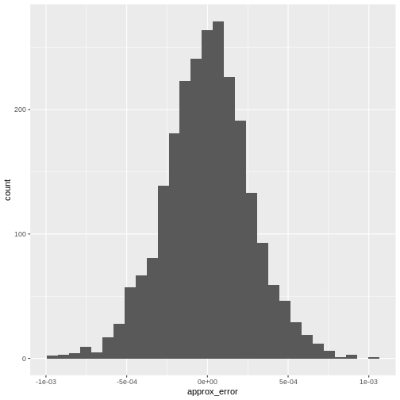

:::::::::::::::::::::::::::::::::::::: questions 

- How do we work with single-cell datasets that are too large to fit in memory?
- How do we speed up single-cell analysis workflows for large datasets?
- How do we convert between popular single-cell data formats?

::::::::::::::::::::::::::::::::::::::::::::::::

::::::::::::::::::::::::::::::::::::: objectives

- Work with out-of-memory data representations such as HDF5.
- Speed up single-cell analysis with parallel computation.
- Invoke fast approximations for essential analysis steps.
- Convert `SingleCellExperiment` objects to `SeuratObject`s and `AnnData` objects.

::::::::::::::::::::::::::::::::::::::::::::::::


## Motivation 

Advances in scRNA-seq technologies have increased the number of cells that can 
be assayed in routine experiments.
Public databases such as [GEO](https://www.ncbi.nlm.nih.gov/geo/) are continually
expanding with more scRNA-seq studies, 
while large-scale projects such as the
[Human Cell Atlas](https://www.humancellatlas.org/) are expected to generate
data for billions of cells.
For effective data analysis, the computational methods need to scale with the
increasing size of scRNA-seq data sets.
This section discusses how we can use various aspects of the Bioconductor 
ecosystem to tune our analysis pipelines for greater speed and efficiency.

## Out of memory representations

The count matrix is the central structure around which our analyses are based.
In most of the previous chapters, this has been held fully in memory as a dense 
`matrix` or as a sparse `dgCMatrix`.
Howevever, in-memory representations may not be feasible for very large data sets,
especially on machines with limited memory.
For example, the 1.3 million brain cell data set from 10X Genomics 
([Zheng et al., 2017](https://doi.org/10.1038/ncomms14049))
would require over 100 GB of RAM to hold as a `matrix` and around 30 GB as a `dgCMatrix`.
This makes it challenging to explore the data on anything less than a HPC system.

The obvious solution is to use a file-backed matrix representation where the
data are held on disk and subsets are retrieved into memory as requested. While
a number of implementations of file-backed matrices are available (e.g.,
[bigmemory](https://cran.r-project.org/web/packages/bigmemory/index.html),
[matter](https://bioconductor.org/packages/matter)), we will be using the
implementation from the [HDF5Array](https://bioconductor.org/packages/HDF5Array)
package. This uses the popular HDF5 format as the underlying data store, which
provides a measure of standardization and portability across systems. We
demonstrate with a subset of 20,000 cells from the 1.3 million brain cell data
set, as provided by the
[TENxBrainData](https://bioconductor.org/packages/TENxBrainData) package.


``` r
library(TENxBrainData)

sce.brain <- TENxBrainData20k() 
```

``` r
sce.brain
```

``` output
class: SingleCellExperiment 
dim: 27998 20000 
metadata(0):
assays(1): counts
rownames: NULL
rowData names(2): Ensembl Symbol
colnames: NULL
colData names(4): Barcode Sequence Library Mouse
reducedDimNames(0):
mainExpName: NULL
altExpNames(0):
```

Examination of the `SingleCellExperiment` object indicates that the count matrix
is a `HDF5Matrix`.
From a comparison of the memory usage, it is clear that this matrix object is
simply a stub that points to the much larger HDF5 file that actually contains
the data.
This avoids the need for large RAM availability during analyses.


``` r
counts(sce.brain)
```

``` output
<27998 x 20000> HDF5Matrix object of type "integer":
             [,1]     [,2]     [,3]     [,4] ... [,19997] [,19998] [,19999]
    [1,]        0        0        0        0   .        0        0        0
    [2,]        0        0        0        0   .        0        0        0
    [3,]        0        0        0        0   .        0        0        0
    [4,]        0        0        0        0   .        0        0        0
    [5,]        0        0        0        0   .        0        0        0
     ...        .        .        .        .   .        .        .        .
[27994,]        0        0        0        0   .        0        0        0
[27995,]        0        0        0        1   .        0        2        0
[27996,]        0        0        0        0   .        0        1        0
[27997,]        0        0        0        0   .        0        0        0
[27998,]        0        0        0        0   .        0        0        0
         [,20000]
    [1,]        0
    [2,]        0
    [3,]        0
    [4,]        0
    [5,]        0
     ...        .
[27994,]        0
[27995,]        0
[27996,]        0
[27997,]        0
[27998,]        0
```

``` r
object.size(counts(sce.brain))
```

``` output
2496 bytes
```

``` r
file.size(path(counts(sce.brain)))
```

``` output
[1] 76264332
```

Manipulation of the count matrix will generally result in the creation of a
`DelayedArray` object from the 
[DelayedArray](https://bioconductor.org/packages/DelayedArray) package.
This remembers the operations to be applied to the counts and stores them in
the object, to be executed when the modified matrix values are realized for use
in calculations.
The use of delayed operations avoids the need to write the modified values to a
new file at every operation, which would unnecessarily require time-consuming disk I/O.


``` r
tmp <- counts(sce.brain)

tmp <- log2(tmp + 1)

tmp
```

``` output
<27998 x 20000> DelayedMatrix object of type "double":
             [,1]     [,2]     [,3] ... [,19999] [,20000]
    [1,]        0        0        0   .        0        0
    [2,]        0        0        0   .        0        0
    [3,]        0        0        0   .        0        0
    [4,]        0        0        0   .        0        0
    [5,]        0        0        0   .        0        0
     ...        .        .        .   .        .        .
[27994,]        0        0        0   .        0        0
[27995,]        0        0        0   .        0        0
[27996,]        0        0        0   .        0        0
[27997,]        0        0        0   .        0        0
[27998,]        0        0        0   .        0        0
```

Many functions described in the previous workflows are capable of accepting 
`HDF5Matrix` objects.
This is powered by the availability of common methods for all matrix
representations (e.g., subsetting, combining, methods from 
[DelayedMatrixStats](https://bioconductor.org/packages/DelayedMatrixStats) 
as well as representation-agnostic C++ code 
using [beachmat](https://bioconductor.org/packages/beachmat).
For example, we compute QC metrics below with the same `calculateQCMetrics()` 
function that we used in the other workflows.


``` r
library(scater)

is.mito <- grepl("^mt-", rowData(sce.brain)$Symbol)

qcstats <- perCellQCMetrics(sce.brain, subsets = list(Mt = is.mito))

qcstats
```

``` output
DataFrame with 20000 rows and 6 columns
            sum  detected subsets_Mt_sum subsets_Mt_detected subsets_Mt_percent
      <numeric> <numeric>      <numeric>           <numeric>          <numeric>
1          3060      1546            123                  10            4.01961
2          3500      1694            118                  11            3.37143
3          3092      1613             58                   9            1.87581
4          4420      2050            131                  10            2.96380
5          3771      1813            100                   8            2.65182
...         ...       ...            ...                 ...                ...
19996      4431      2050            127                   9           2.866170
19997      6988      2704             60                   9           0.858615
19998      8749      2988            305                  11           3.486113
19999      3842      1711            129                   8           3.357626
20000      1775       945             26                   6           1.464789
          total
      <numeric>
1          3060
2          3500
3          3092
4          4420
5          3771
...         ...
19996      4431
19997      6988
19998      8749
19999      3842
20000      1775
```

Needless to say, data access from file-backed representations is slower than
that from in-memory representations. The time spent retrieving data from disk is
an unavoidable cost of reducing memory usage. Whether this is tolerable depends
on the application. One example usage pattern involves performing the heavy
computing quickly with in-memory representations on HPC systems with plentiful
memory, and then distributing file-backed counterparts to individual users for
exploration and visualization on their personal machines.

## Parallelization

Parallelization of calculations across genes or cells is an obvious strategy for
speeding up scRNA-seq analysis workflows.

The *[BiocParallel](https://bioconductor.org/packages/3.22/BiocParallel)* package provides a common interface for parallel
computing throughout the Bioconductor ecosystem, manifesting as a `BPPARAM`
argument in compatible functions. We can also use `BiocParallel` with more
expressive functions directly through the package's interface.

#### Basic use


``` r
library(BiocParallel)
```

`BiocParallel` makes it quite easy to iterate over a vector and distribute the
computation across workers using the `bplapply` function. Basic knowledge
of `lapply` is required.

In this example, we find the square root of a vector of numbers in parallel
by indicating the `BPPARAM` argument in `bplapply`.


``` r
param <- MulticoreParam(workers = 2)

bplapply(
    X = c(4, 9, 16, 25),
    FUN = sqrt,
    BPPARAM = param
)
```

``` output
[[1]]
[1] 2

[[2]]
[1] 3

[[3]]
[1] 4

[[4]]
[1] 5
```

A couple notes on this:

* The number of workers is explicitly set to 1 in this example due to the limited resources used to render the online material. 
* Parallel execution with `MulticoreParam()` is not supported on Windows. See `?SnowParam()` as an alternative.

There exists a diverse set of parallelization backends depending on available
hardware and operating systems.

For example, we might use forking across two cores to parallelize the variance
calculations on a Unix system:


``` r
library(MouseGastrulationData)

library(scran)

sce <- WTChimeraData(samples = 5, type = "processed")

sce <- logNormCounts(sce)

dec.mc <- modelGeneVar(sce, BPPARAM = MulticoreParam(2))

dec.mc
```

``` output
DataFrame with 29453 rows and 6 columns
                          mean       total        tech         bio     p.value
                     <numeric>   <numeric>   <numeric>   <numeric>   <numeric>
ENSMUSG00000051951 0.002800256 0.003504940 0.002856697 6.48243e-04 1.20905e-01
ENSMUSG00000089699 0.000000000 0.000000000 0.000000000 0.00000e+00         NaN
ENSMUSG00000102343 0.000000000 0.000000000 0.000000000 0.00000e+00         NaN
ENSMUSG00000025900 0.000794995 0.000863633 0.000811019 5.26143e-05 3.68953e-01
ENSMUSG00000025902 0.170777718 0.388633677 0.170891603 2.17742e-01 2.47893e-11
...                        ...         ...         ...         ...         ...
ENSMUSG00000095041  0.35571083  0.34572194  0.33640994  0.00931199    0.443233
ENSMUSG00000063897  0.49007956  0.41924282  0.44078158 -0.02153876    0.599499
ENSMUSG00000096730  0.00000000  0.00000000  0.00000000  0.00000000         NaN
ENSMUSG00000095742  0.00177158  0.00211619  0.00180729  0.00030890    0.188992
tomato-td           0.57257331  0.47487832  0.49719425 -0.02231593    0.591542
                           FDR
                     <numeric>
ENSMUSG00000051951 6.76255e-01
ENSMUSG00000089699         NaN
ENSMUSG00000102343         NaN
ENSMUSG00000025900 7.56202e-01
ENSMUSG00000025902 1.35508e-09
...                        ...
ENSMUSG00000095041    0.756202
ENSMUSG00000063897    0.756202
ENSMUSG00000096730         NaN
ENSMUSG00000095742    0.756202
tomato-td             0.756202
```

Another approach would be to distribute jobs across a network of computers,
which yields the same result:


``` r
dec.snow <- modelGeneVar(sce, BPPARAM = SnowParam(2))
```

For high-performance computing (HPC) systems with a cluster of compute nodes, 
we can distribute jobs via the job scheduler using the `BatchtoolsParam` class.
The example below assumes a SLURM cluster, though the settings can be easily 
configured for a particular system 
(see [here](https://bioconductor.org/packages/3.22/BiocParallel/vignettes/BiocParallel_BatchtoolsParam.pdf) for
details).


``` r
# 2 hours, 8 GB, 1 CPU per task, for 10 tasks.
rs <- list(walltime = 7200, memory = 8000, ncpus = 1)

bpp <- BatchtoolsParam(10, cluster = "slurm", resources = rs)
```

Parallelization is best suited for independent, CPU-intensive tasks where the
division of labor results in a concomitant reduction in compute time. It is not
suited for tasks that are bounded by other compute resources, e.g., memory or
file I/O (though the latter is less of an issue on HPC systems with parallel
read/write). In particular, R itself is inherently single-core, so many of the
parallelization backends involve (i) setting up one or more separate R sessions,
(ii) loading the relevant packages and (iii) transmitting the data to that
session. Depending on the nature and size of the task, this overhead may
outweigh any benefit from parallel computing. While the default behavior of the
parallel job managers often works well for simple cases, it is sometimes
necessary to explicitly specify what data/libraries are sent to / loaded on the
parallel workers in order to avoid unnecessary overhead.

:::: challenge

How do you turn on progress bars with parallel processing?

::: solution

From `?MulticoreParam` : 

> `progressbar` logical(1) Enable progress bar (based on plyr:::progress_text). Enabling the progress bar changes the default value of tasks to .Machine$integer.max, so that progress is reported for each element of X.

Progress bars are a helpful way to gauge whether that task is going to take 5 minutes or 5 hours.

:::

::::

## Fast approximations

### Nearest neighbor searching

Identification of neighbouring cells in PC or expression space is a common procedure
that is used in many functions, e.g., `buildSNNGraph()`, `doubletCells()`.
The default is to favour accuracy over speed by using an exact nearest neighbour
(NN) search, implemented with the $k$-means for $k$-nearest neighbours algorithm.
However, for large data sets, it may be preferable to use a faster approximate 
approach.

The *[BiocNeighbors](https://bioconductor.org/packages/3.22/BiocNeighbors)* framework makes it easy to switch between search
options by simply changing the `BNPARAM` argument in compatible functions.
To demonstrate, we will use the wild-type chimera data for which we had applied
graph-based clustering using the Louvain algorithm for community detection:


``` r
library(bluster)

sce <- runPCA(sce)

colLabels(sce) <- clusterCells(sce, use.dimred = "PCA",
                               BLUSPARAM = NNGraphParam(cluster.fun = "louvain"))
```

The above clusters on a nearest neighbor graph generated with an exact neighbour
search. We repeat this below using an approximate search, implemented using the
[Annoy](https://github.com/spotify/Annoy) algorithm. This involves constructing
a `AnnoyParam` object to specify the search algorithm and then passing it to the
parameterization of the `NNGraphParam()` function. The results from the exact
and approximate searches are consistent with most clusters from the former
re-appearing in the latter. This suggests that the inaccuracy from the
approximation can be largely ignored.


``` r
library(scran)

library(BiocNeighbors)

clusters <- clusterCells(sce, use.dimred = "PCA",
                         BLUSPARAM = NNGraphParam(cluster.fun = "louvain",
                                                  BNPARAM = AnnoyParam()))

table(exact = colLabels(sce), approx = clusters)
```

``` output
     approx
exact   1   2   3   4   5   6   7   8   9  10  11  12  13  14  15
   1   88   0   0   0   1   0   0   0   2   0   0   0   0   0   0
   2    0 143   0   0   0   0   0   0   0   0   0   0   0   0   1
   3    0   0  75   0   3   0   0   0   0   0   0   0   0   0   0
   4    0   0   0 341   0   0   0   0   0   0   0   0   0   0  56
   5    0   0   0   0 391   0   0   0   0   1   0   1   0   0   0
   6    0   0   0   0   0  81 245   0   0   1   0   2   0   0   0
   7    0   0   0   0   0 128   0   0   0   0   0   0   0   0   0
   8    0   0   0   0   1   0   0  95   0   0   0   0   0   0   0
   9    1   0   0   0   1   0   0   0 106   0   0   0   0   0   0
   10   0   0   0   0   0   0   0   0   0 105   0   8   0   0   0
   11   0   0   0   0   0   1   0   0   0   5 142   0   6   0   0
   12   0   0   0   0   1   0   0   0   0   0   0 213   0   0   0
   13   0   0   0   0   0   0   0   0   0   0   0   0 146   0   0
   14   0   0   0   0   0   0   0   0   0   0   0   0   0  20   0
```

The similarity of the two clusterings can be quantified by calculating the pairwise Rand index: 


``` r
rand <- pairwiseRand(colLabels(sce), clusters, mode = "index")

stopifnot(rand > 0.8)
```

Note that Annoy writes the NN index to disk prior to
performing the search. Thus, it may not actually be faster
than the default exact algorithm for small datasets,
depending on whether the overhead of disk write is offset by
the computational complexity of the search. It is also not
difficult to find situations where the approximation
deteriorates, especially when the number of features exceeds
the number of data points, though this may not have an
appreciable impact on the biological conclusions.


``` r
set.seed(1000)

Y <- matrix(rnorm(3000*1000), ncol = 1000)

exact <- findKNN(Y, k = 20)

approx <- findKNN(Y, k = 20, BNPARAM = AnnoyParam())

mean(exact$index != approx$index)
```

``` output
[1] 0.9344167
```

You can see that in this contrived 1000-dimensional dataset, the approximate method didn't frequently get the same result as the exact method.

<!-- TODO: contrive a better example. They usually have close to the same neighbor sets, just in a different order -->

### Singular value decomposition 

The singular value decomposition (SVD) underlies the PCA used throughout our
analyses, e.g., in `denoisePCA()`, `fastMNN()`, `doubletCells()`. (Briefly, the
right singular vectors are the eigenvectors of the gene-gene covariance matrix,
where each eigenvector represents the axis of maximum remaining variation in the
PCA.) The default `base::svd()` function performs an exact SVD that is not
performant for large datasets. Instead, we use fast approximate methods from the
*[irlba](https://CRAN.R-project.org/package=irlba)* and *[rsvd](https://CRAN.R-project.org/package=rsvd)* packages, conveniently wrapped into
the *[BiocSingular](https://bioconductor.org/packages/3.22/BiocSingular)* package for ease of use and package development.
Specifically, we can change the SVD algorithm used in any of these functions by
simply specifying an alternative value for the `BSPARAM` argument.


``` r
library(scater)
library(BiocSingular)

# As the name suggests, it is random, so we need to set the seed.
set.seed(101000)

r.out <- runPCA(sce, ncomponents = 20, BSPARAM = RandomParam())

str(reducedDim(r.out, "PCA"))
```

``` output
 num [1:2411, 1:20] 14.79 5.79 13.07 -32.19 -26.45 ...
 - attr(*, "dimnames")=List of 2
  ..$ : chr [1:2411] "cell_9769" "cell_9770" "cell_9771" "cell_9772" ...
  ..$ : chr [1:20] "PC1" "PC2" "PC3" "PC4" ...
 - attr(*, "varExplained")= num [1:20] 192.6 87 29.4 23.1 21.6 ...
 - attr(*, "percentVar")= num [1:20] 25.84 11.67 3.94 3.1 2.89 ...
 - attr(*, "rotation")= num [1:500, 1:20] -0.174 -0.173 -0.157 0.105 -0.132 ...
  ..- attr(*, "dimnames")=List of 2
  .. ..$ : chr [1:500] "ENSMUSG00000055609" "ENSMUSG00000052217" "ENSMUSG00000069919" "ENSMUSG00000048583" ...
  .. ..$ : chr [1:20] "PC1" "PC2" "PC3" "PC4" ...
```

``` r
set.seed(101001)

i.out <- runPCA(sce, ncomponents = 20, BSPARAM = IrlbaParam())

str(reducedDim(i.out, "PCA"))
```

``` output
 num [1:2411, 1:20] -14.79 -5.79 -13.07 32.19 26.45 ...
 - attr(*, "dimnames")=List of 2
  ..$ : chr [1:2411] "cell_9769" "cell_9770" "cell_9771" "cell_9772" ...
  ..$ : chr [1:20] "PC1" "PC2" "PC3" "PC4" ...
 - attr(*, "varExplained")= num [1:20] 192.6 87 29.4 23.1 21.6 ...
 - attr(*, "percentVar")= num [1:20] 25.84 11.67 3.94 3.1 2.89 ...
 - attr(*, "rotation")= num [1:500, 1:20] 0.174 0.173 0.157 -0.105 0.132 ...
  ..- attr(*, "dimnames")=List of 2
  .. ..$ : chr [1:500] "ENSMUSG00000055609" "ENSMUSG00000052217" "ENSMUSG00000069919" "ENSMUSG00000048583" ...
  .. ..$ : chr [1:20] "PC1" "PC2" "PC3" "PC4" ...
```

Both IRLBA and randomized SVD (RSVD) are much faster than the exact SVD and
usually yield only a negligible loss of accuracy. This motivates their default
use in many *[scran](https://bioconductor.org/packages/3.22/scran)* and *[scater](https://bioconductor.org/packages/3.22/scater)* functions, at the
cost of requiring users to set the seed to guarantee reproducibility. IRLBA can
occasionally fail to converge and require more iterations (passed via `maxit=`
in `IrlbaParam()`), while RSVD involves an explicit trade-off between accuracy
and speed based on its oversampling parameter (`p=`) and number of power
iterations (`q=`). We tend to prefer IRLBA as its default behavior is more
accurate, though RSVD is much faster for file-backed matrices.

:::: challenge

The uncertainty from approximation error is sometimes aggravating. "Why can't my
computer just give me the right answer?" One way to alleviate this feeling is to
quantify the approximation error on a small test set like the sce we have here.
Using the `ExactParam()` class, visualize the error in PC1 coordinates compared
to the RSVD results.

::: solution
This code block calculates the exact PCA coordinates. Another thing to note: PC vectors are only identified up to a sign flip. We can see that the RSVD PC1 vector points in the 

``` r
set.seed(123)

e.out <- runPCA(sce, ncomponents = 20, BSPARAM = ExactParam())

str(reducedDim(e.out, "PCA"))
```

``` output
 num [1:2411, 1:20] -14.79 -5.79 -13.07 32.19 26.45 ...
 - attr(*, "dimnames")=List of 2
  ..$ : chr [1:2411] "cell_9769" "cell_9770" "cell_9771" "cell_9772" ...
  ..$ : chr [1:20] "PC1" "PC2" "PC3" "PC4" ...
 - attr(*, "varExplained")= num [1:20] 192.6 87 29.4 23.1 21.6 ...
 - attr(*, "percentVar")= num [1:20] 25.84 11.67 3.94 3.1 2.89 ...
 - attr(*, "rotation")= num [1:500, 1:20] 0.174 0.173 0.157 -0.105 0.132 ...
  ..- attr(*, "dimnames")=List of 2
  .. ..$ : chr [1:500] "ENSMUSG00000055609" "ENSMUSG00000052217" "ENSMUSG00000069919" "ENSMUSG00000048583" ...
  .. ..$ : chr [1:20] "PC1" "PC2" "PC3" "PC4" ...
```

``` r
reducedDim(e.out, "PCA")[1:5,1:3]
```

``` output
                 PC1       PC2        PC3
cell_9769 -14.793684 18.470324 -0.4893474
cell_9770  -5.789032 13.347277  5.0560761
cell_9771 -13.066503 16.803152 -0.5602737
cell_9772  32.185950  6.697517 -0.6945423
cell_9773  26.452390  3.083474 -0.2271916
```

``` r
reducedDim(r.out, "PCA")[1:5,1:3]
```

``` output
                 PC1       PC2        PC3
cell_9769  14.793780 18.470111 -0.4888676
cell_9770   5.789148 13.348438  5.0702153
cell_9771  13.066327 16.803423 -0.5562241
cell_9772 -32.186341  6.698347 -0.6892421
cell_9773 -26.452373  3.083974 -0.2299814
```

For the sake of visualizing the error we can just flip the PC1 coordinates:


``` r
reducedDim(r.out, "PCA") = -1 * reducedDim(r.out, "PCA")
```

From there we can visualize the error with a histogram:


``` r
error <- reducedDim(r.out, "PCA")[,"PC1"] - 
         reducedDim(e.out, "PCA")[,"PC1"]

data.frame(approx_error = error) |> 
  ggplot(aes(approx_error)) + 
  geom_histogram()
```



It's almost never more than .001 in this case. 

:::

::::

## Interoperability with popular single-cell analysis ecosytems

### Seurat

[Seurat](https://satijalab.org/seurat) is an R package designed for QC, analysis,
and exploration of single-cell RNA-seq data. Seurat can be used to identify and
interpret sources of heterogeneity from single-cell transcriptomic measurements,
and to integrate diverse types of single-cell data. Seurat is developed and
maintained by the [Satija lab](https://satijalab.org/seurat/authors.html)
and is released under the [MIT license](https://opensource.org/license/mit/).


``` r
library(Seurat)
```

Although the basic processing of single-cell data with Bioconductor packages
(described in the [OSCA book](https://bioconductor.org/books/release/OSCA/)) and
with Seurat is very similar and will produce overall roughly identical results,
there is also complementary functionality with regard to cell type annotation,
dataset integration, and downstream analysis. To make the most of both
ecosystems it is therefore beneficial to be able to easily switch between a
`SeuratObject` and a `SingleCellExperiment`. See also the Seurat [conversion
vignette](https://satijalab.org/seurat/articles/conversion_vignette.html) for
conversion to/from other popular single cell formats such as the AnnData format
used by [scanpy](https://scanpy.readthedocs.io/en/stable/).

Here, we demonstrate converting the Seurat object produced in Seurat's
[PBMC tutorial](https://satijalab.org/seurat/articles/pbmc3k_tutorial.html)
to a `SingleCellExperiment` for further analysis with functionality from
OSCA/Bioconductor.
We therefore need to first install the 
[SeuratData](https://github.com/satijalab/seurat-data) package, which is available
from GitHub only. 


``` r
BiocManager::install("satijalab/seurat-data")
```

We then proceed by loading all required packages and installing the PBMC dataset:


``` r
library(SeuratData)

InstallData("pbmc3k")
```

We then load the dataset as an `SeuratObject` and convert it to a 
`SingleCellExperiment`.


``` r
# Use PBMC3K from SeuratData
pbmc <- LoadData(ds = "pbmc3k", type = "pbmc3k.final")

pbmc <- UpdateSeuratObject(pbmc)

pbmc

pbmc.sce <- as.SingleCellExperiment(pbmc)

pbmc.sce
```

Seurat also allows conversion from `SingleCellExperiment` objects to Seurat objects; 
we demonstrate this here on the wild-type chimera mouse gastrulation dataset. 


``` r
sce <- WTChimeraData(samples = 5, type = "processed")

assay(sce) <- as.matrix(assay(sce))

sce <- logNormCounts(sce)

sce
```

After some processing of the dataset, the actual conversion is carried out with
the `as.Seurat` function.


``` r
sobj <- as.Seurat(sce)

Idents(sobj) <- "celltype.mapped"

sobj
```

### Scanpy

[Scanpy](https://scanpy.readthedocs.io) is a scalable toolkit for analyzing
single-cell gene expression data built jointly with
[anndata](https://anndata.readthedocs.io/). It includes preprocessing,
visualization, clustering, trajectory inference and differential expression
testing. The Python-based implementation efficiently deals with datasets of more
than one million cells. Scanpy is developed and maintained by the [Theis lab]()
and is released under a [BSD-3-Clause
license](https://github.com/scverse/scanpy/blob/master/LICENSE). Scanpy is part
of the [scverse](https://scverse.org/), a Python-based ecosystem for single-cell
omics data analysis.

At the core of scanpy's single-cell functionality is the `anndata` data structure,
scanpy's integrated single-cell data container, which is conceptually very similar
to Bioconductor's `SingleCellExperiment` class.

Bioconductor's *[zellkonverter](https://bioconductor.org/packages/3.22/zellkonverter)* package provides a lightweight
interface between the Bioconductor `SingleCellExperiment` data structure and the
Python `AnnData`-based single-cell analysis environment. The idea is to enable
users and developers to easily move data between these frameworks to construct a
multi-language analysis pipeline across R/Bioconductor and Python.


``` r
library(zellkonverter)
```

The `readH5AD()` function can be used to read a `SingleCellExperiment` from an
H5AD file. Here, we use an example H5AD file contained in the  *[zellkonverter](https://bioconductor.org/packages/3.22/zellkonverter)*
package.


``` r
example_h5ad <- system.file("extdata", "krumsiek11.h5ad",
                            package = "zellkonverter")

readH5AD(example_h5ad)
```

``` output
Installing pyenv ...
Done! pyenv has been installed to '/home/runner/.local/share/r-reticulate/pyenv/bin/pyenv'.
Using Python: /home/runner/.pyenv/versions/3.14.0/bin/python3.14
Creating virtual environment '/home/runner/.cache/R/basilisk/1.22.0/zellkonverter/1.20.0/zellkonverterAnnDataEnv-0.12.3' ... 
```

``` output
Done!
Installing packages: pip, wheel, setuptools
```

``` output
Installing packages: 'anndata==0.12.3', 'h5py==3.15.1', 'natsort==8.4.0', 'numpy==2.3.4', 'pandas==2.3.3', 'scipy==1.16.2'
```

``` output
Virtual environment '/home/runner/.cache/R/basilisk/1.22.0/zellkonverter/1.20.0/zellkonverterAnnDataEnv-0.12.3' successfully created.
```

``` output
class: SingleCellExperiment 
dim: 11 640 
metadata(2): highlights iroot
assays(1): X
rownames(11): Gata2 Gata1 ... EgrNab Gfi1
rowData names(0):
colnames(640): 0 1 ... 158-3 159-3
colData names(1): cell_type
reducedDimNames(0):
mainExpName: NULL
altExpNames(0):
```

We can also write a `SingleCellExperiment` to an H5AD file with the
`writeH5AD()` function. This is demonstrated below on the wild-type
chimera mouse gastrulation dataset. 


``` r
out.file <- tempfile(fileext = ".h5ad")

writeH5AD(sce, file = out.file)
```

The resulting H5AD file can then be read into Python using scanpy's
[read_h5ad](https://scanpy.readthedocs.io/en/stable/generated/scanpy.read_h5ad.html)
function and then directly used in compatible Python-based analysis frameworks.


## Exercises

:::::::::::::::::::::::::::::::::: challenge

#### Exercise 1: Out of memory representation

Write the counts matrix of the wild-type chimera mouse gastrulation dataset to
an HDF5 file. Create another counts matrix that reads the data from the HDF5
file. Compare memory usage of holding the entire matrix in memory as opposed to
holding the data out of memory.

:::::::::::::: hint

See the `HDF5Array` function for reading from HDF5 and the `writeHDF5Array`
function for writing to HDF5 from the *[HDF5Array](https://bioconductor.org/packages/3.22/HDF5Array)* package.

:::::::::::::::::::::::

:::::::::::::: solution


``` r
wt_out <- tempfile(fileext = ".h5")

wt_counts <- counts(WTChimeraData())
```

``` r
writeHDF5Array(wt_counts,
               name = "wt_counts",
               file = wt_out)
```

``` output
<29453 x 30703> sparse HDF5Matrix object of type "double":
                       cell_1     cell_2     cell_3 ... cell_30702 cell_30703
ENSMUSG00000051951          0          0          0   .          0          0
ENSMUSG00000089699          0          0          0   .          0          0
ENSMUSG00000102343          0          0          0   .          0          0
ENSMUSG00000025900          0          0          0   .          0          0
ENSMUSG00000025902          0          0          0   .          0          0
               ...          .          .          .   .          .          .
ENSMUSG00000095041          0          1          2   .          0          0
ENSMUSG00000063897          0          0          0   .          0          0
ENSMUSG00000096730          0          0          0   .          0          0
ENSMUSG00000095742          0          0          0   .          0          0
         tomato-td          1          0          1   .          0          0
```

``` r
oom_wt <- HDF5Array(wt_out, "wt_counts")

object.size(wt_counts)
```

``` output
1520366960 bytes
```

``` r
object.size(oom_wt)
```

``` output
2488 bytes
```

:::::::::::::::::::::::

:::::::::::::::::::::::::::::::::::::::::::::

:::::::::::::::::::::::::::::::::: challenge

#### Exercise 2: Parallelization

Perform a PCA analysis of the  wild-type chimera mouse gastrulation
dataset using a multicore backend for parallel computation. Compare the runtime
of performing the PCA either in serial execution mode, in multicore execution
mode with 2 workers, and in multicore execution mode with 3 workers.

:::::::::::::: hint

Use the function `system.time` to obtain the runtime of each job.

:::::::::::::::::::::::

:::::::::::::: solution


``` r
sce.brain <- logNormCounts(sce.brain)

system.time({i.out <- runPCA(sce.brain, 
                             ncomponents = 20, 
                             BSPARAM = ExactParam(),
                             BPPARAM = SerialParam())})

system.time({i.out <- runPCA(sce.brain, 
                             ncomponents = 20, 
                             BSPARAM = ExactParam(),
                             BPPARAM = MulticoreParam(workers = 2))})

system.time({i.out <- runPCA(sce.brain, 
                             ncomponents = 20, 
                             BSPARAM = ExactParam(),
                             BPPARAM = MulticoreParam(workers = 3))})
```

:::::::::::::::::::::::

:::::::::::::::::::::::::::::::::::::::::::::


:::::::::::::: checklist
## Further Reading

* OSCA book, [Chapter 14](https://bioconductor.org/books/release/OSCA.advanced/dealing-with-big-data.html): Dealing with big data 
* The `BiocParallel` [intro vignette](https://bioconductor.org/packages/3.22/BiocParallel/vignettes/Introduction_To_BiocParallel.html). 
::::::::::::::

::::::::::::::::::::::::::::::::::::: keypoints 

- Out-of-memory representations can be used to work with single-cell datasets that are too large to fit in memory.
- Parallelization of calculations across genes or cells is an effective strategy for speeding up analysis of large single-cell datasets.
- Fast approximations for nearest neighbor search and singular value composition can speed up essential steps of single-cell analysis with minimal loss of accuracy.
- Converter functions between existing single-cell data formats enable analysis workflows that leverage complementary functionality from poplular single-cell analysis ecosystems.

::::::::::::::::::::::::::::::::::::::::::::::::

## Session Info


``` r
sessionInfo()
```

``` output
R version 4.5.2 (2025-10-31)
Platform: x86_64-pc-linux-gnu
Running under: Ubuntu 22.04.5 LTS

Matrix products: default
BLAS:   /usr/lib/x86_64-linux-gnu/blas/libblas.so.3.10.0 
LAPACK: /usr/lib/x86_64-linux-gnu/lapack/liblapack.so.3.10.0  LAPACK version 3.10.0

locale:
 [1] LC_CTYPE=C.UTF-8       LC_NUMERIC=C           LC_TIME=C.UTF-8       
 [4] LC_COLLATE=C.UTF-8     LC_MONETARY=C.UTF-8    LC_MESSAGES=C.UTF-8   
 [7] LC_PAPER=C.UTF-8       LC_NAME=C              LC_ADDRESS=C          
[10] LC_TELEPHONE=C         LC_MEASUREMENT=C.UTF-8 LC_IDENTIFICATION=C   

time zone: UTC
tzcode source: system (glibc)

attached base packages:
[1] stats4    stats     graphics  grDevices utils     datasets  methods  
[8] base     

other attached packages:
 [1] zellkonverter_1.20.0         Seurat_5.4.0                
 [3] SeuratObject_5.3.0           sp_2.2-0                    
 [5] BiocSingular_1.26.1          BiocNeighbors_2.4.0         
 [7] bluster_1.20.0               scran_1.38.0                
 [9] MouseGastrulationData_1.24.0 SpatialExperiment_1.20.0    
[11] BiocParallel_1.44.0          scater_1.38.0               
[13] ggplot2_4.0.1                scuttle_1.20.0              
[15] TENxBrainData_1.30.0         HDF5Array_1.38.0            
[17] h5mread_1.2.1                rhdf5_2.54.1                
[19] DelayedArray_0.36.0          SparseArray_1.10.7          
[21] S4Arrays_1.10.1              abind_1.4-8                 
[23] Matrix_1.7-4                 SingleCellExperiment_1.32.0 
[25] SummarizedExperiment_1.40.0  Biobase_2.70.0              
[27] GenomicRanges_1.62.1         Seqinfo_1.0.0               
[29] IRanges_2.44.0               S4Vectors_0.48.0            
[31] BiocGenerics_0.56.0          generics_0.1.4              
[33] MatrixGenerics_1.22.0        matrixStats_1.5.0           
[35] BiocStyle_2.38.0            

loaded via a namespace (and not attached):
  [1] RcppAnnoy_0.0.22       splines_4.5.2          later_1.4.4           
  [4] filelock_1.0.3         tibble_3.3.0           polyclip_1.10-7       
  [7] fastDummies_1.7.5      lifecycle_1.0.4        httr2_1.2.2           
 [10] edgeR_4.8.1            globals_0.18.0         lattice_0.22-7        
 [13] MASS_7.3-65            magrittr_2.0.4         plotly_4.11.0         
 [16] limma_3.66.0           rmarkdown_2.30         yaml_2.3.12           
 [19] metapod_1.18.0         httpuv_1.6.16          otel_0.2.0            
 [22] sctransform_0.4.2      spam_2.11-1            spatstat.sparse_3.1-0 
 [25] reticulate_1.44.1      cowplot_1.2.0          pbapply_1.7-4         
 [28] DBI_1.2.3              RColorBrewer_1.1-3     Rtsne_0.17            
 [31] purrr_1.2.0            BumpyMatrix_1.18.0     rappdirs_0.3.3        
 [34] ggrepel_0.9.6          irlba_2.3.5.1          spatstat.utils_3.2-0  
 [37] listenv_0.10.0         goftest_1.2-3          RSpectra_0.16-2       
 [40] spatstat.random_3.4-3  dqrng_0.4.1            fitdistrplus_1.2-4    
 [43] parallelly_1.46.0      codetools_0.2-20       tidyselect_1.2.1      
 [46] farver_2.1.2           ScaledMatrix_1.18.0    viridis_0.6.5         
 [49] spatstat.explore_3.6-0 BiocFileCache_3.0.0    jsonlite_2.0.0        
 [52] progressr_0.18.0       ggridges_0.5.7         survival_3.8-3        
 [55] tools_4.5.2            ica_1.0-3              Rcpp_1.1.0            
 [58] glue_1.8.0             gridExtra_2.3          xfun_0.55             
 [61] dplyr_1.1.4            withr_3.0.2            formatR_1.14          
 [64] BiocManager_1.30.27    fastmap_1.2.0          basilisk_1.22.0       
 [67] rhdf5filters_1.22.0    digest_0.6.39          rsvd_1.0.5            
 [70] R6_2.6.1               mime_0.13              scattermore_1.2       
 [73] tensor_1.5.1           spatstat.data_3.1-9    RSQLite_2.4.5         
 [76] tidyr_1.3.1            data.table_1.17.8      renv_1.1.5            
 [79] htmlwidgets_1.6.4      httr_1.4.7             uwot_0.2.4            
 [82] pkgconfig_2.0.3        gtable_0.3.6           blob_1.2.4            
 [85] lmtest_0.9-40          S7_0.2.1               XVector_0.50.0        
 [88] htmltools_0.5.9        dotCall64_1.2          scales_1.4.0          
 [91] png_0.1-8              spatstat.univar_3.1-5  knitr_1.50            
 [94] reshape2_1.4.5         rjson_0.2.23           nlme_3.1-168          
 [97] curl_7.0.0             cachem_1.1.0           zoo_1.8-15            
[100] stringr_1.6.0          BiocVersion_3.22.0     KernSmooth_2.23-26    
[103] parallel_4.5.2         miniUI_0.1.2           vipor_0.4.7           
[106] AnnotationDbi_1.72.0   pillar_1.11.1          grid_4.5.2            
[109] vctrs_0.6.5            RANN_2.6.2             promises_1.5.0        
[112] dbplyr_2.5.1           beachmat_2.26.0        xtable_1.8-4          
[115] cluster_2.1.8.1        beeswarm_0.4.0         evaluate_1.0.5        
[118] magick_2.9.0           cli_3.6.5              locfit_1.5-9.12       
[121] compiler_4.5.2         rlang_1.1.6            crayon_1.5.3          
[124] future.apply_1.20.1    labeling_0.4.3         plyr_1.8.9            
[127] ggbeeswarm_0.7.3       stringi_1.8.7          deldir_2.0-4          
[130] viridisLite_0.4.2      Biostrings_2.78.0      lazyeval_0.2.2        
[133] spatstat.geom_3.6-1    dir.expiry_1.18.0      ExperimentHub_3.0.0   
[136] RcppHNSW_0.6.0         patchwork_1.3.2        bit64_4.6.0-1         
[139] future_1.68.0          Rhdf5lib_1.32.0        KEGGREST_1.50.0       
[142] statmod_1.5.1          shiny_1.12.1           AnnotationHub_4.0.0   
[145] ROCR_1.0-11            igraph_2.2.1           memoise_2.0.1         
[148] bit_4.6.0             
```
