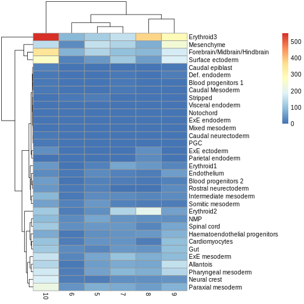
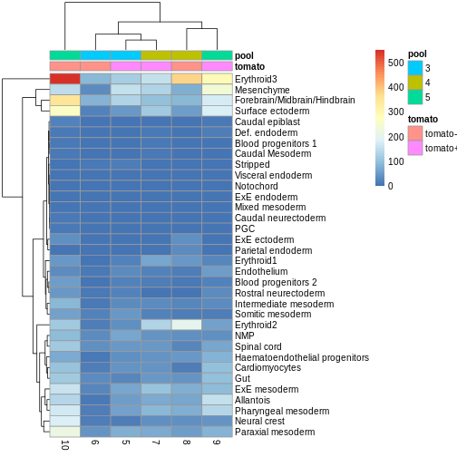
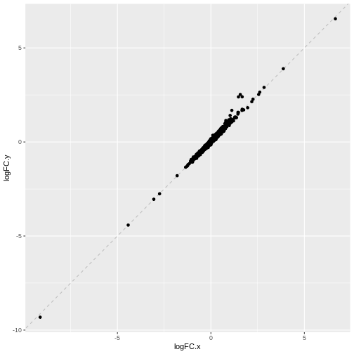
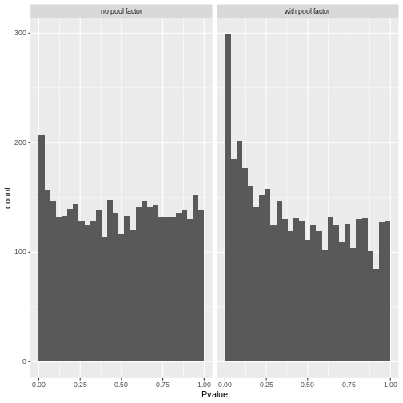

:::::::::::::::::::::::::::::::::::::: questions 

- How can we integrate data from multiple batches, samples, and studies?
- How can we identify differentially expressed genes between experimental conditions for each cell type?
- How can we identify changes in cell type abundance between experimental conditions?

::::::::::::::::::::::::::::::::::::::::::::::::

::::::::::::::::::::::::::::::::::::: objectives

- Correct batch effects and diagnose potential problems such as over-correction.
- Perform differential expression comparisons between conditions based on pseudo-bulk samples.
- Perform differential abundance comparisons between conditions.

::::::::::::::::::::::::::::::::::::::::::::::::


## Setup and data exploration

As before, we will use the the wild-type data from the Tal1 chimera experiment:

- Sample 5: E8.5 injected cells (tomato positive), pool 3
- Sample 6: E8.5 host cells (tomato negative), pool 3
- Sample 7: E8.5 injected cells (tomato positive), pool 4
- Sample 8: E8.5 host cells (tomato negative), pool 4
- Sample 9: E8.5 injected cells (tomato positive), pool 5
- Sample 10: E8.5 host cells (tomato negative), pool 5

Note that this is a paired design in which for each biological replicate (pool 3, 4, and 5), we have both host and injected cells.

We start by loading the data and doing a quick exploratory analysis, essentially applying the normalization and visualization techniques that we have seen in the previous lectures to all samples. Note that this time we're selecting samples 5 to 10, not just 5 by itself. Also note the `type = "processed"` argument: we are explicitly selecting the version of the data that has already been QC processed.


``` r
library(MouseGastrulationData)
library(batchelor)
library(edgeR)
library(scater)
library(ggplot2)
library(scran)
library(pheatmap)
library(scuttle)

sce <- WTChimeraData(samples = 5:10, type = "processed")
```

``` r
sce
```

``` output
class: SingleCellExperiment 
dim: 29453 20935 
metadata(0):
assays(1): counts
rownames(29453): ENSMUSG00000051951 ENSMUSG00000089699 ...
  ENSMUSG00000095742 tomato-td
rowData names(2): ENSEMBL SYMBOL
colnames(20935): cell_9769 cell_9770 ... cell_30702 cell_30703
colData names(11): cell barcode ... doub.density sizeFactor
reducedDimNames(2): pca.corrected.E7.5 pca.corrected.E8.5
mainExpName: NULL
altExpNames(0):
```

``` r
colData(sce)
```

``` output
DataFrame with 20935 rows and 11 columns
                  cell          barcode    sample       stage    tomato
           <character>      <character> <integer> <character> <logical>
cell_9769    cell_9769 AAACCTGAGACTGTAA         5        E8.5      TRUE
cell_9770    cell_9770 AAACCTGAGATGCCTT         5        E8.5      TRUE
cell_9771    cell_9771 AAACCTGAGCAGCCTC         5        E8.5      TRUE
cell_9772    cell_9772 AAACCTGCATACTCTT         5        E8.5      TRUE
cell_9773    cell_9773 AAACGGGTCAACACCA         5        E8.5      TRUE
...                ...              ...       ...         ...       ...
cell_30699  cell_30699 TTTGTCACAGCTCGCA        10        E8.5     FALSE
cell_30700  cell_30700 TTTGTCAGTCTAGTCA        10        E8.5     FALSE
cell_30701  cell_30701 TTTGTCATCATCGGAT        10        E8.5     FALSE
cell_30702  cell_30702 TTTGTCATCATTATCC        10        E8.5     FALSE
cell_30703  cell_30703 TTTGTCATCCCATTTA        10        E8.5     FALSE
                pool stage.mapped        celltype.mapped closest.cell
           <integer>  <character>            <character>  <character>
cell_9769          3        E8.25             Mesenchyme   cell_24159
cell_9770          3         E8.5            Endothelium   cell_96660
cell_9771          3         E8.5              Allantois  cell_134982
cell_9772          3         E8.5             Erythroid3  cell_133892
cell_9773          3        E8.25             Erythroid1   cell_76296
...              ...          ...                    ...          ...
cell_30699         5         E8.5             Erythroid3   cell_38810
cell_30700         5         E8.5       Surface ectoderm   cell_38588
cell_30701         5        E8.25 Forebrain/Midbrain/H..   cell_66082
cell_30702         5         E8.5             Erythroid3  cell_138114
cell_30703         5         E8.0                Doublet   cell_92644
           doub.density sizeFactor
              <numeric>  <numeric>
cell_9769    0.02985045    1.41243
cell_9770    0.00172753    1.22757
cell_9771    0.01338013    1.15439
cell_9772    0.00218402    1.28676
cell_9773    0.00211723    1.78719
...                 ...        ...
cell_30699   0.00146287   0.389311
cell_30700   0.00374155   0.588784
cell_30701   0.05651258   0.624455
cell_30702   0.00108837   0.550807
cell_30703   0.82369305   1.184919
```

For the sake of making these examples run faster, we drop low quality cells (stripped nuclei and doublets) and also randomly select 50% cells per sample.


``` r
drop <- sce$celltype.mapped %in% c("stripped", "Doublet")

sce <- sce[,!drop]

set.seed(29482)

idx <- unlist(tapply(colnames(sce), sce$sample, function(x) {
    perc <- round(0.50 * length(x))
    sample(x, perc)
}))

sce <- sce[,idx]
```

We now normalize the data, run some dimensionality reduction steps, and visualize the data in a tSNE plot. In this case we have many different cell types, so we define a custom palette with many visually distinct colors (adapted from the `polychrome` palette in the [`pals` package](https://cran.r-project.org/web/packages/pals/vignettes/pals_examples.html)). 


``` r
sce <- logNormCounts(sce)

dec <- modelGeneVar(sce, block = sce$sample)

chosen.hvgs <- dec$bio > 0

sce <- runPCA(sce, subset_row = chosen.hvgs, ntop = 1000)

sce <- runTSNE(sce, dimred = "PCA")

sce$sample <- as.factor(sce$sample)

plotTSNE(sce, colour_by = "sample")
```


``` r
color_vec <- c("#5A5156", "#E4E1E3", "#F6222E", "#FE00FA", "#16FF32", "#3283FE", 
               "#FEAF16", "#B00068", "#1CFFCE", "#90AD1C", "#2ED9FF", "#DEA0FD", 
               "#AA0DFE", "#F8A19F", "#325A9B", "#C4451C", "#1C8356", "#85660D", 
               "#B10DA1", "#3B00FB", "#1CBE4F", "#FA0087", "#333333", "#F7E1A0", 
               "#C075A6", "#782AB6", "#AAF400", "#BDCDFF", "#822E1C", "#B5EFB5", 
               "#7ED7D1", "#1C7F93", "#D85FF7", "#683B79", "#66B0FF", "#FBE426")

plotTSNE(sce, colour_by = "celltype.mapped") +
    scale_color_manual(values = color_vec) +
    theme(legend.position = "bottom")
```


There are evident sample effects. Depending on the analysis that you want to perform you may want to remove or retain the sample effect. For instance, if the goal is to identify cell types with a clustering method, one may want to remove the sample effects with "batch effect" correction methods.

For now, let's assume that we want to remove this effect.

:::: challenge

It seems like samples 5 and 6 are clearly separated off the other samples in gene expression space. Given the group of cells in each sample, why might this make sense for these samples as opposed to some other pair of samples? What is the factor presumably leading to this difference?

::: solution

Samples 5 and 6 were from the same "pool" of cells. Looking at the documentation for the dataset under `?WTChimeraData` we see that the pool variable is defined as: "Integer, embryo pool from which cell derived; samples with same value are matched." So samples 5 and 6 have an experimental factor in common which causes a shared, systematic difference in their gene expression profiles compared to the other samples. That's why you can see many isolated blue/orange clusters on the first TSNE plot. If you were developing single-cell library preparation protocols you might want to preserve this effect to understand how variation in pools leads to variation in expression, but for now, given that we're investigating other effects, we'll want to remove this as undesired technical variation.

:::

::::

## Correcting batch effects

We "correct" the effect of samples with the `correctExperiment` function
in the `batchelor` package, using the `sample` column as the batch variable.


``` r
set.seed(10102)

merged <- correctExperiments(
    sce, 
    batch = sce$sample, 
    subset.row = chosen.hvgs,
    PARAM = FastMnnParam(
        merge.order = list(
            list(1,3,5), # WT (3 replicates)
            list(2,4,6)  # td-Tomato (3 replicates)
        )
    )
)

merged <- runTSNE(merged, dimred = "corrected")

plotTSNE(merged, colour_by = "batch")
```


We can also see that when coloring cells by cell type, the cell types are now largely confined to individual clusters:


``` r
plotTSNE(merged, colour_by = "celltype.mapped") +
    scale_color_manual(values = color_vec) +
    theme(legend.position = "bottom")
```


Once we have removed the sample effect, we can proceed with the differential 
expression (DE) analysis.

:::: challenge

True or False? After batch correction, no batch-level information is present in the corrected data.

::: solution

False. Batch-level data can be retained through confounding with experimental factors or poor ability to distinguish experimental effects from batch effects. Remember, the changes needed to correct the data are empirically estimated, so they can carry along error. 

While batch effect correction algorithms usually do a pretty good job, it's smart to do a sanity check for batch effects at the end of your analysis. You always want to make sure that that effect you're resting your paper submission on isn't driven by batch effects.

:::

::::


## Differential Expression

In order to perform a differential expression (DE) analysis, we need to identify
groups of cells across samples/conditions (depending on the experimental 
design and the overall goal of the experiment). 

As we have seen before, there are two ways of grouping cells, cell clustering and cell
labeling. Here, we apply the second approach to group cells
according to the already annotated cell types to proceed with the computation of
the pseudo-bulk samples.

### Pseudo-bulk samples

To compute differences between groups of cells, a possible way is to compute
pseudo-bulk samples, where we summarize the gene expression for all the cells of each
specific cell type. We are then able to detect differences in gene expression 
between two different conditions for one cell type at a time.

To compute pseudo-bulk samples, we use the `aggregateAcrossCells` function in the 
`scuttle` package, which takes as input not only a SingleCellExperiment, 
but also the label used for the identification of cell groups/types.
Here, we use as not just the cell type label, but also the sample ID, as
we want be able to discern between replicates and conditions later in the analysis.


``` r
# Using 'label' and 'sample' as our two factors; each column of the output
# corresponds to one unique combination of these two factors.

summed <- aggregateAcrossCells(
    merged, 
    id = colData(merged)[,c("celltype.mapped", "sample")]
)

summed
```

``` output
class: SingleCellExperiment 
dim: 13641 179 
metadata(2): merge.info pca.info
assays(1): counts
rownames(13641): ENSMUSG00000051951 ENSMUSG00000025900 ...
  ENSMUSG00000096730 ENSMUSG00000095742
rowData names(3): rotation ENSEMBL SYMBOL
colnames: NULL
colData names(15): batch cell ... sample ncells
reducedDimNames(5): corrected pca.corrected.E7.5 pca.corrected.E8.5 PCA
  TSNE
mainExpName: NULL
altExpNames(0):
```

### Differential Expression (DE) Analysis

The main advantage of using pseudo-bulk samples is that we can use
established methods for bulk DE analysis like 
[edgeR](https://bioconductor.org/packages/edgeR) and
[DESeq2](https://bioconductor.org/packages/DESeq2). Both, 
[edgeR](https://bioconductor.org/packages/edgeR) and
[DESeq2](https://bioconductor.org/packages/DESeq2),
are based on negative binomial models, but differ in their normalization strategies
and several implementation details.

First, let's start with a specific cell type, for instance the "Mesenchymal stem
cells", and analyze gene expression differences between conditions for this cell type.
We store the counts table in a `DGEList` data container called `y`, along with experimental
metadata.


``` r
current <- summed[, summed$celltype.mapped == "Mesenchyme"]

y <- DGEList(counts(current), samples = colData(current))

y
```

``` output
An object of class "DGEList"
$counts
                   Sample1 Sample2 Sample3 Sample4 Sample5 Sample6
ENSMUSG00000051951       2       0       0       0       1       0
ENSMUSG00000025900       0       0       0       0       0       0
ENSMUSG00000025902       4       0       2       0       3       6
ENSMUSG00000033845     765     130     508     213     781     305
ENSMUSG00000002459       2       0       1       0       0       0
13636 more rows ...

$samples
        group lib.size norm.factors batch cell barcode sample stage tomato pool
Sample1     1  2478901            1     5 <NA>    <NA>      5  E8.5   TRUE    3
Sample2     1   548407            1     6 <NA>    <NA>      6  E8.5  FALSE    3
Sample3     1  1260187            1     7 <NA>    <NA>      7  E8.5   TRUE    4
Sample4     1   578699            1     8 <NA>    <NA>      8  E8.5  FALSE    4
Sample5     1  2092329            1     9 <NA>    <NA>      9  E8.5   TRUE    5
Sample6     1   904929            1    10 <NA>    <NA>     10  E8.5  FALSE    5
        stage.mapped celltype.mapped closest.cell doub.density sizeFactor
Sample1         <NA>      Mesenchyme         <NA>           NA         NA
Sample2         <NA>      Mesenchyme         <NA>           NA         NA
Sample3         <NA>      Mesenchyme         <NA>           NA         NA
Sample4         <NA>      Mesenchyme         <NA>           NA         NA
Sample5         <NA>      Mesenchyme         <NA>           NA         NA
Sample6         <NA>      Mesenchyme         <NA>           NA         NA
        celltype.mapped.1 sample.1 ncells
Sample1        Mesenchyme        5    151
Sample2        Mesenchyme        6     28
Sample3        Mesenchyme        7    127
Sample4        Mesenchyme        8     75
Sample5        Mesenchyme        9    239
Sample6        Mesenchyme       10    146
```

We usually want to discard low quality samples with low sequencing depth / library
size as they have the potential to skew normalization and/or DE analysis.

We can see that in our case we don't have low quality samples, so there is no need
for such a filtering step.


``` r
discarded <- current$ncells < 10

y <- y[,!discarded]

summary(discarded)
```

``` output
   Mode   FALSE 
logical       6 
```

Typically, we also want to filter out genes
with too low of an expression to be meaningfully retained in a statistcal analysis
for differential expression.


``` r
keep <- filterByExpr(y, group = current$tomato)

y <- y[keep,]

summary(keep)
```

``` output
   Mode   FALSE    TRUE 
logical    9121    4520 
```

We can now proceed with normalizing the data. There are several approaches for
normalizing bulk data, that are thus readily applicable to pseudo-bulk data.
Here, we use the Trimmed Mean of *M*-values (TMM) method, implemented in the
`edgeR` package within the `calcNormFactors` function.


``` r
y <- calcNormFactors(y)

y$samples
```

``` output
        group lib.size norm.factors batch cell barcode sample stage tomato pool
Sample1     1  2478901    1.0506857     5 <NA>    <NA>      5  E8.5   TRUE    3
Sample2     1   548407    1.0399112     6 <NA>    <NA>      6  E8.5  FALSE    3
Sample3     1  1260187    0.9700083     7 <NA>    <NA>      7  E8.5   TRUE    4
Sample4     1   578699    0.9871129     8 <NA>    <NA>      8  E8.5  FALSE    4
Sample5     1  2092329    0.9695559     9 <NA>    <NA>      9  E8.5   TRUE    5
Sample6     1   904929    0.9858611    10 <NA>    <NA>     10  E8.5  FALSE    5
        stage.mapped celltype.mapped closest.cell doub.density sizeFactor
Sample1         <NA>      Mesenchyme         <NA>           NA         NA
Sample2         <NA>      Mesenchyme         <NA>           NA         NA
Sample3         <NA>      Mesenchyme         <NA>           NA         NA
Sample4         <NA>      Mesenchyme         <NA>           NA         NA
Sample5         <NA>      Mesenchyme         <NA>           NA         NA
Sample6         <NA>      Mesenchyme         <NA>           NA         NA
        celltype.mapped.1 sample.1 ncells
Sample1        Mesenchyme        5    151
Sample2        Mesenchyme        6     28
Sample3        Mesenchyme        7    127
Sample4        Mesenchyme        8     75
Sample5        Mesenchyme        9    239
Sample6        Mesenchyme       10    146
```

To investigate the effect of the normalization, we use a Mean-Difference (MD)
plot for each sample in order to detect possible normalization issues due to
insufficient cells/reads/UMIs in any of the pseudo-bulk profiles.

In our case, we verify that all these plots are centered on 0 ($y$-axis) and
display a trumpet shape, as expected.


``` r
par(mfrow = c(2,3))

for (i in seq_len(ncol(y))) {
    plotMD(y, column = i)
}
```


``` r
par(mfrow = c(1,1))
```

Furthermore, we want to check if the samples cluster together based
on known experimental factors (like the tomato injection in this case).

Here, we use a multidimensional scaling (MDS) plot to inspect this.
Multidimensional scaling (also called principal *coordinate* analysis (PCoA)) is a dimensionality reduction technique that's conceptually similar to principal *component* analysis (PCA).
    

``` r
limma::plotMDS(cpm(y, log = TRUE), 
               col = ifelse(y$samples$tomato, "red", "blue"))
```


We then construct a design matrix with the tomato variable as the main factors and pool
as an additional covariate.


``` r
design <- model.matrix(~factor(pool) + factor(tomato),
                       data = y$samples)
design
```

``` output
        (Intercept) factor(pool)4 factor(pool)5 factor(tomato)TRUE
Sample1           1             0             0                  1
Sample2           1             0             0                  0
Sample3           1             1             0                  1
Sample4           1             1             0                  0
Sample5           1             0             1                  1
Sample6           1             0             1                  0
attr(,"assign")
[1] 0 1 1 2
attr(,"contrasts")
attr(,"contrasts")$`factor(pool)`
[1] "contr.treatment"

attr(,"contrasts")$`factor(tomato)`
[1] "contr.treatment"
```

Now we can estimate the Negative Binomial (NB) overdispersion parameter, to model
the mean-variance trend.


``` r
y <- estimateDisp(y, design)

summary(y$trended.dispersion)
```

``` output
   Min. 1st Qu.  Median    Mean 3rd Qu.    Max. 
0.01002 0.01591 0.02472 0.02131 0.02574 0.02652 
```

The BCV plot allows us to visualize the relationship between the Biological Coefficient
of Variation and the Average log CPM for each gene.
Additionally, the Common and Trend BCV are shown in `red` and `blue`.


``` r
plotBCV(y)
```


We then fit a Quasi-Likelihood (QL) negative binomial generalized linear model for each gene. 
The `robust = TRUE` parameter avoids distortions from highly variable clusters.
The QL method includes an additional dispersion parameter for incorporating the uncertainty and variability of the per-gene variance, which is not well estimated by the NB dispersions, so the two dispersion types complement each other in the final analysis.


``` r
fit <- glmQLFit(y, design, robust = TRUE)

summary(fit$var.prior)
```

``` output
Length  Class   Mode 
     0   NULL   NULL 
```

``` r
summary(fit$df.prior)
```

``` output
   Min. 1st Qu.  Median    Mean 3rd Qu.    Max. 
 0.6968  7.9221  7.9221  7.8972  7.9221  7.9221 
```

QL dispersion estimates for each gene as a function of abundance. Raw estimates (black) are shrunk towards the trend (blue) to yield squeezed estimates (red).


``` r
plotQLDisp(fit)
```


We then use an empirical Bayes quasi-likelihood *F*-test to test for differential expression (due to tomato injection) for each gene at a False Discovery Rate (FDR) of 5%.
The low number of DE genes shwos that tomato injection does not have a major impact on gene expression in mesenchymal cells.


``` r
res <- glmQLFTest(fit, coef = ncol(design))

summary(decideTests(res))
```

``` output
       factor(tomato)TRUE
Down                    5
NotSig               4510
Up                      5
```

``` r
topTags(res)
```

``` output
Coefficient:  factor(tomato)TRUE 
                        logFC   logCPM          F       PValue          FDR
ENSMUSG00000010760 -4.1560168 9.973704 1070.96054 1.940322e-11 8.770254e-08
ENSMUSG00000096768  1.9992563 8.844258  379.81665 3.081008e-09 6.963079e-06
ENSMUSG00000086503 -6.4902580 7.411257  248.15766 1.911494e-07 2.879984e-04
ENSMUSG00000035299  1.7979019 6.904163  126.18570 5.814967e-07 6.570913e-04
ENSMUSG00000101609  1.3746824 7.310009   81.40822 4.275035e-06 3.864631e-03
ENSMUSG00000019188 -1.0193854 7.545530   62.43651 1.374972e-05 1.035812e-02
ENSMUSG00000024423  0.9943824 7.391075   59.10516 1.742749e-05 1.125318e-02
ENSMUSG00000042607 -0.9541504 7.468203   45.63814 5.201678e-05 2.938948e-02
ENSMUSG00000027520  1.5873733 6.952923   41.78827 7.480284e-05 3.594063e-02
ENSMUSG00000036446 -0.8307640 9.401028   41.16271 7.951468e-05 3.594063e-02
```

All the previous steps can be conveniently performed for each cell type, with
the `pseudoBulkDGE` function from the [scran](https://bioconductor.org/packages/scran)
package.


``` r
summed.filt <- summed[,summed$ncells >= 10]

de.results <- pseudoBulkDGE(
    summed.filt, 
    label = summed.filt$celltype.mapped,
    design = ~factor(pool) + tomato,
    coef = "tomatoTRUE",
    condition = summed.filt$tomato 
)
```

The returned object is a list of `DataFrame`s each storing the results for one of the cell types.
Each of these `DataFrame`s also contains the intermediate results of the full [edgeR](https://bioconductor.org/packages/edgeR) pipeline carried out above, which allows us to apply diagnostics and visualization of individual steps of the pipeline.


``` r
cur.results <- de.results[["Allantois"]]

cur.results[order(cur.results$PValue),]
```

``` output
DataFrame with 13641 rows and 5 columns
                       logFC    logCPM         F      PValue         FDR
                   <numeric> <numeric> <numeric>   <numeric>   <numeric>
ENSMUSG00000037664  -8.00072  11.56010  3349.683 1.15757e-27 4.81318e-24
ENSMUSG00000010760  -2.57691  12.41096  1095.755 8.21809e-22 1.70854e-18
ENSMUSG00000086503  -7.01824   7.50026   762.544 6.36342e-20 8.81970e-17
ENSMUSG00000096768   1.82579   9.33347   314.684 1.83678e-15 1.90934e-12
ENSMUSG00000022464   0.96701  10.28038   119.758 6.65050e-11 5.53056e-08
...                      ...       ...       ...         ...         ...
ENSMUSG00000095247        NA        NA        NA          NA          NA
ENSMUSG00000096808        NA        NA        NA          NA          NA
ENSMUSG00000079808        NA        NA        NA          NA          NA
ENSMUSG00000096730        NA        NA        NA          NA          NA
ENSMUSG00000095742        NA        NA        NA          NA          NA
```

:::: challenge

Clearly some of the results have low *p*-values. What about the effect sizes? What does `logFC` stand for?

::: solution

"logFC" stands for log fold-change, typically on a log2 scale. That means a 2-fold increase in gene expression corresponds to a logFC of log2(2) = 1. 

`ENSMUSG00000037664` seems to have an estimated logFC of about -8. That points to a large decrease in expression of that gene in Allantois cells of the tomato positive samples.

:::

::::


## Differential Abundance (DA) analysis

In addition to differences in gene expression, we also want to find differences
in cell type *abundance* between conditions (here in tomato positive vs wild type
samples).

Therefore, we first quantify the number of cells for each cell type, and then
fit a model to detect differences between the injected cells and the background.

This process is very similar to differential expression analysis, but here we
apply the analysis on the computed abundances without normalizing the data first.


``` r
abundances <- table(merged$celltype.mapped, merged$sample) 

abundances <- unclass(abundances) 

extra.info <- colData(merged)[match(colnames(abundances), merged$sample),]

y.ab <- DGEList(abundances, samples = extra.info)

design <- model.matrix(~factor(pool) + factor(tomato), y.ab$samples)

y.ab <- estimateDisp(y.ab, design, trend = "none")
```

``` error
Error in loglik + prior.n * m0: non-conformable arrays
```

``` r
fit.ab <- glmQLFit(y.ab, design, robust = TRUE, abundance.trend = FALSE)
```

### Background on compositional effect

We don't normalize the abundance data with the `calcNormFactors` function, as this would
implicitly work under the assumption that most of the input features do not
vary between conditions. This is typically not a reasonable assumption for
cell type abundances as we often only have a few different cell populations that
all can change with different experimental conditions.
This means that here we will not normalize for library size, which in abundance
data corresponds to the total number of cells in each sample (cell type).

However, this can lead our data to be susceptible to compositional
effects. "Compositional" refers to the fact that the cluster abundances in a
sample are not independent of one another because each cell type is effectively
competing for space in the sample. They behave like proportions in that they
must sum to 1. If the abundance of cell type A increases under a certain condition,
we consequenlty observe less abundance of all other cell types,
even if all other cell types are not directly affected by this condition.

Not accounting for compositionality means that any conclusions derived from the DA
analysis can be biased by the amount of cells present for each cell type.
And it is not uncommon that the number of cells can be strongly unbalanced between
cell types, with some low abundance cell types comprising close to 0 percent and
certain high abundance cell types making up close to 100 percent of all cells in 
a sample.

We now look at different approaches for handling the compositional effect.

### Assuming most labels do not change

We can use a similar approach as for the DE analysis, assuming that most
labels are not changing, in particular if we consider the fact that only few genes
where found to be differentially expressed in the analysis above.

To do so, we first normalize the data with `calcNormFactors` and then we fit and 
estimate a QL-model for the abundance data.


``` r
y.ab2 <- calcNormFactors(y.ab)

y.ab2$samples$norm.factors
```

``` output
[1] 1.1029040 1.0228173 1.0695358 0.7686501 1.0402941 1.0365354
```

We then use functions from [edgeR](https://bioconductor.org/packages/edgeR) as before: 


``` r
y.ab2 <- estimateDisp(y.ab2, design, trend = "none")
```

``` error
Error in loglik + prior.n * m0: non-conformable arrays
```

``` r
fit.ab2 <- glmQLFit(y.ab2, design, robust = TRUE, abundance.trend = FALSE)

res2 <- glmQLFTest(fit.ab2, coef = ncol(design))

summary(decideTests(res2))
```

``` output
       factor(tomato)TRUE
Down                    2
NotSig                 32
Up                      0
```

``` r
topTags(res2, n = 10)
```

``` output
Coefficient:  factor(tomato)TRUE 
                       logFC   logCPM         F       PValue          FDR
ExE ectoderm      -5.7548150 13.13052 36.592240 6.975860e-08 2.371793e-06
Parietal endoderm -6.9054141 12.34396 25.026083 4.230885e-06 7.192505e-05
Mesenchyme         0.9661857 16.32776  6.489987 1.311439e-02 1.220524e-01
Erythroid3        -0.9188382 17.34602  6.313470 1.435911e-02 1.220524e-01
Neural crest      -1.0212778 14.84714  5.444709 2.259224e-02 1.536272e-01
ExE endoderm      -3.9992886 10.75223  4.356716 4.061361e-02 2.301438e-01
Endothelium        0.8725903 14.12053  3.393104 6.983028e-02 3.391756e-01
Cardiomyocytes     0.6943555 14.93781  2.662584 1.073567e-01 4.562660e-01
Allantois          0.5914769 15.55508  2.120304 1.499595e-01 5.665138e-01
Erythroid2        -0.5257535 15.97144  1.742353 1.912673e-01 6.503088e-01
```

###  Testing against a log-fold change threshold

An alternative approach assumes that the composition bias introduces a spurious
log2-fold change of no more than a \tau quantity for a non-DA label.

In other words, we interpret this as the maximum log-fold change in the total
number of cells given by DA in other labels. On the other hand, when choosing
\tau, we should not consider fold-differences in the totals due to differences
in capture efficiency or for the case that the size of the original cell population is not
attributable to composition bias. We then mitigate the effect of composition
biases by testing each label for changes in abundance beyond \tau.


``` r
res.lfc <- glmTreat(fit.ab, coef = ncol(design), lfc = 1)

summary(decideTests(res.lfc))
```

``` output
       factor(tomato)TRUE
Down                    2
NotSig                 32
Up                      0
```

``` r
topTags(res.lfc)
```

``` output
Coefficient:  factor(tomato)TRUE 
                         logFC unshrunk.logFC   logCPM       PValue
ExE ectoderm        -5.5017654     -5.9296357 13.07357 6.705761e-06
Parietal endoderm   -6.5845020    -27.4411287 12.28571 1.247000e-04
ExE endoderm        -3.9304866    -23.9322019 10.76304 6.597463e-02
Mesenchyme           1.1604318      1.1616585 16.35326 1.442717e-01
Endothelium          1.0475417      1.0530630 14.14043 2.211749e-01
Caudal neurectoderm -1.4682413     -1.6212501 11.10535 3.169903e-01
Cardiomyocytes       0.8628677      0.8654665 14.97008 3.478012e-01
Neural crest        -0.8281842     -0.8307410 14.84525 3.726793e-01
Allantois            0.7832266      0.7846135 15.55470 4.217972e-01
Def. endoderm        0.7225404      0.7356721 12.49927 4.304678e-01
                             FDR
ExE ectoderm        0.0002279959
Parietal endoderm   0.0021198993
ExE endoderm        0.7477125066
Mesenchyme          0.9876518478
Endothelium         0.9876518478
Caudal neurectoderm 0.9876518478
Cardiomyocytes      0.9876518478
Neural crest        0.9876518478
Allantois           0.9876518478
Def. endoderm       0.9876518478
```

Addionally, the choice of \tau can be guided by other external experimental data, like a previous or a pilot experiment.

## Exercises


:::::::::::::::::::::::::::::::::: challenge

#### Exercise 1: Heatmaps

Use the `pheatmap` package to create a heatmap of the abundances table. Does it comport with the model results?

:::::::::::::: hint

You can simply hand `pheatmap()` a matrix as its only argument. `pheatmap()` has a million options you can adjust, but the defaults are usually pretty good. Try to overlay sample-level information with the `annotation_col` argument for an extra challenge.

:::::::::::::::::::::::

:::::::::::::: solution


``` r
pheatmap(y.ab$counts)
```



``` r
anno_df <- y.ab$samples[,c("tomato", "pool")]

anno_df$pool = as.character(anno_df$pool)

anno_df$tomato <- ifelse(anno_df$tomato,
                         "tomato+",
                         "tomato-")

pheatmap(y.ab$counts,
         annotation_col = anno_df)
```



The top DA result was a decrease in ExE ectoderm in the tomato condition, which you can sort of see, especially if you `log1p()` the counts or discard rows that show much higher values. ExE ectoderm counts were much higher in samples 8 and 10 compared to 5, 7, and 9. 

:::::::::::::::::::::::

:::::::::::::::::::::::::::::::::::::::::::::

:::::::::::::::::::::::::::::::::: challenge

#### Exercise 2: Model specification and comparison

Try re-running the pseudobulk DGE without the `pool` factor in the design specification. Compare the logFC estimates and the distribution of p-values for the `Erythroid3` cell type.

:::::::::::::: hint

After running the second pseudobulk DGE, you can join the two `DataFrame`s of `Erythroid3` statistics using the `merge()` function. You will need to create a common key column from the gene IDs.

:::::::::::::::::::::::

:::::::::::::: solution


``` r
de.results2 <- pseudoBulkDGE(
    summed.filt, 
    label = summed.filt$celltype.mapped,
    design = ~tomato,
    coef = "tomatoTRUE",
    condition = summed.filt$tomato 
)

eryth1 <- de.results$Erythroid3

eryth2 <- de.results2$Erythroid3

eryth1$gene <- rownames(eryth1)

eryth2$gene <- rownames(eryth2)

comp_df <- merge(eryth1, eryth2, by = 'gene')

comp_df <- comp_df[!is.na(comp_df$logFC.x),]

ggplot(comp_df, aes(logFC.x, logFC.y)) + 
    geom_abline(lty = 2, color = "grey") +
    geom_point() 
```



``` r
# Reshape to long format for ggplot facets. This is 1000x times easier to do
# with tidyverse packages:
pval_df <- reshape(comp_df[,c("gene", "PValue.x", "PValue.y")],
                   direction = "long", 
                   v.names = "Pvalue",
                   timevar = "pool_factor",
                   times = c("with pool factor", "no pool factor"),
                   varying = c("PValue.x", "PValue.y"))

ggplot(pval_df, aes(Pvalue)) + 
    geom_histogram(boundary = 0,
                   bins = 30) + 
    facet_wrap("pool_factor")
```



We can see that in this case, the logFC estimates are strongly consistent between the two models, which tells us that the inclusion of the `pool` factor in the model doesn't strongly influence the estimate of the `tomato` coefficients in this case.

The p-value histograms both look alright here, with a largely flat plateau over most of the 0 - 1 range and a spike near 0. This is consistent with the hypothesis that most genes are unaffected by `tomato` but there are a small handful that clearly are. 

If there were large shifts in the logFC estimates or p-value distributions, that's a sign that the design specification change has a large impact on how the model sees the data. If that happens, you'll need to think carefully and critically about what variables should and should not be included in the model formula.

:::::::::::::::::::::::

:::::::::::::::::::::::::::::::::::::::::::::

:::: challenge

#### Extension challenge 1: Group effects

Having multiple independent samples in each experimental group is always helpful, but it's particularly important when it comes to batch effect correction. Why?

::: solution

It's important to have multiple samples within each experimental group because it helps the batch effect correction algorithm distinguish differences due to batch effects (uninteresting) from differences due to group/treatment/biology (interesting). 

Imagine you had one sample that received a drug treatment and one that did not, each with 10,000 cells. They differ substantially in expression of gene X. Is that an important scientific finding? You can't tell for sure, because the effect of drug is indistinguishable from a sample-wise batch effect. But if the difference in gene X holds up when you have five treated samples and five untreated samples, now you can be a bit more confident. Many batch effect correction methods will take information on experimental factors as additional arguments, which they can use to help remove batch effects while retaining experimental differences.

:::

::::

:::::::::::::: checklist
## Further Reading

* OSCA book, Multi-sample analysis, [Chapters 1, 4, and 6](https://bioconductor.org/books/release/OSCA.multisample)

::::::::::::::

::::::::::::::::::::::::::::::::::::: keypoints 
-   Batch effects are systematic technical differences in the observed expression
    in cells measured in different experimental batches.
-   Computational removal of batch-to-batch variation with the `correctExperiment`
    function from the *[batchelor](https://bioconductor.org/packages/3.22/batchelor)* package allows us to combine data
    across multiple batches for a consolidated downstream analysis.
-   Differential expression (DE) analysis of replicated multi-condition scRNA-seq experiments
    is typically based on pseudo-bulk expression profiles, generated by summing
    counts for all cells with the same combination of label and sample.
-   The `aggregateAcrossCells` function from the *[scater](https://bioconductor.org/packages/3.22/scater)* package
    facilitates the creation of pseudo-bulk samples.   
-   The `pseudoBulkDGE` function from the *[scran](https://bioconductor.org/packages/3.22/scran)* package can be used
    to detect significant changes in expression between conditions for pseudo-bulk samples
    consisting of cells of the same type.
-   Differential abundance (DA) analysis aims at identifying significant changes in
    cell type abundance across conditions.
-   DA analysis uses bulk DE methods such as *[edgeR](https://bioconductor.org/packages/3.22/edgeR)* and *[DESeq2](https://bioconductor.org/packages/3.22/DESeq2)*,
    which provide suitable statistical models for count data in the presence of
    limited replication - except that the counts are not of reads per gene, but
    of cells per label.
::::::::::::::::::::::::::::::::::::::::::::::::

## Session Info


``` r
sessionInfo()
```

``` output
R version 4.5.3 (2026-03-11)
Platform: x86_64-pc-linux-gnu
Running under: Ubuntu 22.04.5 LTS

Matrix products: default
BLAS:   /usr/lib/x86_64-linux-gnu/blas/libblas.so.3.10.0 
LAPACK: /usr/lib/x86_64-linux-gnu/lapack/liblapack.so.3.10.0  LAPACK version 3.10.0

locale:
 [1] LC_CTYPE=C.UTF-8       LC_NUMERIC=C           LC_TIME=C.UTF-8       
 [4] LC_COLLATE=C.UTF-8     LC_MONETARY=C.UTF-8    LC_MESSAGES=C.UTF-8   
 [7] LC_PAPER=C.UTF-8       LC_NAME=C              LC_ADDRESS=C          
[10] LC_TELEPHONE=C         LC_MEASUREMENT=C.UTF-8 LC_IDENTIFICATION=C   

time zone: UTC
tzcode source: system (glibc)

attached base packages:
[1] stats4    stats     graphics  grDevices utils     datasets  methods  
[8] base     

other attached packages:
 [1] pheatmap_1.0.13              scran_1.38.0                
 [3] scater_1.38.0                ggplot2_4.0.1               
 [5] scuttle_1.20.0               edgeR_4.8.1                 
 [7] limma_3.66.0                 batchelor_1.26.0            
 [9] MouseGastrulationData_1.24.0 SpatialExperiment_1.20.0    
[11] SingleCellExperiment_1.32.0  SummarizedExperiment_1.40.0 
[13] Biobase_2.70.0               GenomicRanges_1.62.1        
[15] Seqinfo_1.0.0                IRanges_2.44.0              
[17] S4Vectors_0.48.0             BiocGenerics_0.56.0         
[19] generics_0.1.4               MatrixGenerics_1.22.0       
[21] matrixStats_1.5.0            BiocStyle_2.38.0            

loaded via a namespace (and not attached):
 [1] DBI_1.2.3                 formatR_1.14             
 [3] gridExtra_2.3             httr2_1.2.2              
 [5] rlang_1.2.0               magrittr_2.0.4           
 [7] otel_0.2.0                compiler_4.5.3           
 [9] RSQLite_2.4.5             DelayedMatrixStats_1.32.0
[11] png_0.1-8                 vctrs_0.7.3              
[13] pkgconfig_2.0.3           crayon_1.5.3             
[15] fastmap_1.2.0             dbplyr_2.5.1             
[17] magick_2.9.0              XVector_0.50.0           
[19] labeling_0.4.3            rmarkdown_2.30           
[21] ggbeeswarm_0.7.3          purrr_1.2.0              
[23] bit_4.6.0                 bluster_1.20.0           
[25] xfun_0.55                 cachem_1.1.0             
[27] beachmat_2.26.0           blob_1.2.4               
[29] DelayedArray_0.36.0       BiocParallel_1.44.0      
[31] cluster_2.1.8.1           irlba_2.3.5.1            
[33] parallel_4.5.3            R6_2.6.1                 
[35] RColorBrewer_1.1-3        Rcpp_1.1.1-1.1           
[37] knitr_1.50                splines_4.5.3            
[39] Matrix_1.7-4              igraph_2.2.1             
[41] tidyselect_1.2.1          viridis_0.6.5            
[43] abind_1.4-8               yaml_2.3.12              
[45] codetools_0.2-20          curl_7.0.0               
[47] lattice_0.22-7            tibble_3.3.0             
[49] withr_3.0.2               KEGGREST_1.50.0          
[51] BumpyMatrix_1.18.0        S7_0.2.1                 
[53] Rtsne_0.17                evaluate_1.0.5           
[55] BiocFileCache_3.0.0       ExperimentHub_3.0.0      
[57] Biostrings_2.78.0         pillar_1.11.1            
[59] BiocManager_1.30.27       filelock_1.0.3           
[61] renv_1.2.2                BiocVersion_3.22.0       
[63] sparseMatrixStats_1.22.0  scales_1.4.0             
[65] glue_1.8.0                metapod_1.18.0           
[67] tools_4.5.3               AnnotationHub_4.0.0      
[69] BiocNeighbors_2.4.0       ScaledMatrix_1.18.0      
[71] locfit_1.5-9.12           cowplot_1.2.0            
[73] grid_4.5.3                AnnotationDbi_1.72.0     
[75] beeswarm_0.4.0            BiocSingular_1.26.1      
[77] vipor_0.4.7               cli_3.6.5                
[79] rsvd_1.0.5                rappdirs_0.3.3           
[81] viridisLite_0.4.2         S4Arrays_1.10.1          
[83] dplyr_1.1.4               ResidualMatrix_1.20.0    
[85] gtable_0.3.6              digest_0.6.39            
[87] dqrng_0.4.1               ggrepel_0.9.6            
[89] SparseArray_1.10.7        rjson_0.2.23             
[91] farver_2.1.2              memoise_2.0.1            
[93] htmltools_0.5.9           lifecycle_1.0.5          
[95] httr_1.4.7                statmod_1.5.1            
[97] bit64_4.6.0-1            
```

